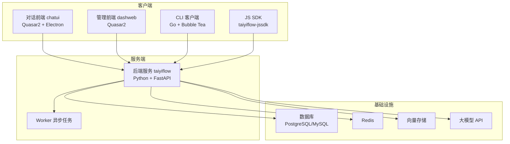
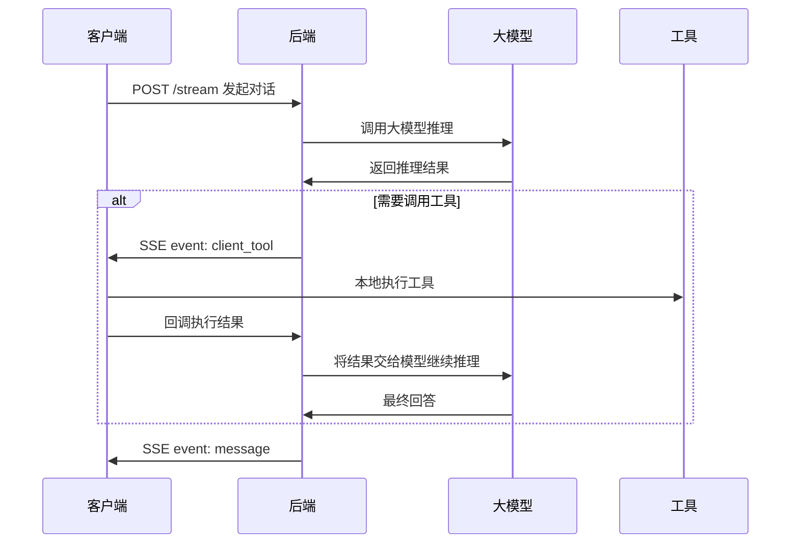

# 系统架构总览

> 这篇文档帮助贡献者理解太乙智启的整体架构、组件关系和数据流。

## 架构图



## 组件职责

| 组件 | 技术栈 | 职责 |
|------|--------|------|
| taiyiflow | Python / FastAPI / SQLModel | Agent 编排、RAG、流式对话、MCP、API |
| taiyiflow-chatui | Quasar2 / Electron | 桌面客户端 & Web 对话界面 |
| dashweb | Quasar2 | 可视化流程设计器、管理后台 |
| taiyiflow-cli | Go / Bubble Tea | 终端智能体客户端 |
| taiyiflow-jssdk | JavaScript / Vite | Web 嵌入式集成 SDK |

## 后端目录结构

```
taiyiflow/src/backend/
├── base/taiyiflow/
│   ├── api/v1/          # API 路由
│   ├── alembic/         # 数据库迁移
│   ├── initial_setup/   # 初始化配置
│   └── models/          # 数据模型
├── taiyiflow/           # 核心包
├── tests/               # 测试
└── scripts/             # 脚本
```

## 数据流



## 相关文档

- [开发环境搭建](/contributor-guide/dev-setup) — 开始开发前必读
- [后端开发指南](/contributor-guide/backend-dev) — 后端开发详情
