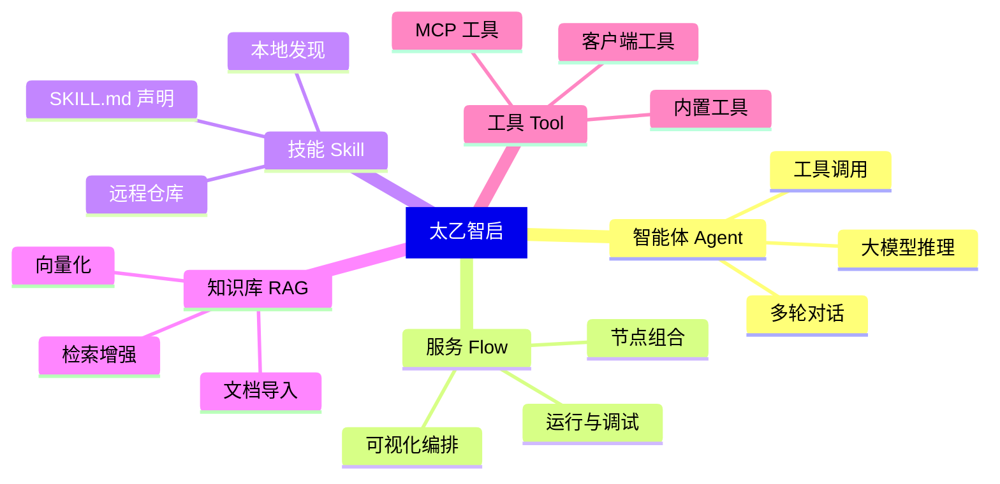

# 核心概念

> 这篇文档用通俗的语言解释太乙智启中的关键术语，帮助你建立整体认知。

## 概念地图

## Agent（智能体）

**通俗理解**：Agent 就是一个"会思考、能动手"的 AI 助手。

它不只是回答问题（那是普通聊天机器人），还能：
- 调用工具（读文件、执行命令、搜索网络）
- 根据执行结果继续推理
- 多步骤完成复杂任务

在太乙智启中，每次你发起对话，后端会启动一个 Agent 执行链路来处理你的请求。

## Flow（服务/流程）

**通俗理解**：Flow 是 Agent 的"工作蓝图"。

一个 Flow 定义了：
- 使用哪个大模型
- 系统提示词是什么
- 可以调用哪些工具
- 知识库如何关联

你可以在管理前端的**可视化流程设计器**中，通过拖拽节点来设计 Flow，无需编写代码。

## Session（会话）

**通俗理解**：Session 就是一次"对话上下文"。

- 一个 Session 包含多轮对话消息
- Agent 在同一个 Session 内能记住之前说过的话
- Session 可以分组管理

## Skill（技能）

**通俗理解**：技能是给 Agent 的"操作手册"。

技能本质上是一段**结构化的提示词**，告诉 Agent 在特定场景下应该怎么做。例如：
- "当用户要求生成 PDF 时，按以下步骤操作……"
- "当用户要求调试代码时，按以下排查顺序……"

技能通过 `SKILL.md` 文件声明，支持：
- **本地技能**：存放在 `~/.snz1dp/skills/` 或工作区 `.snz1dp/skills/`
- **远程技能**：从技能仓库搜索、安装、更新
- **内置技能**：随客户端打包分发

:::tip 技能 ≠ 工具
技能是"知识注入"（告诉 Agent 怎么做），工具是"能力扩展"（让 Agent 能做到）。两者经常配合使用。
:::

## MCP（Model Context Protocol）

**通俗理解**：MCP 是 Agent 调用外部工具的"标准插座"。

就像 USB 是设备的通用接口一样，MCP 让 Agent 能以统一的方式调用各种工具：
- 本地文件操作
- 终端命令执行
- 浏览器自动化
- 第三方 API 调用

太乙智启完整支持 MCP 协议，你可以通过 `mcp_tools` 或 `available_tools` 字段声明可用工具。

## RAG（检索增强生成）

**通俗理解**：让 AI "先查资料再回答"。

普通大模型只能基于训练时学到的知识回答。RAG 的流程是：

1. **导入**：将你的文档（PDF、Word、Markdown 等）导入知识库
2. **向量化**：将文档内容转换为向量并存入向量数据库
3. **检索**：用户提问时，先检索最相关的文档片段
4. **生成**：将检索到的内容作为上下文，交给大模型生成回答

这样 AI 就能基于你的**私有数据**回答问题，而不是凭空编造。

## 客户端工具（Client Tool）

**通俗理解**：Agent 发出指令，你的电脑来执行。

有些操作必须在用户本地执行（如读写本地文件、打开浏览器），太乙智启通过**客户端工具回调协议**实现：

1. Agent 决定需要调用某个工具
2. 服务端通过 SSE 事件通知客户端
3. 客户端在本地执行工具
4. 客户端将执行结果回调给服务端
5. Agent 根据结果继续推理

## 运行时策略

太乙智启支持两种运行时策略：

| 策略 | 适用场景 | 说明 |
|------|----------|------|
| `default` | 问答、规划 | 标准终止行为，适合 ask/plan 模式 |
| `hermes` | 工具调用 | 失败恢复与收口控制，适合 agent 模式 |

## 请求类型

| 类型 | 说明 |
|------|------|
| `ask` | 纯问答模式，Agent 只回答不执行操作 |
| `plan` | 规划模式，Agent 制定执行计划但不直接执行 |
| `agent` | 执行模式，Agent 可以调用工具、读写文件、执行命令 |

## 下一步

- [安装与部署](/getting-started/installation) — 把太乙智启跑起来
- [第一次对话](/getting-started/first-conversation) — 5 分钟体验完整流程
