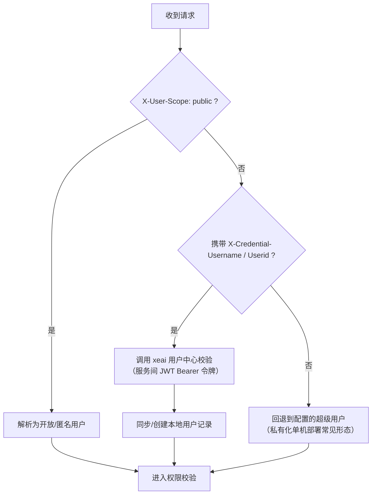

# 认证与鉴权

> 本篇是协议层文档：说明调用太乙智启服务端 API 时的身份凭据形式、解析规则与授权模型。

## 凭据形式总览

| 凭据 | 传递方式 | 适用场景 |
|------|----------|----------|
| 用户凭据头 | `X-Credential-Username` / `X-Credential-Userid` | 网关/用户中心已认证后的服务间透传 |
| JWT access token | `Authorization: Bearer <token>` | 登录态客户端（桌面端、WebSocket） |
| 开放访问标识 | `X-User-Scope: public` | 匿名/开放场景 |
| 持久令牌（persistent token） | 换牌接口 | 长期会话自动续期 |

## 服务端身份解析规则

后端对每个请求按以下优先级解析用户身份：



要点：

- 用户体系对接 **xeai 用户中心**：请求凭据头中的用户名/用户 ID 会被送到用户中心校验并拉取角色，首次在平台出现的用户会自动创建本地记录。
- 私有化独立部署（未接入用户中心）时，请求会回退到配置的超级用户身份，适合内网可信环境快速集成。
- WebSocket 连接使用相同的凭据头解析逻辑。

## 登录与 Token（用户中心侧）

面向桌面端/移动端等需要用户登录的客户端，认证由 XEAI 用户中心承担，主要流程：

### 账号密码登录

```
1. GET  /oauth/api/password_token     → 获取 RSA 公钥 + ticket
2. 客户端用 RSA 公钥加密密码
3. POST /ajax_logon                   → 提交加密密码（form-urlencoded）
   ↳ 错误码 404/405/408 时触发验证码挑战：
     - 图形验证码：GET /kaptcha/image
     - 短信/邮箱/TOTP：POST /send_verify → POST /send_verify/validate
```

### 扫码登录

```
1. GET /oauth/api/channel_names       → 判断是否支持扫码
2. GET /oauth/api/token               → 获取二维码令牌
3. 轮询 GET /oauth/api/wait_event     → 3s 间隔，state: 0 等待 / 1 成功 / 9 过期 / -1 取消
```

### 持久令牌与自动续期

长期会话（桌面端"记住我"）使用持久令牌机制：

```
1. POST /logged/persistent_token      → 登录后创建持久令牌
2. access token 过期（401）时换牌：
   a. GET  /sso/salt                   → 获取盐值
   b. 计算 SHA-256(deviceId + salt) 签名
   c. POST /sso                        → 换取新 access token
3. 换牌成功 → 重放原始请求；换牌失败 → 清理令牌并跳转登录
```

Web SPA 形态不做本地登录：401 时刷新页面，由网关 SSO 完成重定向认证。

## WebSocket 认证

WebSocket 连接支持两种方式传递认证信息：

- **Header**：`Authorization: Bearer <token>`（适用于非浏览器客户端）
- **Query 参数**：`?token=<token>`（适用于浏览器 WebSocket）

语音对话 WS（`/api/v1/agents/dialogue/websocket`）的连接参数（`flow-id`、`device-id`、`authorization` 等）全部通过 HTTP Header 传入（query 兜底）。

认证失败时服务端以关闭码 **4001** 断开连接。

## 授权模型

身份认证通过后，访问权限由两层控制：

### 角色权限（管理面）

- 用户角色来自 xeai 用户中心，按应用维度（`APP_CODE`）划分
- 管理类接口通过角色依赖校验（如仅超级用户可访问系统设置）

### 应用授权（数据面）

- 每个智能服务归属一个 App，App 的 `user_scope` 决定可见范围：`publish`（公开）/ `organization`（组织内）/ `user`（私有）
- 运行智能服务时校验当前用户对该 App 的访问权；无权时返回 403（WebSocket 关闭码 4003）
- 组织与成员授权通过 `app_org` / `app_user` 关联模型管理

## 产物下载认证（SSO Token）

客户端下载服务端产物文件（会话中生成的文档、图片等）时需要携带时效性令牌：

- 每次下载前获取最新 SSO token（客户端工具 `get_sso_token`）
- 附加方式二选一：
  - 请求头 `Authorization: Bearer <token>`
  - URL query `?__TOKEN__=<token>`（浏览器直接打开场景）

## 安全建议

:::warning
- 生产环境必须使用 HTTPS/WSS
- 服务间透传用户凭据头时，确保网关层剥离外部请求伪造的同名 Header
:::

## 相关文档

- [流式对话 API](/integration/stream-api) — 携带凭据发起对话
- [WebSocket 接口](/integration/websocket-api) — WS 认证与关闭码
- [集成核心概念](/integration/concepts) — App/Flow 授权模型的业务视角
