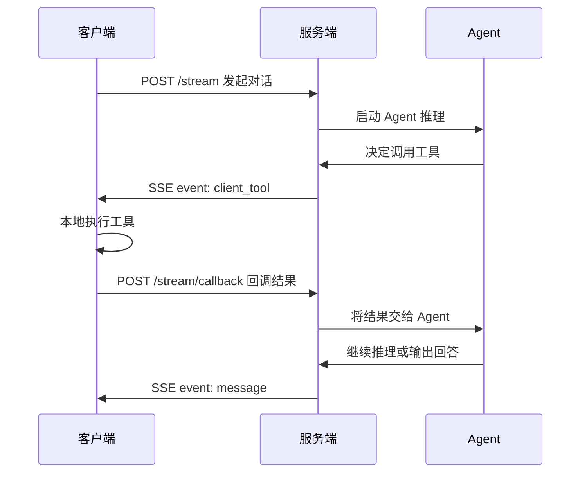

# 客户端工具回调协议

> 这篇文档详细说明太乙智启的客户端工具回调机制，即 Agent 如何指挥客户端本地执行工具。

## 工作原理



## 适用场景

- 目标工具需要在设备端或客户端本地执行
- Agent 需要等待客户端执行结果再继续推理
- 客户端通过 `text/event-stream` 消费运行过程

## 服务端事件类型

| 事件 | 说明 |
|------|------|
| `client_tool` | 客户端本地工具调用 |
| `mcp_tool` | MCP 协议工具调用 |
| `built_in` | 内置工具调用 |

## 事件负载格式

```json
{
  "flow_id": "flow-1",
  "context": {
    "session_id": "session-1",
    "run_id": "run-1",
    "message_id": "message-1"
  },
  "server": {
    "name": "device/local"
  },
  "function": {
    "id": "call-1",
    "name": "open_url",
    "arguments": {
      "url": "https://example.com"
    }
  },
  "event_type": "client_tool"
}
```

## 客户端回调

执行完工具后，客户端需将结果回调：

```
POST /api/v1/run/{flow_id}/stream/callback
Content-Type: application/json
```

<!-- TODO: 补充回调请求体完整格式和字段说明 -->

## 工具声明

客户端在发起对话时通过以下字段声明可用工具：

- `available_tools`：允许调用的工具列表（推荐）
- `client_mcp_servers`：本地 MCP 服务与工具清单
- `mcp_tools`：兼容旧字段，新接入请使用 `available_tools`

## 错误处理

<!-- TODO: 补充工具执行失败的处理流程 -->

## 相关文档

- [流式对话 API](/integration/stream-api) — 完整接口文档
- [MCP 工具开发](/skill-development/mcp-tools) — 开发自定义 MCP 工具
