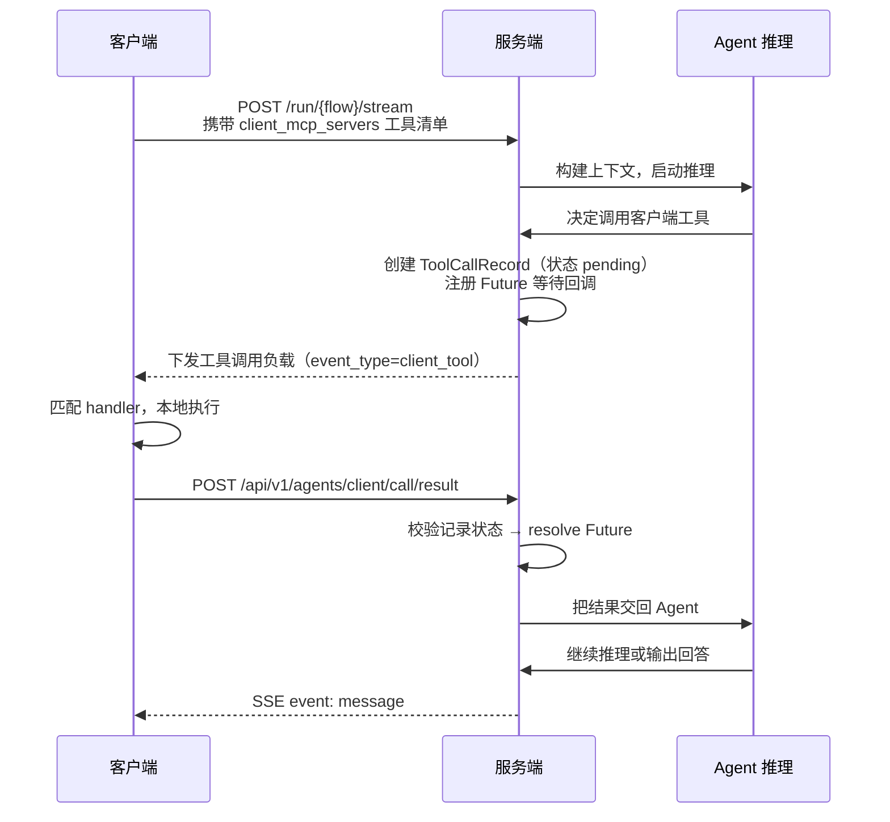
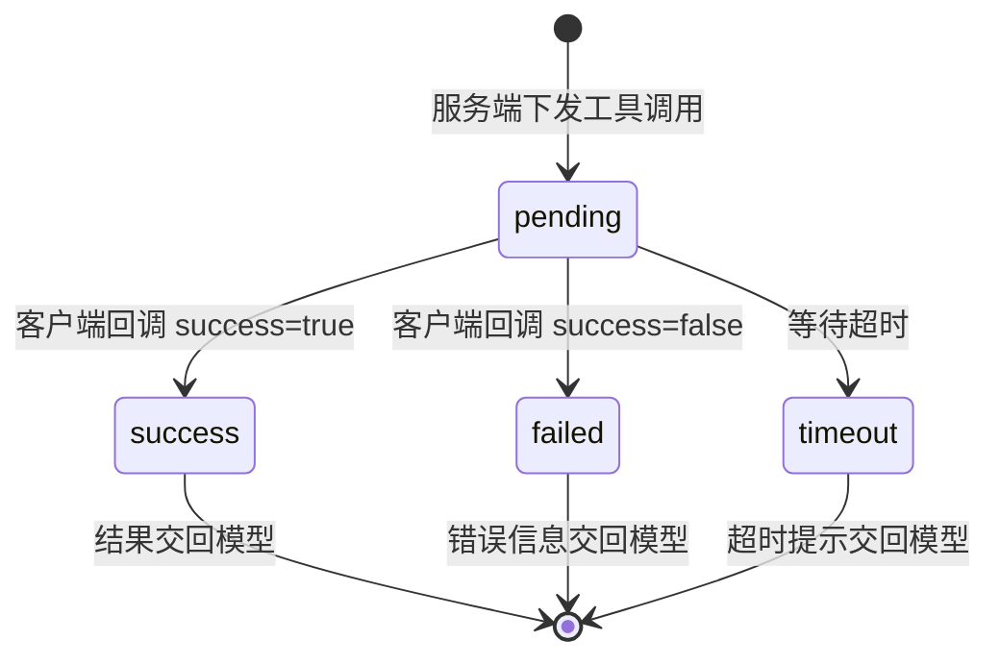

# 客户端工具协议

> 本篇是协议层文档：详细说明太乙智启的客户端工具回调机制——AI 在服务端推理，但通过「工具下发 → 客户端本地执行 → 结果回调」的闭环操作客户端环境。这是实现本地文件读写、Shell 执行、浏览器自动化、页面操作等能力的核心协议。

## 工作原理



关键点：服务端在下发工具调用后**阻塞等待**（`asyncio.wait_for(future, timeout)`），直到客户端回调结果或超时。

## 工具类型与命名前缀

| event_type | 含义 | 工具名前缀 |
|------------|------|-----------|
| `client_tool` | 客户端本地工具调用 | `c_` |
| `mcp_tool` | 远程 MCP 服务器工具调用 | `s_` |
| `built_in` | 服务端内置工具调用 | — |

前缀用于在同一工具命名空间中区分执行位置，避免客户端工具与远程 MCP 工具重名冲突。

## 一、声明可用工具

客户端在发起对话请求时，通过以下字段声明本地能力：

| 字段 | 说明 |
|------|------|
| `client_mcp_servers` | 客户端 MCP 服务器与工具清单（含 JSON Schema 定义），**推荐** |
| `available_tools` | 本次请求允许调用的工具白名单 |
| `command_execution_target` | `server` / `client`，命令类工具的执行位置 |

`client_mcp_servers` 结构示例：

```json
{
  "client_mcp_servers": {
    "order-server": {
      "tools": [
        {
          "name": "query_order",
          "description": "根据订单号查询订单状态。当用户询问订单进度时使用。",
          "input_schema": {
            "type": "object",
            "properties": {
              "order_id": { "type": "string", "description": "订单号" }
            },
            "required": ["order_id"]
          }
        }
      ]
    }
  },
  "available_tools": ["c_order-server_query_order"]
}
```

:::tip description 决定调用准确率
模型只能看到 `name` / `description` / `input_schema`。description 要写清楚「做什么 + 什么时候用 + 参数含义」，这是提升工具被正确调用的最有效手段。
:::

## 二、接收工具调用负载

服务端通过流式通道下发（SSE 的 `message` 事件 data 中，或 WebSocket 的 `custom` 事件）：

```json
{
  "flow_id": "flow-1",
  "context": {
    "session_id": "session-1",
    "run_id": "run-1",
    "message_id": "message-1",
    "user_id": "user-1"
  },
  "server": { "name": "order-server" },
  "function": {
    "id": "call-1",
    "name": "query_order",
    "arguments": { "order_id": "DD20260901001" }
  },
  "event_type": "client_tool"
}
```

### 字段说明

| 字段 | 说明 | 回调时是否需带回 |
|------|------|-----------------|
| `flow_id` | 智能服务 ID | ✅ 必填 |
| `context.session_id` | 会话 ID | ✅ 建议带回 |
| `context.run_id` | 本次执行链路 ID | ✅ 必填 |
| `context.message_id` | 当前消息 ID | ✅ 建议带回 |
| `context.user_id` | 发起用户 | ❌ |
| `server.name` | 工具所属服务器名 | ❌（用于本地匹配 handler） |
| `function.id` | 调用 ID（call_id） | ✅ 必填 |
| `function.name` | 工具函数名 | ❌ |
| `function.arguments` | 工具参数（已由模型按 schema 生成） | ❌ |
| `event_type` | 冗余字段，兼容不解析 SSE `event:` 行的客户端 | ❌ |

:::warning 工具名匹配建议
下发时 `function.name` 可能带有 `c_` 前缀或服务器名拼接。健壮的实现应：先按「server.name + function.name」精确匹配，失败时按工具名后缀回退匹配。JS SDK 的 `ClientMCPServers` 即采用此策略。
:::

## 三、回调执行结果

### 端点

```
POST /api/v1/agents/client/call/result
Content-Type: application/json
```

:::tip 注意
回调端点是 **`/api/v1/agents/client/call/result`**，不是 `/run/{flow}/stream/callback`。所有客户端工具（无论来自哪个 flow、哪种流式协议）统一回调到这一个端点。
:::

### 请求体（MCPClientCallResult）

| 字段 | 类型 | 必填 | 说明 |
|------|------|------|------|
| `flow_id` | string | ✅ | 服务 ID，服务端据此校验 Flow 与 App 访问权限 |
| `run_id` | string | ✅ | 执行 ID |
| `call_id` | string | ✅ | 调用 ID（来自 `function.id`） |
| `success` | boolean | ✅ | 调用是否成功 |
| `session_id` | string | ❌ | 会话 ID |
| `message_id` | string | ❌ | 消息 ID |
| `result` | any | ❌ | 成功时的返回数据（对象/数组/字符串均可） |
| `error_message` | string | ❌ | 失败时的错误信息 |

### 成功示例

```bash
curl -X POST 'https://your-platform/api/v1/agents/client/call/result' \
  -H 'Content-Type: application/json' \
  -H 'Authorization: Bearer your-token' \
  -d '{
    "flow_id": "flow-1",
    "session_id": "session-1",
    "message_id": "message-1",
    "run_id": "run-1",
    "call_id": "call-1",
    "success": true,
    "result": { "order_id": "DD20260901001", "status": "已发货", "eta": "2026-09-08" }
  }'
```

### 失败示例

```json
{
  "flow_id": "flow-1",
  "run_id": "run-1",
  "call_id": "call-1",
  "success": false,
  "error_message": "订单号不存在"
}
```

:::tip 失败也要回调
工具执行失败时**必须回调** `success: false` + `error_message`，而不是静默丢弃。服务端会把错误信息交给模型，模型可据此重试、换参数或向用户解释；若不回调，服务端只能等到超时，浪费一整轮迭代。
:::

### 服务端校验

回调时服务端依次校验：

1. `flow_id` 对应的 Flow 存在
2. 当前用户对 Flow 所属 App 有访问权（否则 403）
3. `call_id` 对应的调用记录存在且状态为 **pending**（已完成/已超时的记录不可重复回调）

校验通过后完成 Future，推理链路继续。

## 四、状态机与超时



- 每次调用生成一条 `ToolCallRecord`（持久化，可通过 `GET /api/v1/sessions/{session_id}/callrecords` 查询）
- `callback_id` 形如 `{run_id}.{call_id}`
- 超时后记录状态置为 `timeout`，模型收到超时提示；此时客户端再回调会因状态非 pending 而被拒绝

## 五、特殊返回：动态扩展工具

工具结果中若返回 `switch_to_agent` 结构且携带 `additional_tools`，服务端会把这些新工具定义**动态合并**进当前连接的可用工具列表，实现「运行中按需解锁能力」。

典型用法：一个入口工具根据用户意图判断需要哪类专用工具，返回后模型即可在后续迭代中调用它们，无需客户端预先声明全部工具。

## 六、JS SDK 场景的差异

当客户端是 JS SDK（Web 嵌入）时，工具调用不走 HTTP 回调，而是通过 postMessage 在 SDK 与 iframe 内 ChatUI 之间传递：

| 环节 | 消息 |
|------|------|
| ChatUI → SDK | `client_tool`（负载结构同上） |
| SDK → ChatUI | `finish:client_tool`（携带回填了 `flow_id`/`session_id`/`message_id`/`run_id`/`call_id` 的结果） |
| ChatUI → 后端 | `POST /api/v1/agents/client/call/result` |

即 ChatUI 充当了「postMessage 协议」与「HTTP 回调协议」之间的适配层。SDK 侧只需实现 handler，无需关心 HTTP 回调。

## 七、权限与安全

客户端工具直接操作本地环境，务必实现权限管控：

| 措施 | 说明 |
|------|------|
| 审批模式 | 高风险操作（写文件、Shell、桌面输入）执行前弹窗确认 |
| 沙箱根目录 | 限制文件工具可访问的目录范围，阻止越界 |
| 工具白名单 | 通过 `available_tools` 精确控制本次请求可用的工具 |
| 权限声明 | 工具 `meta.permissions` 声明所需权限，执行前逐项申请 |
| 审计日志 | 记录每次工具调用的参数与结果 |

ChatUI 桌面端在 `src-electron/agent-runtime/security.js` 实现了完整的审批与沙箱体系；JS SDK 通过 `PermissionManager` + `SecurityPolicy` + `AuditLogger` 提供浏览器侧的权限控制（`enableSecurity: true` 开启）。

## 错误处理清单

| 现象 | 可能原因 | 处理 |
|------|----------|------|
| 模型不调用工具 | description 不清晰 / 未列入 `available_tools` | 优化 description，检查白名单 |
| 回调返回 400「错误的请求」 | `flow_id` 不存在或拼写错误 | 核对 flow_id |
| 回调返回 403 | 当前用户无权访问该 Flow 所属 App | 检查认证身份与 App 授权 |
| 回调被忽略 | 记录状态已非 pending（超时或重复回调） | 检查执行耗时，避免重复回调 |
| 服务端提示调用超时 | 客户端未回调或执行过久 | 确保失败也回调；长任务改为异步任务模式 |
| WebSocket 关闭码 4009 | 同会话并发执行冲突 | 等待上一轮结束或更换 session_id |

## 相关文档

- [流式对话 API](/integration/stream-api) — 工具声明字段所在的请求契约
- [WebSocket 接口](/integration/websocket-api) — 协同通道上的任务分发
- [JS SDK 集成](/integration/jssdk) — `registerTool` 使用方式
- [MCP 工具开发](/skill-development/mcp-tools) — 开发标准 MCP 工具
- [客户端工具开发](/skill-development/client-tools) — 客户端工具开发指南
