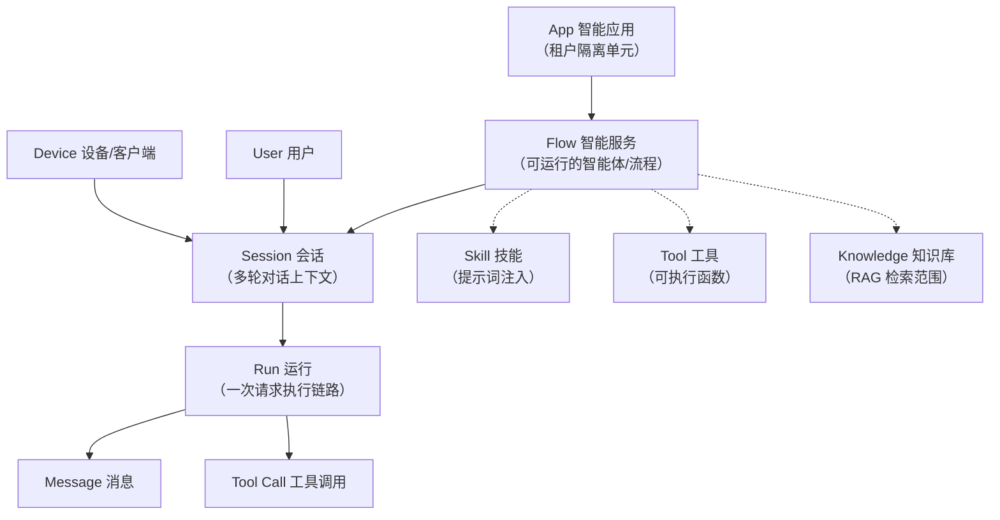

# 集成核心概念

> 本篇是业务层文档：不涉及具体接口参数，只讲清楚太乙智启集成开发中的核心概念、对象模型与租户隔离方式。理解这些概念后，再阅读协议层与底层文档会顺畅很多。

## 概念全景图

## 应用（App）：租户隔离单元

**App 是太乙智启的顶层资源容器与权限边界**。每个智能服务（Flow）都归属于一个 App。

App 通过 `user_scope` 控制可见范围：

| user_scope | 含义 |
|------------|------|
| `publish` | 公开发布，所有用户可访问 |
| `organization` | 组织内可见，通过组织/成员授权访问 |
| `user` | 私有，仅创建者与显式授权成员可访问 |

集成时的意义：

- 你调用某个智能服务，实际访问权限由「该服务所属 App 的 user_scope + 你的用户身份/角色」共同决定。
- 多租户 SaaS 集成时，通常为每个租户创建独立 App，实现数据与权限隔离（详见[厂商指南 · 多租户架构](/vendor-guide/multi-tenancy)）。

## 智能服务（Flow）：可运行的智能体

**Flow 是运行端点的直接对象**，可以理解为"一个配置好的智能体"。它包含：

- 提示词与模型配置
- 可视化编排的组件流程（图执行引擎）
- 绑定的知识库、工具、技能范围

关键约定：

| 概念 | 说明 |
|------|------|
| `flow_id_or_name` | 所有运行端点同时接受 **Flow 的 UUID 或名称**，如 `/api/v1/run/{flow_id_or_name}/stream` |
| `is_chat` | 区分对话型服务与一次性执行服务 |
| `master_flow_id` | 主流程机制：一个 Flow 可以声明主流程，实现多智能体协作编排 |
| 影子智能服务 | 同一 Flow 可派生影子实例，用于灰度/实验 |

:::tip 如何获取 flow_id
- 管理后台的智能服务列表页
- `GET /api/v1/agents/flows` 接口（智能体客户端视角的可用服务列表）
- `GET /api/v1/run/{flow_id_or_name}/metadata` 可查询服务元信息
:::

## 会话（Session）与运行（Run）

### Session：多轮对话的上下文容器

- 由服务端生成或客户端指定 `session_id`（不传则自动生成，通过响应头 `x-session-id` 返回）。
- 同一 `session_id` 下的多轮请求共享对话历史，AI 能"记住"之前的内容。
- 会话归属于某个 Flow 与用户，可通过分组（group）组织。
- **同一会话同一时刻只允许一个执行**：并发请求会收到冲突错误（WebSocket 关闭码 4009）。

### Run：一次请求的执行链路

- 每次发起对话产生一个 `run_id`，标识本次 Agent 执行链路。
- Run 之下包含多条 Message 与多次 Tool Call。
- 客户端工具回调时必须原样带回 `run_id`、`call_id`，服务端据此将结果路由回正确的等待点。

### Message：消息

- 用户输入与 AI 输出都以消息形式持久化在会话中。
- `message_id` 用于绑定客户端回调与前端渲染。

## 请求类型（request_type）：三种交互形态

同一个 Flow 可以用三种模式运行，决定了 AI 的行为边界：

| 值 | 名称 | 行为 | 典型场景 |
|----|------|------|----------|
| `ask` | 问答模式 | 纯问答，不执行操作 | Web 对话、知识问答 |
| `plan` | 规划模式 | 制定计划但不执行 | 任务拆解、方案评审 |
| `agent` | 执行模式 | 可调用工具、多轮迭代直至完成目标 | CLI/桌面端自动化、RPA |

不同客户端类型（`client_type`）有默认映射：`web`/`device` 默认 `ask`，`cli`/`desktop` 默认 `agent`。

## 技能（Skill）：提示词注入

**技能本质是注入到系统提示词中的 Markdown 文本**，告诉 AI"遇到某类任务应该怎么做"。

- 技能不是可调用的函数，而是知识与行为规范的载体（如"输出图表时使用 ECharts 代码块"）。
- 三种来源：
  1. **内置技能**：服务端预置（如 echarts、mermaid），按客户端类型自动注入
  2. **数据库技能包**：管理端上传的 `SkillPackage`，按 app/flow/system 三级作用域授权
  3. **客户端技能包**：随请求上送的 `client_skill_packages`，由 JS SDK / ChatUI / CLI 本地提供
- 支持**渐进式披露**：先注入技能摘要，AI 需要时再通过 skill 工具加载全文，避免提示词过长。

详见[技能注入机制](/integration/skill-injection)与[技能开发](/skill-development/skill-basics)。

## 工具（Tool）：可执行的函数

工具让 AI"能做到"某件事。按执行位置分为三类：

| 类别 | 执行位置 | 声明方式 | 示例 |
|------|----------|----------|------|
| **服务端内置工具** | 后端平台 | Flow 配置 | 知识库检索、联网搜索 |
| **远程 MCP 工具** | 第三方 MCP 服务器 | 平台 MCP 管理 | 数据库查询、企业系统 API |
| **客户端工具** | 发起请求的客户端本地 | 请求字段 `client_mcp_servers` | 读写本地文件、执行 Shell、操作浏览器 |

客户端工具是集成开发的重点：AI 在服务端推理，但通过**工具下发 → 客户端执行 → 结果回调**的闭环操作客户端本地环境。工具名以 `c_` 前缀标识客户端工具、`s_` 前缀标识远程 MCP 工具。

详见[客户端工具协议](/integration/client-tool-protocol)。

## 客户端（Client）与设备（Device）

太乙智启支持多种客户端形态接入同一后端：

| client_type | 形态 | 说明 |
|-------------|------|------|
| `web` | 浏览器 | ChatUI Web 版、JS SDK 嵌入页 |
| `desktop` | Electron 桌面端 | ChatUI 桌面版，具备完整本地工具能力 |
| `cli` | 命令行 | taiyiflow-cli |
| `device` | 硬件设备 | 语音终端等受限设备 |

- `client_id` / `device_id` 标识具体客户端实例与物理设备，用于客户端协同通道（在线状态、任务分发、定时任务、语音广播）。
- 客户端能力差异：Web 端受浏览器沙箱限制（无本地 Shell/文件工具），桌面端与 CLI 具备完整本地执行能力。服务端按 `client_type` 调整默认技能与工具策略。

## 知识库（Knowledge）与检索范围

- Flow 可绑定知识库实现 RAG 问答。
- 请求级可通过 `knowledge_scopes` / `knowledge_docs` 进一步限定本次检索范围。
- 请求级 `internet_search` 控制是否允许联网搜索。

## 用户与认证身份

- 用户体系对接 **xeai 用户中心**（统一认证），后端按请求凭据头解析用户身份。
- 用户角色决定管理端功能的访问权限；App 授权决定智能服务的访问权限。
- 集成时你需要关心的凭据形式：JWT access token（登录态）、持久令牌（自动续期）。

详见[认证与鉴权](/integration/authentication)。

## 概念与请求字段的对应关系

最后，把上述概念映射到实际请求字段，作为进入协议层文档的桥梁：

| 概念 | 请求字段 |
|------|----------|
| 智能服务 | URL 路径 `{flow_id_or_name}`、`master_flow_id` |
| 会话 | `session_id`、`group_id` |
| 运行 | `run_id` |
| 消息 | `message_id`、`input_value`、`input_files` |
| 请求类型 | `request_type` |
| 客户端 | `client_type`、`client_id`、`device_id` |
| 技能 | `client_skill_packages`、`requested_skill_names` |
| 工具 | `available_tools`、`client_mcp_servers`、`command_execution_target` |
| 知识库 | `knowledge_scopes`、`knowledge_docs`、`internet_search` |
| 记忆 | `long_term_memory_enabled`、`cross_session_memory_enabled` |

## 下一步

- 选择集成方式：[集成方式总览](/integration/overview)
- Web 嵌入：[JS SDK 集成](/integration/jssdk)
- 接口契约：[流式对话 API](/integration/stream-api)
