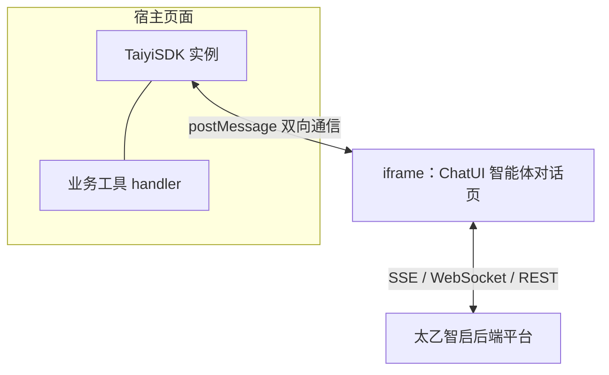

# JS SDK 集成

> 本篇是应用层文档：介绍如何使用太乙智启 JS SDK（npm 包名 `taiyiflow`）在任意 Web 页面中嵌入智能体对话助手。当前 SDK 版本 **1.0.0**。

## JS SDK 是什么

TaiyiFlow JS SDK 是一个**零运行时依赖**的纯前端 SDK，核心能力：

- **快速嵌入智能对话**：通过悬浮图标（Launcher）或容器模式，把智能体对话页（ChatUI）以 iframe 形式嵌入宿主页面
- **客户端工具注册（MCP 协议）**：让智能体调用宿主页面提供的业务函数
- **技能注入**：向智能体注入提示词文本，定制其行为与领域知识
- **深度融合（Deep Integration）**：智能体感知并操控宿主页面 DOM（快照、高亮、标注、表单填写、点击、滚动、查询）
- **插件化扩展**、可观测性（错误边界/性能监控/健康检查）、本地权限控制

:::tip 架构要点
SDK 本身**不直接访问后端 API**。它把 `agentUrl` 指向的对话页装入 iframe，与后端的 SSE/WebSocket 流式通信由 iframe 内的 ChatUI 承担；SDK 与 ChatUI 之间通过 `window.postMessage` 双向通信。因此 SDK 层没有独立的 token/API Key 机制，登录态由对话页自身建立（同域 Cookie 或平台 SSO）。
:::



## 安装与引入

### npm 安装

```bash
npm install taiyiflow
```

```javascript
import TaiyiSDK from 'taiyiflow'
```

### CDN / script 引入（UMD）

```html
<script src="https://snz1.cn/taiyi/jssdk/umd/taiyiflow.js"></script>
<script>
  const sdk = new TaiyiSDK({ agentUrl: 'https://your-platform/taiyi/chat/your-flow-id' })
</script>
```

CDN 地址始终指向最新版本。也可自行部署 SDK 静态产物（`dist/esm`、`dist/umd`、`dist/iife` 三种格式）。

## 快速开始

### 1. 初始化

```javascript
import TaiyiSDK from 'taiyiflow'

const sdk = new TaiyiSDK({
  agentUrl: 'https://your-platform/taiyi/chat/your-flow-id', // 必填：智能体对话页 URL
  agentName: '小助手',            // 智能体名称（也可由 flow_metadata 消息自动填充）
  position: 'bottom-right',      // 悬浮图标位置
  origin: 'https://your-platform' // postMessage 安全源限制，生产环境务必设置
})
```

页面右下角出现悬浮图标，点击即打开对话窗口。

### 2. 主动发起对话

```javascript
// 打开对话框并直接发送问题
sdk.chat('帮我分析一下本月的销售数据')

// 监听智能体就绪
sdk.on('agent:ready', () => {
  console.log('智能体已就绪')
})
```

### 3. 容器嵌入模式

不用悬浮窗，把对话直接嵌入页面指定容器：

```javascript
const sdk = new TaiyiSDK({
  agentUrl: 'https://your-platform/taiyi/chat/your-flow-id',
  containerMode: true,
  containerSelector: '#chat-container' // 容器模式下必填
})
```

容器模式会禁用悬浮、拖拽、全屏与关闭按钮，对话框固定填充容器。

### 4. 销毁

SPA 路由切换或组件卸载时务必销毁，避免内存泄漏：

```javascript
sdk.destroy()
```

## 初始化参数（SDKOptions）

### 基础配置

| 参数 | 类型 | 默认值 | 说明 |
|------|------|--------|------|
| `agentUrl` | string | `''` | **必填**，智能体对话页 URL（iframe src） |
| `agentName` | string | null | 智能体名称 |
| `iconUrl` | string | `''` | 悬浮图标图片，默认使用内置图标 |
| `enableFloatIcon` | boolean | `true` | 是否显示悬浮图标 |
| `position` | string | `'bottom-right'` | 图标位置：`top-left` / `top-right` / `bottom-left` / `bottom-right` |
| `absorption` | boolean | `false` | 对话框吸附侧边模式 |
| `absorptionSelector` | string | `'body'` | 吸附目标容器选择器 |
| `containerMode` | boolean | `false` | 容器嵌入模式 |
| `containerSelector` | string | `''` | 容器选择器（容器模式必填） |
| `origin` | string | `'*'` | postMessage 安全源限制 |
| `logLevel` | string | `'info'` | 日志级别：`debug` / `info` / `warn` / `error` |

### 功能开关

| 参数 | 默认 | 说明 |
|------|------|------|
| `enableMCP` | `true` | 启用 MCP 插件（客户端工具） |
| `clientMcpServers` | `{}` | 初始客户端工具定义 |
| `enableSkills` / `skills` / `requestedSkillNames` | `true` / `[]` / `[]` | 技能插件与初始技能 |
| `enableCodeExec` / `codeExec` | `true` | JS 代码执行插件（`sandboxMode: 'normal' \| 'sandbox'`、timeout 等） |
| `enableFileTools` / `fileTools` | `true` | 文件工具插件 |
| `enableDeepIntegration` / `enableActions` / `enableAnnotationOverlay` / `enableContextProviders` | `true` | 深度融合子系统 |
| `enableLifecycleHooks` | `false` | 启用异步生命周期 Hooks |

### 可观测性与安全

| 参数 | 默认 | 说明 |
|------|------|------|
| `enableErrorBoundary` | `true` | 错误边界 |
| `enablePerformanceMonitor` / `performanceSampleRate` / `autoReportPerformance` | — | 性能监控 |
| `enableHealthCheck` / `healthCheckInterval` | `false` / `30000` | 周期健康检查 |
| `maxRetries` / `retryDelay` | `3` / `1000` | 重试策略 |
| `enableSecurity` / `securityLevel` / `enableAudit` | `false` / `'normal'` / `true` | 本地权限与审计 |

## 实例 API 一览

| 分类 | 方法 |
|------|------|
| 对话框 | `open(anchorRect?)`、`close()`、`chat(question)` |
| 生命周期 | `destroy()`、`getStatus()`、`isReady()`、`waitForReady(timeout)`、`onReady(cb)` |
| 事件 | `on/off/once(event, cb)` |
| 消息 | `send(type, payload)` |
| 插件 | `use(plugin, options)`、`unuse(name)`、`getPlugin(name)`、`hasPlugin(name)` |
| 状态 | `getStore()`、`subscribe(path, cb)` |
| MCP 工具 | `registerTool(server, tool, options)`、`registerTools(...)`、`unregisterTool(...)`、`addClientMcpServer(...)`、`removeClientMcpServer(...)`、`setClientMCPServers(...)` |
| 技能 | `registerSkill(...)`、`unregisterSkill(name)`、`getSkill(name)`、`getAllSkills()`、`setRequestedSkillNames(names)` |
| 代码执行 | `executeCode(code, context, options)`、`getSandboxEngine()` |
| 深度融合 | `executeAction(actionType, params)`、`getAnnotationOverlay()`、`getActionExecutor()` |
| 可观测性 | `getErrorBoundary()`、`getPerformanceMonitor()`、`getHealthChecker()`、`getRecoveryManager()` |
| ask_user 定制 | `setAskUserHandler(handler)`、`getAskUserDialog()` |
| 静态方法 | `TaiyiSDK.create(options)`（异步等待就绪）、`TaiyiSDK.getVersion()` |

## 注册客户端工具（MCP）

让智能体调用宿主页面的业务函数——这是 JS SDK 集成最有价值的能力。

```javascript
sdk.registerTool('order-server', {
  name: 'query_order',
  description: '根据订单号查询订单状态。当用户询问订单进度、物流信息时使用。',
  input_schema: {
    type: 'object',
    properties: {
      order_id: { type: 'string', description: '订单号，如 DD20260901001' }
    },
    required: ['order_id']
  },
  handler: async (args) => {
    // 调用你自己的业务 API
    const res = await fetch(`/api/orders/${args.order_id}`)
    return await res.json()
  }
})
```

工作机制：

1. 工具定义经 `set:client_mcp_servers` 消息同步给 iframe 内的智能体（注册后 50ms 防抖合并同步；智能体就绪 `agent:ready` 时自动全量同步）
2. 智能体决定调用工具时，通过 `client_tool` 消息把调用请求发给 SDK
3. SDK 匹配 handler 执行（可先经本地权限拦截器），结果通过 `finish:client_tool` 消息回传
4. 智能体拿到结果继续推理

:::tip description 编写建议
`description` 是智能体决定是否调用工具的唯一依据。写清楚"做什么 + 什么时候用 + 参数含义"，比堆砌实现细节更有效。
:::

SDK 还内置了一组页面操作工具（注册在 `build-in-server` 下）：`get_page_snapshot`、`highlight_element`、`annotate_element`、`fill_form`、`scroll_to_element`、`query_dom`、`click_element`、`ask_user`、`execute_javascript`、`read_file`、`upload_file`、`write_file`、`download_file` 等，支撑"深度融合"场景——智能体可以直接读懂并操作宿主页面。

工具协议的服务端视角详见[客户端工具协议](/integration/client-tool-protocol)。

## 技能供应

技能是**注入给智能体的提示词文本**（区别于工具：工具是可调用的函数）。两种模式：

### 1. 自定义技能注入

```javascript
const sdk = new TaiyiSDK({
  agentUrl: '...',
  skills: [
    {
      name: 'sales-report-style',
      description: '销售报告写作规范',
      content: '# 销售报告规范\n所有金额使用人民币，保留两位小数；\n环比变化超过 10% 需要单独说明原因。'
    }
  ]
})

// 或运行时动态注册
sdk.registerSkill('faq-helper', '# FAQ 应答规范\n遇到售后问题优先引用官方 FAQ……')
```

技能内容经 `set:client_skill_packages` 消息同步给智能体，最终注入系统提示词。

### 2. 指定服务端技能

复用平台上已配置好的技能包：

```javascript
sdk.setRequestedSkillNames(['echarts', 'richdoc'])
```

服务端会把这些技能纳入当前会话的可用范围（立即同步，不走防抖）。

详见[技能注入机制](/integration/skill-injection)。

## 事件与状态

```javascript
// 生命周期与消息事件
sdk.on('agent:ready', () => {})          // 智能体就绪
sdk.on('dialog:opened', () => {})        // 对话框已打开
sdk.on('flow_metadata', (meta) => {})    // 智能服务元信息
sdk.on('client_tool', (msg) => {})       // 工具调用请求（通常由 SDK 内部处理）

// 状态订阅（路径式）
sdk.subscribe('ui.isOpen', (isOpen) => {
  console.log('对话框开关状态:', isOpen)
})

// 就绪等待
await sdk.waitForReady(10000)
```

## 框架集成范例

### React Hook

```jsx
import { useEffect, useRef } from 'react'
import TaiyiSDK from 'taiyiflow'

export function useTaiyiSDK(options) {
  const sdkRef = useRef(null)

  useEffect(() => {
    sdkRef.current = new TaiyiSDK(options)
    return () => sdkRef.current?.destroy()
  }, [])

  return sdkRef
}
```

### Vue 3 组合式 API

```vue
<script setup>
import { onMounted, onUnmounted, shallowRef } from 'vue'
import TaiyiSDK from 'taiyiflow'

const sdk = shallowRef(null)

onMounted(() => {
  sdk.value = new TaiyiSDK({
    agentUrl: 'https://your-platform/taiyi/chat/your-flow-id',
    origin: 'https://your-platform'
  })
})

onUnmounted(() => sdk.value?.destroy())
</script>
```

:::warning SPA 热更新注意
开发环境下 HMR 可能导致 SDK 重复实例化。请确保在组件卸载钩子中调用 `destroy()`，或在模块级做单例保护。
:::

## 安全建议

- **生产环境必须设置 `origin`** 为智能体域名，SDK 会校验 postMessage 的来源，拒绝非授权域名的消息。
- 登录态需在打开 `agentUrl` 前由平台侧建立（同域 Cookie 或平台登录流程），SDK 不传递凭证。
- iframe 已配置 `sandbox` 与 `allow="cookie; storage-access; microphone"`，跨站场景依赖 Storage Access API 维持会话。
- 工具 handler 中避免直接执行不可信输入；需要权限管控时启用 `enableSecurity`，工具可通过 `meta.permissions` 声明所需权限。

## 深入阅读

- iframe 内对话页的定制与部署：[智能体前端集成与二次开发](/integration/chatui)
- 工具回调的服务端协议：[客户端工具协议](/integration/client-tool-protocol)
