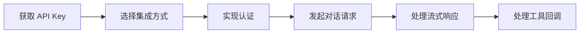

# 集成方式总览

> 这篇文档帮助你选择最适合的集成方式，将太乙智启的 AI 能力嵌入你的系统。

## 三种集成方式

| 方式 | 适用场景 | 技术栈要求 | 复杂度 |
|------|----------|-----------|--------|
| **REST API（SSE 流式）** | 后端服务调用、任意语言集成 | 支持 HTTP 即可 | ⭐⭐ |
| **WebSocket 实时接口** | 需要双向实时通信的场景 | 支持 WebSocket 即可 | ⭐⭐⭐ |
| **JS SDK** | Web 页面嵌入式对话组件 | JavaScript/前端框架 | ⭐ |

## 选择建议

### 场景一：后端服务调用 AI

推荐使用 **REST API（SSE 流式）**。

- 发起 `POST /api/v1/run/{flow_id}/stream` 请求
- 通过 `text/event-stream` 消费流式响应
- 支持客户端工具回调

→ 详见[流式对话 API](/integration/stream-api)

### 场景二：Web 页面嵌入对话窗口

推荐使用 **JS SDK**。

- 一行代码初始化对话组件
- 支持自定义技能注入
- 支持客户端工具回调

→ 详见 [JS SDK 集成](/integration/jssdk)

### 场景三：需要双向实时通信

推荐使用 **WebSocket 接口**。

- 适合语音对话、实时协作等场景
- 支持双向消息推送

→ 详见 [WebSocket 接口](/integration/websocket-api)

## 集成流程概览

## 下一步

1. [认证与鉴权](/integration/authentication) — 获取访问凭证
2. [流式对话 API](/integration/stream-api) — 核心接口文档
3. [集成示例](/integration/examples) — 可直接运行的代码
