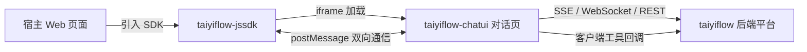
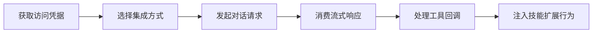

# 集成方式总览

> 太乙智启的集成开发文档按 **业务层 → 应用层 → 协议层 → 底层实现** 四个维度组织，由浅入深。本篇是总导读，帮助你选择合适的集成路径与阅读顺序。

## 三个核心代码仓库

太乙智启的集成能力由三个仓库协同提供：

| 仓库 | 角色 | 面向的集成者 |
|------|------|-------------|
| **taiyiflow** | 后端平台：服务编排与运行引擎（FastAPI），提供 REST/SSE/WebSocket 全部服务端接口 | 后端开发者、任意语言集成者 |
| **taiyiflow-jssdk** | 前端 JS SDK：在任意 Web 页面嵌入智能体对话窗口（iframe + postMessage） | Web 前端开发者 |
| **taiyiflow-chatui** | 对话前端：Vue 3 + Quasar 的完整智能体客户端（Web SPA / Electron 桌面端），也是 JS SDK 中 iframe 加载的页面 | 二次开发者、白标定制厂商 |

三者关系：

- **JS SDK 不直接访问后端**：它把 ChatUI 对话页装进 iframe，与后端的所有流式通信由 ChatUI 承担；SDK 与 ChatUI 之间通过 `postMessage` 协作（工具调用、技能注入等）。
- **ChatUI 是完整的智能体客户端**：对话、客户端工具执行、技能管理、MCP、语音通话、子任务协作，Web 与 Electron 双形态。
- **后端平台是唯一的能力中枢**：所有智能体推理、流程编排、会话与技能管理都在服务端完成。

## 四层文档地图

### 第一层 · 业务层（了解概念与选型）

| 文档 | 内容 |
|------|------|
| [集成核心概念](/integration/concepts) | 应用/智能服务/会话/运行/技能/工具等核心概念与租户模型 |
| 本篇 | 集成方式选型与文档地图 |

### 第二层 · 应用层（快速接入产品能力）

| 文档 | 内容 |
|------|------|
| [JS SDK 集成](/integration/jssdk) | 在 Web 页面嵌入对话助手：安装、初始化、工具注册、技能供应 |
| [ChatUI 前端集成与二次开发](/integration/chatui) | 部署对话前端、Electron 桌面端、白标定制扩展点 |
| [集成代码示例](/integration/examples) | cURL / Python / JavaScript 可运行示例 |

### 第三层 · 协议层（接口契约与协议细节）

| 文档 | 内容 |
|------|------|
| [认证与鉴权](/integration/authentication) | 凭据头、JWT、持久令牌 |
| [流式对话 API（SSE）](/integration/stream-api) | `POST /api/v1/run/{flow}/stream` 完整契约 |
| [WebSocket 接口](/integration/websocket-api) | 流式运行 WS、客户端协同 WS、语音对话 WS |
| [客户端工具协议](/integration/client-tool-protocol) | 工具下发事件与结果回调的完整闭环 |
| [技能注入机制](/integration/skill-injection) | 客户端技能包上送与服务端技能解析 |
| [REST API 参考](/integration/rest-api) | 全部服务端路由分类索引 |

### 第四层 · 底层实现（源码级架构解析）

| 文档 | 内容 |
|------|------|
| [后端平台架构解析](/internals/backend-architecture) | taiyiflow 仓库：目录结构、请求处理链路、服务层设计、配置体系 |
| [JS SDK 内部实现](/internals/jssdk-internals) | taiyiflow-jssdk 仓库：插件化架构、消息通道、构建产物 |
| [ChatUI 内部实现](/internals/chatui-internals) | taiyiflow-chatui 仓库：状态管理、通信层、Electron 工具运行时 |

## 按角色选择阅读路径

### 场景一：后端服务调用 AI（任意语言）

推荐 **REST API（SSE 流式）**，阅读路径：

1. [集成核心概念](/integration/concepts) → 2. [认证与鉴权](/integration/authentication) → 3. [流式对话 API](/integration/stream-api) → 4. [集成代码示例](/integration/examples)

如需 Agent 调用你本地的工具，追加阅读 [客户端工具协议](/integration/client-tool-protocol)。

### 场景二：Web 页面嵌入对话窗口

推荐 **JS SDK**，阅读路径：

1. [JS SDK 集成](/integration/jssdk) → 2. [技能注入机制](/integration/skill-injection) → 3. [客户端工具协议](/integration/client-tool-protocol)

### 场景三：私有化部署完整对话前端 / 桌面端

推荐 **ChatUI**，阅读路径：

1. [ChatUI 前端集成与二次开发](/integration/chatui) → 2. [认证与鉴权](/integration/authentication) → 3. [ChatUI 内部实现](/internals/chatui-internals)

### 场景四：深度二次开发 / 贡献代码

直接阅读第四层底层实现三篇，配合各仓库 `docs/` 目录内的 wiki 文档。

## 集成流程概览

## 下一步

- 初次接触：先读[集成核心概念](/integration/concepts)
- 直接动手：跳到[集成代码示例](/integration/examples)
