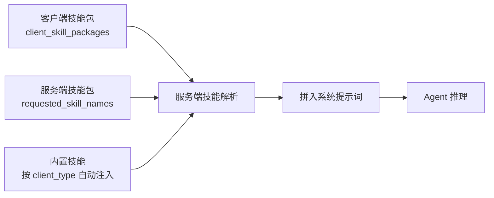
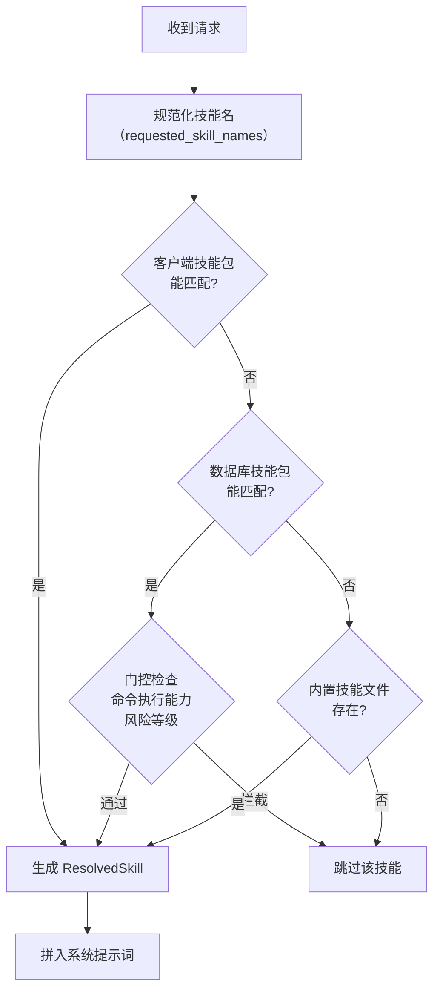

# 技能注入机制

> 本篇是协议层文档：说明客户端如何把技能上送到服务端，以及服务端如何解析、筛选并注入到系统提示词中。

## 概述

:::tip 技能 vs 工具
**技能是提示词文本注入，不是函数调用。** 技能告诉 AI「遇到某类任务应该怎么做」，工具让 AI「能做到某件事」。技能没有 handler、没有参数、没有返回值，只有 Markdown 正文。
:::

技能注入解决的核心问题：让同一个智能服务在不同客户端、不同业务场景下表现出不同的专业能力，而无需为每个场景重新配置 Flow。



## 技能的三种来源

| 来源 | 声明方式 | 说明 |
|------|----------|------|
| **客户端技能包** | 请求字段 `client_skill_packages` | 由 JS SDK / ChatUI / CLI 本地提供，随请求上送 |
| **服务端技能包** | 请求字段 `requested_skill_names` | 平台上已配置的技能包（数据库 `SkillPackage`），按名称引用 |
| **内置技能** | 无需声明 | 服务端预置，按 `client_type` 与 `request_type` 自动注入 |

### 内置技能注入规则

服务端维护两张映射表决定默认注入哪些内置技能：

- **按客户端类型**：`web` / `cli` / `desktop` 各自有默认技能集，另有 `all` 通配项对所有客户端生效
- **按请求类型**：`ask` / `agent` / `plan` 各自有默认技能集

当前内置技能包括 `echarts`（图表输出）、`mermaid`（图形输出）、`richdoc`（富文本文档）等。

## 一、客户端技能包上送

### 请求字段格式

`client_skill_packages` 支持三种形态：JSON 对象、对象数组、或指向服务端存储的路径字符串。最常用的是对象数组：

```json
{
  "input_value": "帮我生成本月销售报告",
  "request_type": "agent",
  "client_skill_packages": [
    {
      "name": "sales-report-style",
      "description": "销售报告写作规范",
      "content": "# 销售报告规范\n所有金额使用人民币，保留两位小数；\n环比变化超过 10% 需单独说明原因；\n报告结尾附数据来源说明。",
      "summary": "销售报告规范",
      "metadata": {
        "request_types": ["agent", "plan"],
        "version": "1.0.0"
      }
    }
  ]
}
```

### 字段说明

| 字段 | 类型 | 必填 | 说明 |
|------|------|------|------|
| `name` | string | ✅ | 技能唯一标识，用于引用与去重 |
| `description` | string | ❌ | 技能用途描述，帮助模型判断何时加载全文 |
| `content` | string | ✅ | 技能正文（Markdown） |
| `summary` | string | ❌ | 摘要；未提供时客户端通常取正文首个非空行（去 `#` 前缀，截断 120 字符） |
| `metadata` | object | ❌ | 元信息，见下表 |

### metadata 常用字段

| 字段 | 说明 |
|------|------|
| `request_types` | 技能适用的请求类型，如 `["agent", "plan"]`；不匹配当前 `request_type` 时不注入 |
| `version` | 语义化版本号，用于客户端检测过期与补装 |
| `requires_command_execution` | 是否需要命令执行能力；Web 端会被过滤 |
| `risk_level` | 风险等级；超出客户端允许等级时被门控拦截 |

## 二、服务端技能名称指定

复用平台上已配置的技能包，只传名称：

```json
{
  "input_value": "画一张系统架构图",
  "requested_skill_names": ["mermaid", "richdoc"]
}
```

服务端收到后按名称解析技能包内容并纳入本次会话的可用范围。

### 服务端技能包模型

数据库中的 `SkillPackage` 关键字段：

| 字段 | 说明 |
|------|------|
| `name` / `display_name` | 标识名与展示名 |
| `description` / `summary` | 描述与摘要 |
| `scope` | 作用域：`app`（应用级）/ `flow`（服务级）/ `system`（系统级） |
| `source_type` | 来源：`builtin` / `custom` / `marketplace` |
| `version` / `version_alias` | 版本号与别名 |
| `artifact_uri` / `artifact_hash` / `content_digest` | 产物地址、哈希与内容摘要 |
| `enabled` | 是否启用 |
| `requires_command_execution` | 是否需要命令执行能力 |
| `risk_level` | 风险等级 |

配套 `SkillPackageAclRule` 提供细粒度访问控制。

### 管理接口

| 端点 | 说明 |
|------|------|
| `/api/v1/skill-packages` | 技能包管理（管理端） |
| `GET /api/v1/agents/skills` | 查询当前用户可见技能（支持 `allow_elevated_risk`、`terminal_type` 上下文参数） |
| `GET /api/v1/agents/skills/{id}` | 下载技能内容 |
| `POST /api/v1/agents/skills/upload` | 上传技能（JSON 或 ZIP multipart） |

## 三、服务端解析流程



解析优先级：**客户端技能包 → 数据库技能包 → 内置技能文件**。同名技能按此顺序取先命中者。

数据库技能包受两道门控：

- `command_execution_enabled`：技能声明需要命令执行时，客户端不具备该能力则跳过
- `allow_elevated_risk`：技能风险等级超出客户端允许范围时跳过

## 四、渐进式披露（Progressive Disclosure）

技能正文可能很长，全量注入会挤占上下文窗口。太乙智启采用两级披露：

1. **摘要注入**：系统提示词中先注入技能的 `name` + `summary` + 触发条件，并标记 `is_summary`
2. **按需加载**：模型判断需要某技能时，调用 `skill` 工具加载全文

这样既保证模型"知道有哪些能力"，又避免提示词膨胀。编写技能时应把**触发条件写在 description / 摘要里**，正文写具体执行规范。

## 五、长度限制

| 限制项 | 上限 | 超限行为 |
|--------|------|----------|
| `client_instructions`（客户端附加指令） | 32000 字符 | 截断 |
| 分组提示词 | 16000 字符 | 截断 |

:::warning 实践建议
- 单个技能正文控制在数千字符内，超长内容拆分为多个技能或改为「摘要 + 按需加载」结构
- 不要把所有技能一次性全量上送；按当前任务场景筛选（ChatUI 通过 @ 技能标签让用户显式选择）
- 技能之间避免内容重复，重复会浪费上下文并可能产生冲突指令
:::

## 六、客户端同步机制

JS SDK 与 ChatUI 都实现了技能变更的自动同步：

| 机制 | 说明 |
|------|------|
| **防抖同步** | 技能注册/注销后 50ms 内的多次变更合并为一次同步（`set:client_skill_packages`） |
| **就绪同步** | 智能体就绪（`agent:ready`）后自动触发全量同步，避免早期消息丢失 |
| **立即同步** | `requested_skill_names` 设置后立即同步，不走防抖 |
| **请求级过滤** | 发起对话时按当前场景过滤技能包，只上送相关技能 |

### JS SDK 用法

```javascript
// 初始化时注入
const sdk = new TaiyiSDK({
  agentUrl: '...',
  skills: [{ name: 'my-skill', description: '...', content: '# ...' }]
})

// 运行时动态注册 / 注销
sdk.registerSkill('faq-helper', '# FAQ 应答规范\n……')
sdk.unregisterSkill('faq-helper')

// 指定服务端技能
sdk.setRequestedSkillNames(['echarts', 'mermaid'])

// 查询
sdk.getAllSkills()
sdk.getRequestedSkillNames()
```

相关事件：`skill:registered`、`skill:unregistered`、`skill:requested_names_updated`。

### ChatUI 用法

- 技能管理页：`/{flowId}/skills`，支持查看服务端可见技能、本地安装/卸载、版本比对
- 对话内 **@ 技能**：输入框中通过 @ 标签显式选择本次对话启用的技能
- 启动时自动发现本地已安装技能并检测缺失/过期，按客户端配置 `skills.auto_install_policy` 决定是否弹窗确认补装
- Web 模式传 `terminal_type='web'`，自动排除含脚本的技能

## 技能包文件格式

客户端本地技能包为 ZIP 或单文件，核心是 `SKILL.md`：

```markdown
---
name: sales-report-style
description: 当用户要求生成销售报告时使用，规范金额格式与变化说明
category: business
version: 1.0.0
metadata:
  request_types: [agent]
---

# 销售报告规范

所有金额使用人民币，保留两位小数……
```

- YAML frontmatter 声明元信息，Markdown 正文为技能内容
- ZIP 包可携带附属文件（脚本、模板、参考资料），通过 `files` 字段声明
- 客户端解析时校验 ZIP 魔术字节，解压后读取 `SKILL.md`

完整编写规范见 [SKILL.md 编写规范](/skill-development/skill-format)。

## 相关文档

- [技能是什么](/skill-development/skill-basics) — 技能概念入门
- [SKILL.md 编写规范](/skill-development/skill-format) — 编写技能
- [技能生命周期](/skill-development/skill-lifecycle) — 从编写到分发
- [JS SDK 集成](/integration/jssdk) — SDK 技能供应 API
