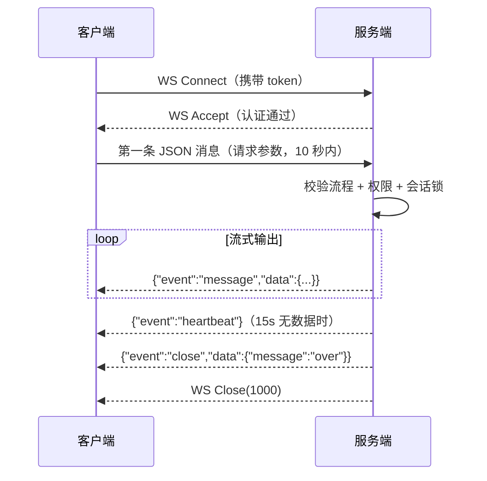

# WebSocket 接口

> 本篇是协议层文档：太乙智启提供四类 WebSocket 端点，分别服务于流式对话、客户端协同、人机语音对话与实时语音识别。

## 端点总览

| 端点 | 用途 | 面向 |
|------|------|------|
| `/api/v1/run/{flow_id_or_name}/websocket` | 流式运行智能服务（SSE 的 WS 等价形式） | 所有集成方 |
| `/api/v1/agents/client/websocket` | 客户端协同通道（在线状态、任务分发、工具回调下发） | CLI / 桌面端 / 设备端 |
| `/api/v1/agents/dialogue/websocket` | 人机实时语音对话 | 语音终端、桌面端通话面板 |
| `/api/v1/asr/websocket` | 实时语音识别（ASR） | 需要流式转写的客户端 |

辅助端点：`GET /api/v1/asr/websocket/alived`、`GET /api/v1/agents/client/websocket/alived`（探活）。

---

## 一、流式运行 WebSocket

### 端点

```
WS /api/v1/run/{flow_id_or_name}/websocket
```

输出完成后服务端主动关闭连接。

### 认证

- **Header**：`Authorization: Bearer <token>`（非浏览器客户端）
- **Query**：`?token=<token>`（浏览器 WebSocket）

也支持 `X-Credential-Username` / `X-Credential-Userid` / `X-User-Scope` 凭据头，与 HTTP 接口一致。

### 连接流程



### 请求参数（第一条消息）

连接建立后必须在 **10 秒内**发送第一条文本消息，内容为 JSON，字段与 SSE 接口的请求体完全一致（见[流式对话 API](/integration/stream-api)）：

```json
{
  "input_value": "用户输入内容",
  "session_id": "可选，不传则自动生成",
  "request_type": "ask",
  "tweaks": {},
  "master_flow_id": null
}
```

### 服务端推送格式

所有消息均为 JSON 文本帧：

```json
{"event": "<事件类型>", "data": { }}
```

| event | 含义 | data 示例 |
|-------|------|-----------|
| `message` | 正常消息/chunk 输出 | `{"chunk": "你好，我是..."}` |
| `heartbeat` | 保活心跳（15s 间隔） | `{"message": "keep-alive"}` |
| `error` | 错误信息 | `{"error": "错误描述"}` |
| `close` | 流式输出结束 | `{"message": "over"}` |
| `custom` | 自定义事件（如工具调用） | `{"event_type": "custom", ...}` |

### 关闭码约定

| 关闭码 | 含义 | 客户端处理建议 |
|--------|------|---------------|
| 1000 | 正常关闭（输出完成） | 无需重连 |
| 4001 | 认证失败 | 刷新令牌后重连 |
| 4002 | 请求参数无效 / 首条消息超时 | 检查参数与发送时机 |
| 4003 | 无权访问此智能服务应用 | 提示用户，勿重试 |
| 4004 | 智能服务不存在或不可用 | 检查 flow_id |
| 4009 | 会话正在执行中（冲突） | 等待上一轮结束或换 session_id |

### 客户端示例

**JavaScript（浏览器）**

```javascript
const ws = new WebSocket(
  `wss://your-platform/api/v1/run/${flowId}/websocket?token=${token}`
)

ws.onopen = () => {
  ws.send(JSON.stringify({
    input_value: '你好',
    session_id: 'my-session-id',
    request_type: 'ask'
  }))
}

ws.onmessage = (event) => {
  const msg = JSON.parse(event.data)
  switch (msg.event) {
    case 'message':
      process.stdout?.write?.(msg.data.chunk ?? '')
      console.log('chunk:', msg.data.chunk)
      break
    case 'close':
      console.log('流式输出完成')
      break
    case 'error':
      console.error('错误:', msg.data.error)
      break
  }
}

ws.onclose = (e) => console.log(`连接关闭: code=${e.code}, reason=${e.reason}`)
```

**Python**

```python
import asyncio, json, websockets

async def run_flow_ws(flow_id: str, token: str, input_value: str):
    uri = f"wss://your-platform/api/v1/run/{flow_id}/websocket"
    headers = {"Authorization": f"Bearer {token}"}

    async with websockets.connect(uri, additional_headers=headers) as ws:
        await ws.send(json.dumps({"input_value": input_value}))

        async for message in ws:
            data = json.loads(message)
            if data["event"] == "message":
                print(data["data"].get("chunk", ""), end="", flush=True)
            elif data["event"] == "close":
                print("\n--- 输出完成 ---")
                break
            elif data["event"] == "error":
                print(f"\n错误: {data['data']['error']}")
                break

asyncio.run(run_flow_ws("your-flow-id", "your-token", "你好"))
```

### 与 SSE 端点对比

| 维度 | SSE 端点 | WebSocket 端点 |
|------|----------|----------------|
| 协议 | HTTP `text/event-stream` | `ws://` / `wss://` |
| 请求方式 | POST Body 传参 | 连接后第一条消息传参 |
| 认证 | HTTP Header | Header / Query token |
| 数据格式 | SSE 文本帧 | JSON 文本帧 |
| 关闭 | HTTP 响应结束 | 服务端 `close(1000)` + 语义化关闭码 |
| 双向通信 | ❌ | ✅（可扩展 cancel / ack） |

### 协议选择配置

服务端「其他参数配置」的 `stream_protocol` 字段决定客户端应走哪个端点：

| 值 | 端点 |
|----|------|
| `sse`（默认） | `POST /api/v1/run/{flow_id_or_name}/stream` |
| `websocket` | `WS /api/v1/run/{flow_id_or_name}/websocket` |

ChatUI 的取值逻辑：桌面端优先用户本地偏好，其次服务端配置；Web 端直接使用服务端配置。

### 注意事项

1. 必须在连接后 10 秒内发送请求参数，否则服务端以 4002 关闭
2. 输出完成后服务端主动关闭，客户端无需手动关闭
3. 客户端断连时服务端自动取消流式任务并释放会话执行锁
4. Nginx 反向代理需配置 WebSocket 透传：

```nginx
proxy_set_header Upgrade $http_upgrade;
proxy_set_header Connection "upgrade";
proxy_read_timeout 600s;
```

---

## 二、客户端协同 WebSocket

面向 CLI、桌面端、设备端的**长连接协同通道**，用于在线状态维护、任务分发与客户端工具调用的实时下发。

### 端点

```
WS /api/v1/agents/client/websocket
```

### 消息封套

所有消息统一为三段式封套：

```json
{
  "type": "<message_type>",
  "event": "<event>",
  "payload": { }
}
```

### 事件清单

| 事件 | 方向 | 说明 |
|------|------|------|
| `connection.ready` | 服务端 → 客户端 | 连接建立成功，payload 含 `instance_id` / `client_id` / `device_id` / `session_id` / `connection_role` |
| `connection.error` | 服务端 → 客户端 | 连接异常 |
| `connection.ping` / `connection.pong` | 双向 | 心跳保活 |
| `connection.kicked` | 服务端 → 客户端 | 同标识重复连接，当前连接被踢下线 |
| `session.update` | 服务端 → 客户端 | 会话状态变更 |
| `primary_task.dispatch` | 服务端 → 客户端 | 主任务分发（如把 Web 端发起的任务转给在线 CLI 执行） |
| `task.dispatch` | 服务端 → 客户端 | 子任务下发 |
| `task.ack` | 客户端 → 服务端 | 任务接收确认 |
| `task.status` | 客户端 → 服务端 | 任务执行状态上报 |
| `task.result` | 客户端 → 服务端 | 任务执行结果 |
| `task.error` | 客户端 → 服务端 | 任务执行错误 |
| `tasks.fetch_recent` / `tasks.recent` | 双向 | 拉取近期任务 |
| `release.push` | 服务端 → 客户端 | 版本发布推送（OTA） |

### 跨进程在线状态

服务端多实例部署时，通过 Redis pubsub + presence 机制同步各实例上的在线连接，因此任意实例都能查询到全局在线客户端并投递任务。

### 配套 REST 端点

| 端点 | 说明 |
|------|------|
| `POST /api/v1/agents/client/primary-dispatch` | 转发主任务到在线客户端 |
| `GET /api/v1/agents/client/online-desktops` | 查询在线桌面端 |
| `/api/v1/agents/client/schedules` | 客户端定时任务 CRUD、启停、执行记录、结果上报 |
| `/api/v1/agents/client/collaborations` | 协同任务 CRUD |
| `POST /api/v1/agents/client/broadcast` | 跨渠道语音广播 |
| `POST /api/v1/agents/client/check-update` | 检查更新 |
| `GET /api/v1/agents/client/releases/{download_token}/download` | 下载安装包 |
| `POST /api/v1/agents/client/release/report-status` | 上报安装状态 |

---

## 三、人机语音对话 WebSocket

面向语音终端与桌面端通话面板的**全双工语音对话**通道，内部串联 VAD（语音活动检测）→ ASR → LLM → TTS 全链路。

### 端点

```
WS /api/v1/agents/dialogue/websocket
```

### 连接参数

参数全部通过 **HTTP Header** 传入（query 兜底）：

| Header | 必填 | 说明 |
|--------|------|------|
| `device-id` | ✅ | 设备 ID；缺失时服务端回一条"端口正常"消息后关闭 |
| `flow-id` | ❌ | 智能服务 ID |
| `master-flow` | ❌ | 主流程 ID |
| `client-id` | ❌ | 客户端实例 ID |
| `device-type` | ❌ | 设备类型 |
| `authorization` | ❌ | 认证令牌 |
| `session-id` | ❌ | 会话 ID |
| `tts-voice` | ❌ | TTS 音色 |
| `language` | ❌ | 语言 |
| `request-type` | ❌ | `ask` / `agent` / `plan` |
| `client-mcp-servers` | ❌ | 客户端工具清单（JSON） |
| `requested-skill-names` | ❌ | 指定技能 |
| `internet-search` | ❌ | 是否联网搜索 |
| `knowledge-scopes` / `knowledge-docs` | ❌ | 知识范围 |
| `long-term-memory-enabled` | ❌ | 长期记忆开关 |
| `group-id` | ❌ | 会话分组 |
| 唤醒 / 翻译 / VAD 相关头 | ❌ | 语音链路调优参数 |

### 特性开关

该端点受服务端特性开关 `human_ai_dialogue` 控制，未开启时不可用。

### 音频编码

语音帧使用 **Opus** 编码双向传输。Web/桌面客户端通过 libopus-wasm 完成编解码，并实现回声消除（AEC）与 30s 心跳、指数退避重连。

---

## 四、实时语音识别 WebSocket

仅做语音转文字，不含对话推理。

### 端点

```
WS /api/v1/asr/websocket
```

- 上行：Opus 音频帧
- 下行：中间转写结果与最终结果
- 心跳：30s；断线指数退避重连
- 探活：`GET /api/v1/asr/websocket/alived`

离线转写请改用 `POST /api/v1/asr/speech_to_text`（上传音频文件）。

---

## 相关文档

- [流式对话 API（SSE）](/integration/stream-api) — 文本对话推荐方式
- [客户端工具协议](/integration/client-tool-protocol) — 协同通道上的工具下发
- [语音相关接口](/reference/api/voice) — TTS / ASR / 声纹 REST 接口
- [认证与鉴权](/integration/authentication) — WS 认证与关闭码 4001
