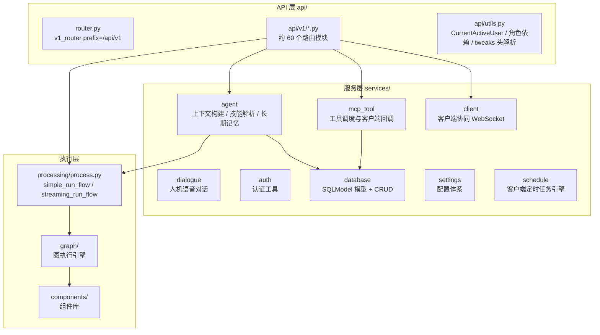
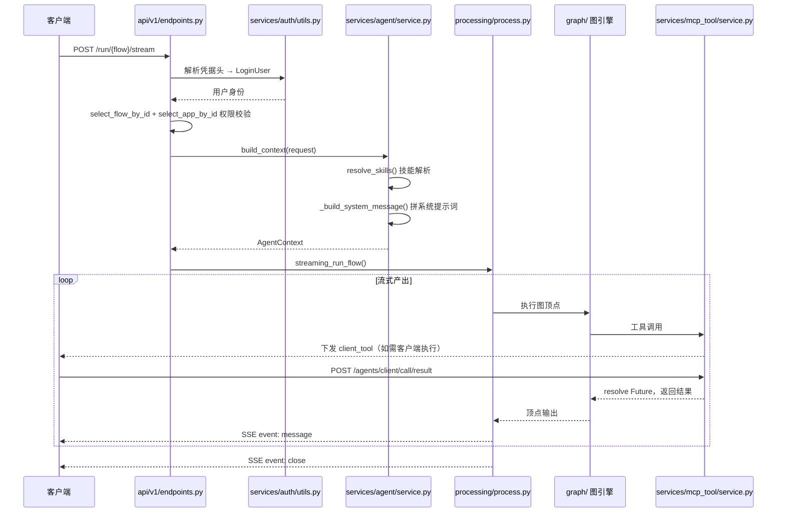
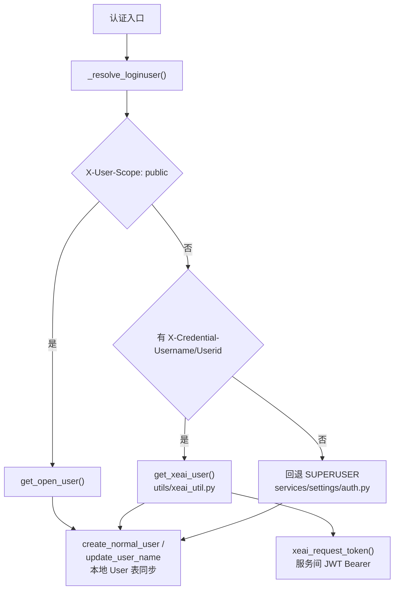
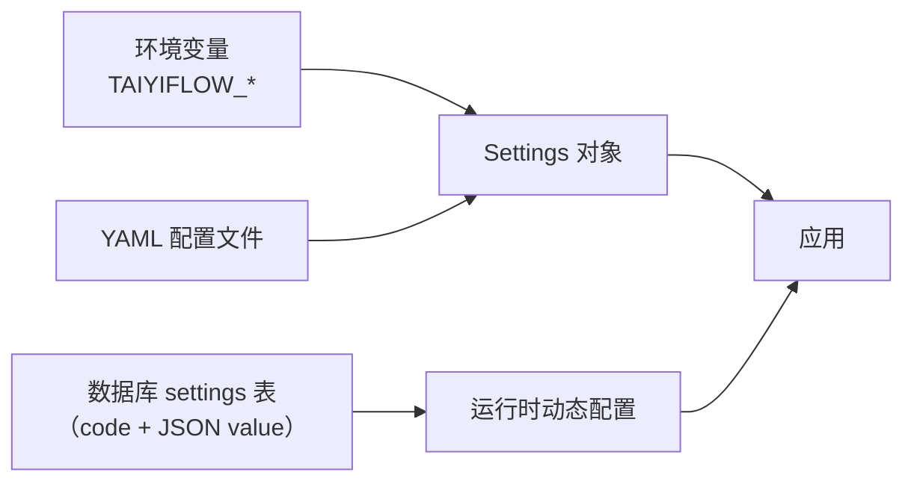

# 后端平台架构解析

> 本篇是底层实现文档：面向需要深度二次开发、排查问题或贡献代码的开发者，解析 **taiyiflow** 仓库（服务编排与运行引擎）的源码级架构。阅读本文建议同时打开仓库代码。

## 仓库总览

```
taiyiflow/
├── src/
│   ├── backend/     # 后端主体（FastAPI），核心包 src/backend/base/taiyiflow/
│   ├── frontend/    # 管理控台前端（React），构建产物挂载到后端 /html
│   ├── worker/      # Celery 工作节点（长耗时任务，Redis 作 broker）
│   └── flower/      # Celery Flower 任务监控节点
├── doc/             # 仓库内文档（websocket-stream-api.md、wiki/后端API文档.md 等）
├── test/            # 测试
└── scripts/         # 构建与运维脚本
```

四个子项目可独立部署：后端 + 前端构成主服务，worker 横向扩展处理长任务，flower 提供任务监控。

## 后端核心包结构

`src/backend/base/taiyiflow/`：

| 目录 | 职责 |
|------|------|
| `main.py` / `server.py` / `worker.py` | 应用工厂与生命周期、CLI 服务入口、Celery 任务定义 |
| `api/` | HTTP/REST 路由层 |
| `services/` | 服务层（工厂 + 依赖注入） |
| `processing/` | 流程执行核心 |
| `graph/` | 图执行引擎（graph / vertex / edge / state） |
| `components/` | 可视化编排组件库 |
| `base/` | LangChain 基础抽象（agents / chains / embeddings / memory / tools / mcp / vectorstores） |
| `custom/` | 自定义组件代码解析与加载 |
| `mcpserver/` | 平台自身作为 MCP Server 的实现 |
| `schema/` | 数据 Schema |
| `initial_setup/` | 启动预置数据（默认 flows、prompts、settings） |
| `utils/` | 常量、认证、用户中心对接 |
| `alembic/` | 数据库迁移 |

## 分层架构



### 服务装配机制

服务层采用工厂 + 依赖注入：

- `services/factory.py`：服务工厂
- `services/manager.py`：服务管理器
- `services/deps.py`：全局依赖提供函数，如 `get_settings_service()`

路由处理函数通过 FastAPI `Depends` 获取服务实例与数据库会话（`AsyncDbSession`），保证请求级隔离。

## 应用生命周期

`main.py` 的 `create_app()` 中，lifespan 阶段完成：

1. 初始化各服务（数据库连接池、缓存、存储）
2. 执行数据库迁移与 `initial_setup/setup.py` 的默认数据预置（`initialize_default_settings()` 等）
3. 启动 APScheduler 定时任务
4. 启动 MCP stream-http 会话管理器（`mcpserver/stream_http.py` 的 `StreamableHTTPSessionManager`）
5. `setup_static_files()` 挂载前端构建产物到 `/html`

运行入口环境变量：`TAIYIFLOW_HOST` / `TAIYIFLOW_PORT` / `TAIYIFLOW_WORKERS` / `TAIYIFLOW_LOG_LEVEL`。

## 一次流式请求的完整链路

以 `POST /api/v1/run/{flow_id_or_name}/stream` 为例：



### 关键源码位置

| 环节 | 文件 |
|------|------|
| 运行端点定义 | `api/v1/endpoints.py`（stream 端点约 L394，WS 端点约 L569，metadata 约 L693） |
| 请求/事件模型 | `api/v1/schemas.py`（`SimplifiedAPIRequest` 约 L790，`StreamData` 约 L221，`MCPClientCallResult` 约 L2382） |
| 简化运行 | `processing/process.py` 的 `simple_run_flow()`（约 L1570） |
| 流式运行 | `processing/process.py` 的 `streaming_run_flow()`（约 L2569） |
| 上下文构建 | `services/agent/service.py` 的 `build_context()`（约 L225） |
| 技能解析 | `services/agent/service.py` 的 `resolve_skills()`（约 L526） |
| 工具调度 | `services/mcp_tool/service.py` 的 `tool_calls()`（约 L230）、`_dispatch_client_tool()`（约 L713） |
| 客户端回调端点 | `api/v1/agent_client.py`（`/client/call/result` 约 L1104） |
| 端点常量 | `utils/constants.py`（WS 端点 L356-368，工具前缀 L418/L421） |

:::tip 行号说明
上述行号基于撰写时的代码版本，仅作定位参考。请以实际仓库为准，用符号名搜索更可靠。
:::

## StreamData：统一的流式事件模型

SSE 与 WebSocket 共用同一个事件模型，只是序列化方式不同：

```python
class StreamData(BaseModel):
    event: str
    data: dict

    def __str__(self) -> str:
        # SSE 格式
        return f"event: {self.event}\ndata: {orjson_dumps(self.data)}\n\n"

    def to_ws_json(self) -> str:
        # WebSocket 格式
        return orjson_dumps({"event": self.event, "data": self.data})
```

这意味着：**新增一种事件类型，SSE 与 WS 两个端点同时获得**，客户端处理逻辑也可复用（ChatUI 正是把 WS 消息适配成 SSE 兼容格式后走同一套 handler）。

## 认证实现细节

核心文件 `services/auth/utils.py`：



- 凭据头常量定义在 `services/auth/utils.py` 顶部（约 L30-40）
- 依赖别名 `CurrentActiveUser = Annotated[UserRead, Depends(get_current_active_user)]`（`api/utils.py`）
- 超管依赖 `get_current_active_superuser`
- WebSocket 认证入口 `get_websocket_loginuser(websocket)`
- 角色校验：`all_role_required()` / `any_role_required()`（`api/utils.py`），经 `get_xeai_user_roles()` 拉取

## 客户端工具回调实现细节

`services/mcp_tool/service.py` 的 `McpToolService` 是工具调度中枢：

### 等待机制

```
_dispatch_client_tool()
  ├─ 创建 ToolCallRecord（callback_id = "{run_id}.{call_id}"，状态 pending）
  ├─ _pending_callbacks[call_record.id] = asyncio.Future()
  ├─ _emit_to_client_side(payload, event=ToolType.client_tool)
  └─ wait_for_response=True → asyncio.wait_for(future, timeout)
```

回调到达时：

```
POST /agents/client/call/result
  → 校验 Flow 存在 + App 访问权
  → on_client_call_result()
  → resolve_callback()  # 完成 Future，唤醒等待中的推理协程
```

`_emit_to_client_side()` 依赖连接对象提供的 `client_call` 回调函数把负载推送到客户端；没有可用连接时抛 `NotImplementedError`——这就是为什么客户端工具必须建立在有效的流式连接或协同通道之上。

### 工具类型枚举

`services/database/models/mcp_tool/model.py`：

```python
class ToolType(str):
    client_tool = "client_tool"   # 客户端工具调用
    mcp_tool = "mcp_tool"         # MCP 工具调用
    built_in = "built_in"         # 内置工具调用
```

`ToolCallRecord` 表（`mcp_tool_calls`）持久化每次调用的参数、结果、状态与时间戳，可通过 `GET /api/v1/sessions/{session_id}/callrecords` 查询，是排查工具调用问题的第一手数据。

### 动态工具合并

`_try_merge_switch_to_agent_tools()`：工具结果中若含 `switch_to_agent.additional_tools`，在序列化前把新工具定义合并进当前连接的可用工具列表，实现运行中按需解锁能力。

## 技能解析实现细节

`services/agent/service.py` 的 `AgentService`：

### 关键常量

| 常量 | 值 | 说明 |
|------|-----|------|
| `MAX_CLIENT_INSTRUCTIONS_CHARS` | 32000 | 客户端附加指令上限，超限截断 |
| `MAX_GROUP_PROMPT_CHARS` | 16000 | 分组提示词上限，超限截断 |
| `DEFAULT_BUILTIN_SKILLS_BY_REQUEST_TYPE` | dict | 按请求类型的默认内置技能 |
| `BUILTIN_SKILLS_BY_CLIENT_TYPE` | dict | 按客户端类型的默认内置技能（含 `all` 通配） |

### 解析顺序

`resolve_skills()` 按优先级依次尝试：

1. **客户端技能包**（请求上送的 `client_skill_packages`）
2. **数据库技能包**（`_resolve_db_skills`，受 `command_execution_enabled` 与 `allow_elevated_risk` 门控）
3. **内置技能文件**（`_load_skill`，路径 `skills_root/<name>/SKILL.md`）

产出 `ResolvedSkill` 列表，其中 `is_summary` 标记决定是注入摘要还是全文（渐进式披露）。

### 内置技能目录

`services/agent/skills/`，每个子目录一个 `SKILL.md`（当前含 `echarts`、`mermaid`、`richdoc`）。新增内置技能只需在此目录添加文件并更新映射表。

### 数据库技能包模型

`services/database/models/skill_package/model.py`：

- `SkillPackage`：`scope` ∈ `app`/`flow`/`system`，含 `flow_id`、`owner_app_id`、`enabled`、`requires_command_execution`、`risk_level`、`artifact_uri`、`artifact_hash`、`content_digest`
- `SkillPackageAclRule`：细粒度访问控制
- 加载工具：`services/skill_package_service.py`、`skill_package/utils.py` 的 `load_resolved_skill_packages`

## 客户端协同通道实现细节

`services/client/service.py`：

- 入口 `start_client_connection()`，消息封套由 `_build_envelope()` 构造：`{type, event, payload}`
- 事件常量集中在文件顶部（约 L67-86）：`connection.*`、`session.update`、`primary_task.dispatch`、`task.*`、`tasks.fetch_recent/recent`、`release.push`
- **多实例在线状态同步**：通过 Redis pubsub + presence 实现（`_listen_broadcasts`、`list_online_connections`），因此任意后端实例都能查询全局在线客户端并投递任务

这是「Web 端发起任务 → 转给在线 CLI/桌面端执行」能力的底层支撑。

## 配置体系

### 三层配置



### 环境变量（pydantic-settings，前缀 `TAIYIFLOW_`）

`services/settings/base.py` 的 `Settings` 类：

| 分组 | 主要项 |
|------|--------|
| 基础 | `config_dir`、`dev`、`host`(127.0.0.1)、`port`(7860)、`workers`、`log_level`、`log_file`、`backend_only` |
| 数据库 | `database_url`（缺省 SQLite）、`pool_size`、`max_overflow`、`db_connect_timeout`、`sqlite_pragmas` |
| 缓存/队列 | `cache_type`(async/redis/memory/disk)、`redis_host/port/db/url`、`celery_enabled` |
| 存储 | `storage_type`(local/s3)、`s3_bucket`、`s3_endpoint_url`、`s3_access_key_id` |
| 变量 | `variable_store`(db/kubernetes)、`store_environment_variables`、`variables_to_get_from_environment` |
| 监控 | `prometheus_enabled/port`、`sentry_dsn`、`telemetry_base_url`、`do_not_track` |
| 组件加载 | `components_path`、`load_flows_path`、`laod_prompts_path` |
| 用户中心 | `xeai_service_prefix`、`xeai_access_algorithm/username/secret`、`xeai_token_expires`、`xeai_user_scope` |

`services/settings/auth.py` 的 `AuthSettings`（同前缀）：`SECRET_KEY`、`DEPLOY_ID`、`SUPERID/SUPERUSER/SUPERUSER_PASSWORD`、`APP_CODE/APP_ID`、`ROLE_GROUPS`、token 过期与 cookie 策略。`SECRET_KEY` 与 `DEPLOY_ID` 持久化在 `CONFIG_DIR/secret_key`、`CONFIG_DIR/deploy_id`。

### YAML 配置

`Settings.update_from_yaml()` / `load_settings_from_yaml()` / `save_settings_to_yaml()`。

### 数据库动态配置

`services/database/models/settings/model.py` 的 `Settings` 表（`code` 主键 + JSON `value`）：

- 启动时 `initial_setup/setup.py` 预置默认值
- REST 管理入口 `api/v1/settings.py`
- 运行时读取函数：`get_openai_settings`、`get_dialogue_settings`、`get_milvus_settings`、`get_internet_search_settings`、`get_other_parameter_settings`
- `OtherParameterSettings` 中含 `stream_protocol`（`sse`/`websocket`）、`max_scheduled_tasks_per_device` 等客户端行为开关

### 特性开关

`services/settings/feature_flags.py` 的 `FEATURE_FLAGS`，如 `human_ai_dialogue` 控制语音对话 WS 端点是否可用。

## 数据模型与多租户

| 模型 | 文件 | 要点 |
|------|------|------|
| `App` | `services/database/models/app/model.py` | 租户隔离单元，`user_scope` ∈ publish/organization/user；配套 `app_org`、`app_user` 成员授权 |
| `Flow` | `services/database/models/flow/model.py` | `owner_appid → app.id`；`(owner_appid, name, is_component)` 唯一约束；`is_chat` 区分对话型；支持影子服务与 `master_flow_id` |
| `ChatSession` | 会话模型 | 关联 flow_id、group_id |
| `ToolCallRecord` | `models/mcp_tool/model.py` | 工具调用审计 |
| `SkillPackage` | `models/skill_package/model.py` | 技能包与 ACL |

数据库访问统一走 SQLModel + 异步会话，迁移由 alembic 管理。

## 二次开发切入点

| 需求 | 切入点 |
|------|--------|
| 新增 REST 端点 | `api/v1/` 下新建路由模块 → 在 `api/router.py` 注册到 `v1_router` |
| 新增流式事件类型 | 在 `processing/process.py` 产出 `StreamData(event=...)`，SSE/WS 自动同时支持 |
| 新增内置技能 | `services/agent/skills/<name>/SKILL.md` + 更新 `BUILTIN_SKILLS_BY_CLIENT_TYPE` |
| 新增服务端工具 | `services/mcp_tool/plugins_func/register.py` 的 `ToolType` 体系 + 组件库 |
| 新增编排组件 | `components/` 下按现有组件模式实现 |
| 调整认证策略 | `services/auth/utils.py` 的 `_resolve_loginuser()` |
| 新增配置项 | `services/settings/base.py`（环境变量）或数据库 settings 表（运行时可调） |
| 新增客户端协同事件 | `services/client/service.py` 事件常量 + `_build_envelope()` |

## 相关文档

- [REST API 参考](/integration/rest-api) — 全部路由索引
- [流式对话 API](/integration/stream-api) — 运行端点契约
- [客户端工具协议](/integration/client-tool-protocol) — 工具回调闭环
- [技能注入机制](/integration/skill-injection) — 技能解析规则
- [ChatUI 内部实现](/internals/chatui-internals) — 前端如何消费这些接口
- 仓库内文档：`taiyiflow/doc/websocket-stream-api.md`、`taiyiflow/doc/wiki/后端API文档.md`
