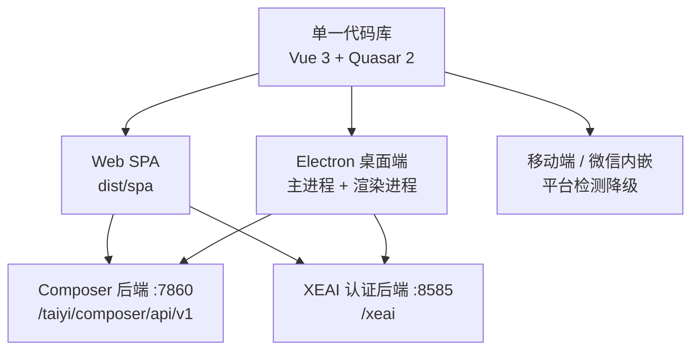
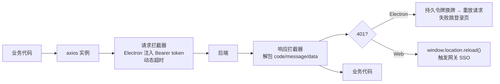
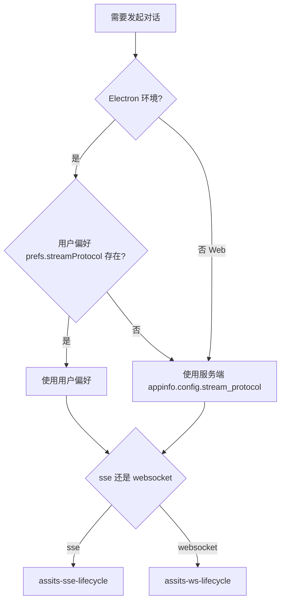
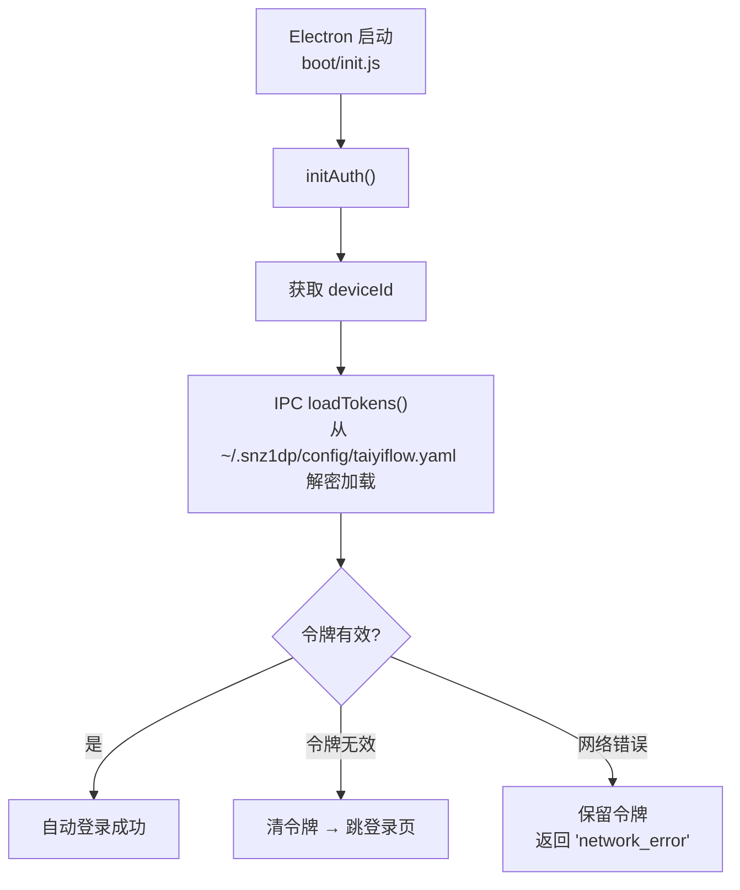
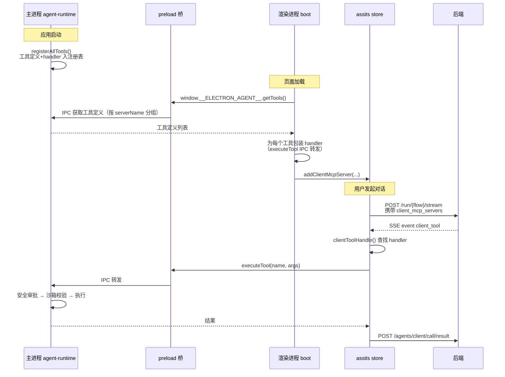
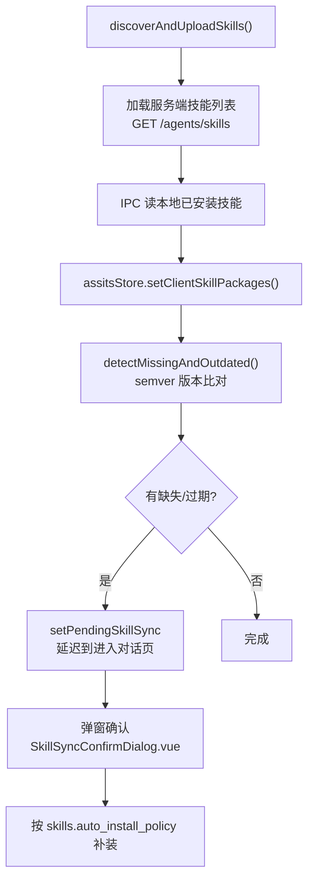

# ChatUI 内部实现

> 本篇是底层实现文档：解析 **taiyiflow-chatui** 仓库的源码级架构，面向需要二次开发对话前端、定制白标产品或排查前端链路问题的开发者。

## 项目定位

taiyiflow-chatui 是太乙智启的一体化智能体前端，同一套代码库支持三种形态：



技术栈：Vue 3（Composition API，`vueOptionsAPI: false`）、Quasar 2 + @quasar/app-vite、Pinia、Vue Router（history 模式，base `/taiyi/chat`）、axios、`@microsoft/fetch-event-source`、markdown-it + highlight.js + katex + mermaid + echarts、libopus-wasm、Electron 34。

## 目录结构

```
taiyiflow-chatui/
├── src/
│   ├── api/            # axios 接口封装（19 个模块）
│   ├── boot/           # 启动插件（theme/i18n/moment/request/init/global-components/viewer/message/guide/agent-tools-init）
│   ├── components/     # 全局组件（agent/、call/、prompt/、mention/、preview/ + 40 余个顶层组件）
│   ├── composables/    # 组合式函数（15 个）
│   ├── css/            # app.scss、dark-theme.scss、markdown.scss、quasar.variables.scss
│   ├── directives/     # middleTruncate、safeHtml
│   ├── docs/           # 内嵌帮助文档与 licenses
│   ├── i18n/           # zh.js
│   ├── js/             # audio/stream-context.js、utils/blocking-queue.js
│   ├── layouts/        # MainLayout.vue、SingelLayout.vue
│   ├── pages/          # home（对话核心）/ user / knowledge / files / skills / mcp / apps / share / about / wechat / exhibition / electron
│   ├── plugins/        # platform-detector.js
│   ├── router/         # index.js（守卫）+ routes.js
│   ├── stores/         # Pinia（35+ store，assits/ 与 device-call/ 有子模块）
│   └── utils/          # 60+ 工具模块
├── src-electron/       # Electron 主进程
│   ├── electron-main.js / electron-preload.js
│   ├── managers/       # window / tray / menu / update / power / ipc-handlers
│   ├── agent-runtime/  # 主进程工具运行时（核心）
│   └── utils/          # config-manager / device-id / chatui-prefs / logger
├── quasar.config.js    # 构建配置（路径常量、代理、分包、electron 段）
├── scripts/            # 版本注入、签名公证、技能打包
└── docs/               # wiki（13 篇）、arch（12 篇专题）、build、design
```

## 构建配置要点（quasar.config.js）

### 路径常量

文件顶部定义三个关键常量，私有化部署调整网关前缀时改这里：

| 常量 | 默认值 | 说明 |
|------|--------|------|
| `CHAT_WEB_URL` | `/taiyi/chat` | Web 页面路由 base |
| `COMPOSER_API_URL` | `/taiyi/composer/api/v1` | 业务后端前缀 |
| `XEAI_API_URL` | `/xeai` | 认证后端前缀 |

### 开发代理

devServer 端口 **4005**：

- `/taiyi/composer/api/v1` → `http://localhost:7860`（Composer）
- `/xeai` → `http://localhost:8585`（XEAI）
- WebSocket 代理：`/asr/websocket`、`/agents/client/websocket`
- 代理层注入开发者身份头 `X-Credential-Username` / `X-User-Scope`，本地开发免登录

生产 Electron 注入 `API_BASE_URL='https://snz1.cn'`；Web 端走相对路径。

### 分包与压缩

精细的 `manualChunks`：`vue-vendor` / `quasar-vendor` / `markdown-vendor` / `echarts-vendor` / `mermaid-vendor` / `office-pdf|docx|excel|pptx-vendor` / `sse-vendor` 等。生产构建启用 gzip + brotli（vite-plugin-compression）。

boot 顺序：`theme → i18n → moment → request → init → global-components → viewer → message → guide`。

## 状态管理：assits store 的模块化拆分

`src/stores/assits.js` 是**最核心的 store**（对话状态中枢）。由于逻辑极其复杂，实际实现拆分到 `src/stores/assits/` 的 18 个子模块：

| 子模块 | 职责 |
|--------|------|
| `assits-chat-core.js` | `startChatting()` / `stopChatting()`、自动续跑 |
| `assits-sse-lifecycle.js` | `buildSseOptions()`：onopen/onmessage/onclose/onerror + 空闲定时器 |
| `assits-sse-handler.js` | SSE 消息事件处理（上下文压缩、echarts、file_written、搜索结果、chunk/build） |
| `assits-ws-lifecycle.js` | WebSocket 流式对话实现 |
| `assits-tool-handle.js` | `clientToolHandle()` 客户端工具执行 |
| `assits-tool-filter.js` | `buildAvailableToolsList()` 工具白名单构建 |
| `assits-tool-preview.js` | 工具调用预览 |
| `assits-skill-filter.js` | `filterSkillPackages()` / `filterRequestedSkillNames()` |
| `assits-skill-sync.js` | `ensureRequestedSkillsInstalled()`、`retrySkillFetchAfterInstall()` |
| `assits-session.js` | 会话切换与快照 |
| `assits-pending-queue.js` | 待处理消息队列 |
| `assits-mcp-manage.js` | MCP 服务器管理 |
| `assits-subtask-state.js` | 子任务状态 |
| `schedule-tool-handle.js` | 定时任务工具处理 |
| `assits-file-ops.js` / `assits-search.js` / `assits-flow-features.js` / `assits-constants.js` | 文件操作、搜索、Flow 特性、常量 |

其他关键 store：

| Store | 职责 |
|-------|------|
| `auth.js` | 认证（登录、令牌、换牌） |
| `logged.js` | 用户信息与 appinfo（含服务端配置） |
| `server-config.js` | Electron 服务器地址配置 |
| `skill-store.js` | 技能（服务端可见、本地安装、版本比对） |
| `mcp-store.js` | MCP 连接管理 |
| `device-call.js` + `device-call/`（9 个子模块） | 语音通话 |
| `tts.js` | TTS 流式播放 |
| `voice-delegate.js` | 语音指令委派给文本会话 |
| `subtask-manager.js` / `subtask-stream-store.js` | 子任务管理 |
| `store-registry.js` | 跨模块 store 注册，**避免循环依赖** |
| `theme.js` / `network-status.js` / `event-bus.js` / `workspace.js` / `inapp-browser.js` / `client-collab.js` | 主题、网络状态、事件总线、工作区、内置浏览器、协同 |

:::tip store-registry 的设计意图
Pinia store 之间互相引用容易形成循环依赖（assits ↔ skill-store ↔ mcp-store）。`store-registry.js` 提供延迟获取机制，模块在运行时按需取用其他 store 实例，而非顶层 import。二次开发新增 store 交互时应沿用此模式。
:::

## 通信层实现

### HTTP 封装（src/utils/request.js）



- baseURL = `getApiBaseUrl() + getComposerApiUrl()`
- 默认超时 **600s**（对齐 CLI 的 `http_timeout_seconds`，流式对话可能很长）
- 支持 `config.retry` / `retryDelay` 重试、`returnRawData`（不解包）、`notFoundReturn`、blob/stream 透传
- 换牌去重：`_tokenRefreshPromise` 保证并发 401 只触发一次换牌
- 导出 `registerAuthStore` / `refreshAccessToken` / `updateRequestBaseURL`（运行时切换服务器）

### 运行时配置（src/utils/runtime-config.js）

单例管理 `apiBaseUrl` / `composerApiUrl` / `xeaiApiUrl`，可运行时变更。Electron 端由 `stores/server-config.js` 持久化到 `~/.snz1dp/config/taiyiflow.yaml`——**与 CLI 共享同一份配置**。

### API 模块（src/api/）

| 模块 | 对应后端 |
|------|----------|
| `agents.js` | `/agents/*` 智能体客户端接口 |
| `flow.js` | `/run/{flowId}/metadata` |
| `client_call.js` | `/agents/client/call/result`（工具回调）、发版状态上报 |
| `skills.js` | `/agents/skills*` |
| `agent-mcp.js` | `/agents/mcp` |
| `files.js` / `knowledges.js` / `prompts.js` / `shares.js` | 文件、知识库、提示词、分享 |
| `asr.js` | `/asr/speech_to_text` |
| `voice-broadcast.js` | `/agents/client/broadcast` |
| `auth.js` | **独立 axios 实例**，baseURL 指向 `/xeai`，30s 超时 |
| `appinfo.js` / `profile.js` / `sysuser.js` / `health.js` / `verify.js` / `collaboration.js` / `exhibition.js` | 应用信息、用户、健康检查等 |

### SSE 流式对话

入口 `assits-chat-core.js` 的 `startChatting()`：

```javascript
fetchEventSource(`${host}/taiyi/composer/api/v1/run/${flowId}/stream`, {
  method: 'POST',
  body: JSON.stringify(payload),
  ...buildSseOptions()   // onopen/onmessage/onclose/onerror + 空闲定时器
})
```

选择 `@microsoft/fetch-event-source` 而非原生 `EventSource` 的原因：原生 EventSource 只支持 GET 且无法自定义请求头，而本接口需要 POST + 认证头。

### 流式协议切换（src/utils/stream-protocol.js）



### WebSocket 流式对话（assits-ws-lifecycle.js）

- URL：`/run/{flowId}/websocket`，`http→ws`、`https→wss`，令牌通过 URL 携带
- 连接后首条消息发送 SimplifiedAPIRequest JSON
- 服务端推 `{event, data}`，`event === "close"` 后关闭连接
- **关键设计**：WS 消息被适配成 SSE 兼容格式后，复用 `assits-sse-handler.js` 同一套处理逻辑，避免两套协议各写一遍业务处理

### 语音链路

| 能力 | 实现 |
|------|------|
| 实时 ASR | `src/utils/asrWebsocket.js` 的 `AsrWebSocketClient`：连 `/asr/websocket`，Opus 帧上行，30s 心跳，指数退避重连最多 20 次，回声抑制 |
| Opus 编解码 | `src/utils/opus-utils.js`（libopus-wasm） |
| 麦克风设备 | `src/utils/audio-devices.js` |
| 桌面/移动 ASR | `src/composables/useDesktopAsr.js`、`useMobileVoice.js` |
| 离线转写 | `src/utils/audioSpeech.js` + `api/asr.js`（Blob→WAV 后上传） |
| TTS 播放 | `src/stores/tts.js`（fetch 流 + MediaSource，倍速播放，401 换牌） |
| 实时通话 | `src/stores/device-call/`：`call-connection.js`（WS 连接与 OTA 配置）、`call-protocol.js`（STT/LLM/TTS 协议）、`audio-capture.js`/`audio-playback.js`（Opus 采集播放）、`aec-loopback.js`（回声消除）、`call-mcp.js`（通话中 MCP 工具）；UI 为 `components/call/CallPanel.vue` |
| 语音委托 | `stores/voice-delegate.js`：语音指令委派给文本会话 `startChatting` |
| 语音广播 | `api/voice-broadcast.js`：ask_user 问题广播到语音会话 TTS 播报 |

## 认证实现

### API 层（src/api/auth.js）

独立 axios 实例指向 `/xeai`：

| 流程 | 端点序列 |
|------|----------|
| 密码登录 | `GET /oauth/api/password_token`（取 RSA 公钥 + ticket）→ `utils/crypto.js` 的 `encryptPasswordWithPublicKey`（jsencrypt）→ `POST /ajax_logon`（form-urlencoded） |
| 验证码挑战 | 错误码 404/405/408 触发：`GET /kaptcha/image`（图形码）、`POST /send_verify` → `/send_verify/validate`（短信/邮箱/TOTP） |
| 扫码登录 | `GET /oauth/api/channel_names`（判断支持）→ `GET /oauth/api/token`（取二维码）→ 轮询 `GET /oauth/api/wait_event`（3s 间隔，state 0 等待/1 成功/9 过期/-1 取消） |
| 持久令牌 | `POST /logged/persistent_token`（创建）→ 换牌：`GET /sso/salt` → SHA-256(deviceId + salt) 签名 → `POST /sso` |

### Store 层（src/stores/auth.js）



**区分「令牌无效」与「网络错误」是重要的健壮性设计**：离线启动时不能误清用户令牌。

- `_handleLoginSuccess`：保存 accessToken；勾选"记住"时创建并持久化 persistentToken（IPC `saveTokens`）
- `logout()`：清理服务端安装的本地技能包、MCP 连接缓存与 Stdio 子进程、清除令牌
- 登录页 `src/pages/electron/LoginPage.vue`（路由 `/electron/login`，属 `constantRoutes` 免认证）
- 跳转封装 `src/utils/electron-nav.js` 的 `navigateToLogin`

Web 环境不做本地登录：401 时 `window.location.reload()`，由网关 SSO 完成重定向（`BUILD.yaml` 的 ingress 为 `/taiyi/chat` 配置了 sso）。

## 客户端工具运行时（Electron）

这是 ChatUI 桌面端最核心的能力：**工具在主进程实现，渲染进程通过 IPC 桥接注册到对话流**。



### 主进程工具注册表

`src-electron/agent-runtime/index.js` 维护 `toolRegistry`（Map）+ `handlerIndex`；`register-all.js` 的 `registerAllTools()` 在 `electron-main.js` 启动时调用。

| 工具模块 | 能力 |
|----------|------|
| `file-tools.js` | 本地文件读/写/编辑/glob/搜索 |
| `shell-tools.js` | Shell 执行、后台任务系列、终端输出捕获 |
| `cli-tools.js` | CLI 相关工具 |
| `browser-tools.js` | 浏览器自动化 |
| `computer-tools.js` | 桌面截图与输入 |
| `document-tools.js` | `document_unstructured`、`image_understanding` |
| `subtask-tools.js` | `run_subtask` 子任务并行调度 |
| `skill-tools.js` | 技能加载 |
| `schedule-tools.js` | 定时任务 |
| `todo-tools.js` / `session-tools.js` | 待办清单、会话工具 |
| `ask-user.js` | 向用户收集澄清信息 |
| `sso-token-tools.js` | 获取产物下载令牌 |
| `mcp-stdio-manager.js` | Stdio MCP 子进程管理 |
| `inapp-browser-manager.js` / `inapp-browser-recorder.js` | 内置浏览器 |
| `security.js` | 审批模式、沙箱、权限规则 |
| `file-snapshot.js` | 文件变更快照（Diff 视图） |
| `instructions.js` | 指令注入 |
| `http-client.js` / `runtime-detect.js` | HTTP 客户端、运行时探测 |
| `builtin-skills/` + `bundled-skills-content.js` | 27 个内置技能 |

### 渲染进程桥接（src/boot/agent-tools-init.js）

`registerAgentTools()`：

- **Electron 模式**：`window.__ELECTRON_AGENT__.getTools()` 获取按 serverName 分组的工具定义 → 为每个工具包装 handler（`executeTool(name, args)` IPC 转发主进程）→ 注册到 `assitsStore.addClientMcpServer()`
- **Web 模式**：只注册 `src/utils/mcp-builtin-tools.js` 的 7 个 MCP 管理内置工具（`mcp_list_servers`、`mcp_toggle_tool` 等），因为浏览器无法执行本地操作

### 工具执行回路

后端 SSE 推 `client_tool` → `assits-tool-handle.js` 的 `clientToolHandle()` 查找 handler 执行 → 结果经 `src/utils/client-mcp.js`（`getCallbackData` / `toolCallResult`）组装 → `api/client_call.js` 的 `POST /agents/client/call/result` 回传。

特殊工具走专用处理路径：

| 工具 | 处理模块 |
|------|----------|
| `ask_user` | `utils/ask-user-renderer.js`（弹窗收集用户输入） |
| 模式切换 | `utils/mode-switch-renderer.js` |
| `run_subtask` | `stores/subtask-manager.js`（详见 `docs/wiki/subtask-architecture.md`） |
| 定时任务 | `assits/schedule-tool-handle.js` |

### 外部 MCP 服务器

`src/utils/mcpClient.js`：JSON-RPC 2.0 客户端，支持 **Stdio / Streamable HTTP / SSE** 三种传输，带会话与端点缓存复用。配置持久化 `src/utils/mcpConfig.js`（Electron：`~/.snz1dp/config/mcp.json`；Web：localStorage）。

### 安全审批体系（agent-runtime/security.js）

| 机制 | 说明 |
|------|------|
| approval mode | 审批模式（自动/确认/只读） |
| sandbox roots / escape policy | 沙箱根目录与越界策略 |
| 写确认策略 | 文件写入前确认 |
| 技能审查策略 | 技能脚本执行前审查 |
| browser / computer 权限模式 | 浏览器与桌面操作的独立权限开关 |

## 技能管理实现

### 启动发现与同步（boot/agent-tools-init.js）



### Store（src/stores/skill-store.js）

管理服务端可见技能、安装记录、本地安装/卸载（IPC `getSkillPackages` / `installSkill` / `uninstallSkill`）、semver 版本比较、缺失与过期检测（`detectMissingAndOutdated`）、自动补装（`syncMissingSkills` / `syncOutdatedSkills`）、默认加载技能持久化（localStorage）。

### 请求级过滤

发起对话时 `assits-skill-filter.js` 的 `filterSkillPackages()` / `filterRequestedSkillNames()` 过滤技能包随请求上送；`assits-skill-sync.js` 的 `ensureRequestedSkillsInstalled()` 保证请求的技能已安装（含 `retrySkillFetchAfterInstall` 安装后重试拉取）。

### 技能包格式（src/utils/skill-pack.js）

ZIP 魔术字节校验 → fflate 解压 → `SKILL.md` YAML frontmatter 解析 → `name` / `display_name` 约定处理。

### UI

| 组件 | 说明 |
|------|------|
| `pages/skills/Index.vue` | 技能管理页（路由 `/:flowId/skills`） |
| `components/agent/SkillManagePanel.vue` | 管理面板 |
| `SkillDetailPanel.vue` / `SkillDetailDialog.vue` | 详情 |
| `SkillSyncConfirmDialog.vue` / `SkillUploadConfirmDialog.vue` | 同步/上传确认 |
| `composables/useSkillManagement.js` | 对话内 @ 技能（`initDefaultSkillTags` 生成标签；Web 模式传 `terminal_type='web'` 排除含脚本技能） |

## Electron 主进程架构

### 入口

| 文件 | 职责 |
|------|------|
| `electron-main.js` | 单实例锁、AppUserModelID、权限请求 handler、CORS、托盘、窗口、更新管理器、电源管理、全局快捷键 |
| `electron-preload.js` | contextBridge 暴露桥接对象；同步取主题防闪白 |

### preload 暴露的桥

| 全局对象 | 用途 |
|----------|------|
| `window.__ELECTRON_AUTH__` | 令牌加载/保存（`loadTokens` / `saveTokens`） |
| `window.__ELECTRON_AGENT__` | 工具定义获取与执行（`getTools` / `executeTool`）、技能包管理 |
| `window.__ELECTRON_PREFS__` | 用户偏好（含 `streamProtocol`） |
| `window.__ELECTRON_THEME__` | 主题 |
| `window.__ELECTRON_LOG__` | 日志 |

### managers/

`window-manager.js`（窗口创建/重建/显示）、`tray-manager.js` + `tray-icon.js`（系统托盘）、`menu-manager.js`（应用菜单）、`update-manager.js`（自动更新）、`power-manager.js`（防休眠）、`ipc-handlers.js`（全部 IPC 注册）。

### utils/

`config-manager.js`（读写 `~/.snz1dp/config/taiyiflow.yaml`，**与 CLI 共享**）、`device-id.js`、`chatui-prefs.js`（`chatui-preferences.json`）、`notes-manager.js`、`logger.js`、`constants.js`、`devConfig.js`。

### 渲染端配套

`components/ElectronDragBar.vue`、`ElectronWindowControls.vue`（自绘窗口控制）、`composables/useElectronDrag.js`、`utils/electron-nav.js`、`stores/server-config.js` + `pages/user/EditServerConfig.vue`（服务器地址切换）、`components/UpdateNotifier.vue` / `VersionUpdateDialog.vue`、`stores/inapp-browser.js` + `components/agent/InAppBrowserTab.vue`。

### 打包内置运行时

安装包打入 `taiyiflow-cli`、Python、Node 到 `bin/`，素材目录 `build/runtime-assets/<platform>-<arch>/`、`build/electron-extra/`。这使得桌面端无需用户预装任何运行时即可执行技能脚本与 CLI 工具。

## 构建与部署

### Web SPA

```dockerfile
# 两阶段构建
阶段1: snz1.cn/base/node:20-alpine
       npm install && node scripts/update-version.js && quasar build
阶段2: snz1.cn/dp/vueapp:2.2
       复制 dist/spa → /app/html
       注入 nginx/default.conf + scripts/40-replace-context-path.sh
```

`nginx/default.conf`：gzip、SPA history 回退（`rewrite ^/(.*) /index.html`）。

`BUILD.yaml`：镜像 `snz1.cn/taiyiflow/chatui`，linux/amd64 + arm64，端口 `5000:80`，环境变量 `WEB_CONTEXT_PATH=/taiyi/chat`、`TZ=Asia/Shanghai`，健康检查 `/health`，ingress 配置 SSO（`/taiyi/chat`）与匿名路径（`/js/libs`，600s 读写超时，供书签小工具 JS 库）。

### Electron

| 目标 | 说明 |
|------|------|
| `make electron-image` | packager 目录包 |
| `make electron-builder-image` / `electron-builder-host` | 安装包（镜像内/本机构建） |
| `make electron-installers-{windows,linux,macos}` | 各平台安装包 |
| `make sign-windows` | Windows 签名 |
| `make download-runtime-assets` / `prepare-electron-runtime-bin` | 运行时素材准备 |

`Dockerfile.electron`：Alpine 容器内构建（国内镜像源，Linux 用 Ruby fpm 打 deb/rpm，Windows 用 Wine）。

`quasar.config.js` electron 段：

- packager `afterComplete` 钩子：复制 builtin-skills / tray-icon / 运行时 bin；Windows/Linux 可执行文件重命名为 `TaiyiAgent`；macOS Mach-O 逐个签名 + 深度签名 + 验证
- builder：appId `taiyiflow-agent`；mac dmg/zip + hardenedRuntime + entitlements（`build/entitlements.mac.plist`）；win NSIS + Certum 云证书签名（`scripts/custom-win-sign.js`）+ `build/installer.nsh` 静默卸载旧包；linux deb/rpm

签名公证脚本：`scripts/after-pack.js`、`after-sign.js`（`@electron/notarize`）、`after-all-artifact-build.js`、`notarize-utils.js`、`sign-windows.js`、`fix-linux-packages.js`、`package-linux-installers.js`。指南：`docs/build/macOS构建签名公证指南.md`。

辅助脚本：`update-version.js`（写 `public/version.json`）、`copy-pdfjs-assets.js`（postinstall）、`gen-bundled-skills.js`（内置技能打包）、`electron-preview.js`、`40-replace-context-path.sh`。

## 二次开发切入点

| 需求 | 切入点 |
|------|--------|
| 新增对话页功能 | `src/pages/home/` + `src/stores/assits/` 对应子模块 |
| 新增 API 调用 | `src/api/` 新建模块，复用 `utils/request.js` 实例 |
| 新增 SSE 事件处理 | `src/stores/assits/assits-sse-handler.js` |
| 新增桌面端工具 | `src-electron/agent-runtime/` 新建工具模块 → 在 `register-all.js` 注册 |
| 调整工具权限 | `src-electron/agent-runtime/security.js` |
| 新增 store | `src/stores/`，跨 store 引用走 `store-registry.js` |
| 品牌定制 | 见[ChatUI 前端集成与二次开发](/integration/chatui)的白标扩展点表 |
| 新增内置技能 | `src-electron/agent-runtime/builtin-skills/` → 重跑 `gen-bundled-skills.js` |
| 调整网关前缀 | `quasar.config.js` 顶部三个常量 |
| 新增语言 | `src/i18n/` 添加语言包 + `boot/i18n.js` 注册 |

## 仓库内文档

ChatUI 自带完善的 wiki，深度开发时优先查阅：

| 文档 | 内容 |
|------|------|
| `docs/wiki/Home.md` | 项目概述、技术栈、文档索引 |
| `docs/wiki/Architecture.md` | 分层架构图 |
| `docs/wiki/Getting-Started.md` | 环境搭建（Node 20 + Quasar CLI，dev 端口 4005） |
| `docs/wiki/Directory-Structure.md` | 目录详解 |
| `docs/wiki/Routing.md` | asyncRoutes/constantRoutes、双布局 |
| `docs/wiki/State-Management.md` | Pinia store 清单与职责 |
| `docs/wiki/API-Layer.md` | api 模块表、axios 封装与错误处理 |
| `docs/wiki/Electron-Integration.md` | 主/渲染进程模型、IPC、安全策略 |
| `docs/wiki/Agent-Runtime.md` | 主进程工具运行时 |
| `docs/wiki/subtask-architecture.md` | `run_subtask` 完整架构（本地/远程路由、嵌套防护、独立取消、超时保护、与 Go CLI 函数对齐表） |
| `docs/wiki/Components.md` / `Configuration.md` / `Build-and-Deployment.md` | 组件、环境变量表、三种构建模式 |
| `docs/arch/`（12 篇） | 专题方案：sdk客户端工具调用、WS实时语音识别流程、产物变更Diff对比视图、文件预览方案、右侧抽屉面板使用指南等 |

## 相关文档

- [ChatUI 前端集成与二次开发](/integration/chatui) — 部署与定制视角
- [后端平台架构解析](/internals/backend-architecture) — 服务端实现
- [JS SDK 内部实现](/internals/jssdk-internals) — SDK 如何与 ChatUI 协作
- [流式对话 API](/integration/stream-api)、[WebSocket 接口](/integration/websocket-api) — 通信契约
