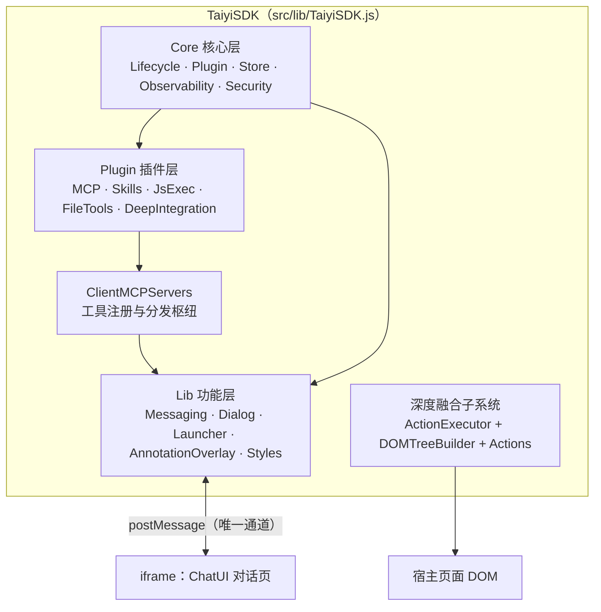
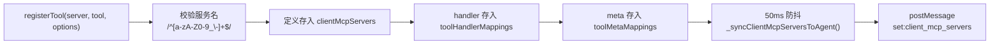
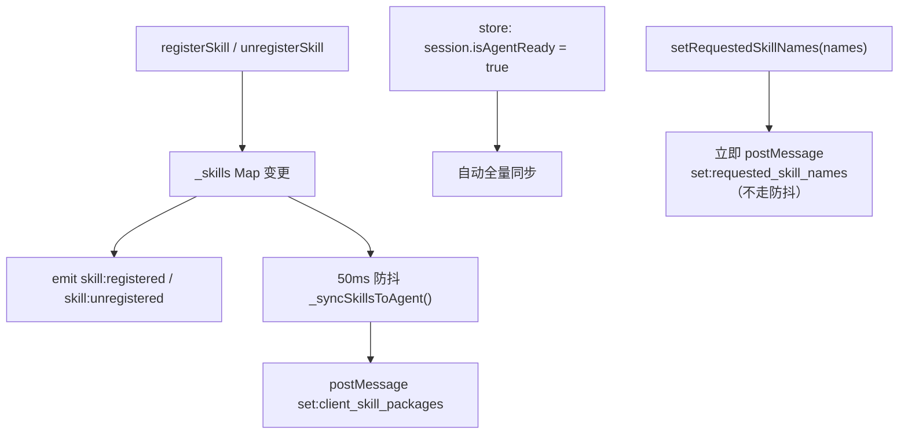
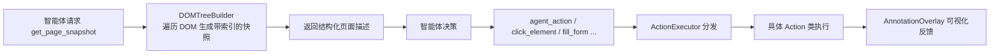

# JS SDK 内部实现

> 本篇是底层实现文档：解析 **taiyiflow-jssdk** 仓库的源码级架构，面向需要定制 SDK 行为、编写插件或排查 postMessage 通信问题的开发者。SDK 版本 1.0.0，npm 包名 `taiyiflow`。

## 设计定位

SDK 的核心设计约束：

1. **零运行时依赖**：`package.json` 的 dependencies 为空，所有能力自实现，避免与宿主页面的依赖冲突
2. **不直接访问后端**：与后端的 SSE/WebSocket/REST 通信全部由 iframe 内的 ChatUI 承担，SDK 只与 ChatUI 通过 postMessage 协作
3. **插件化**：核心能力（MCP 工具、技能、代码执行、文件工具、深度融合）都是可插拔的插件，宿主可按需关闭
4. **代码混淆分发**：生产构建启用 javascript-obfuscator，保护实现细节

## 目录结构

```
taiyiflow-jssdk/
├── src/
│   ├── index.js                 # 包入口，export default TaiyiSDK
│   ├── demo.js                  # IIFE 演示入口（挂载 window.TaiyiSDK 并自动实例化）
│   ├── lib/                     # 功能层
│   │   ├── TaiyiSDK.js          # SDK 入口类，聚合全部子系统
│   │   ├── Dialog.js            # 对话框 UI（iframe 容器、拖拽、全屏、吸附、容器模式）
│   │   ├── Launcher.js          # 悬浮图标（拖拽、边缘吸附、半隐藏）
│   │   ├── Messaging.js         # postMessage 通信封装
│   │   ├── ClientMCPServers.js  # 工具注册与调用分发（核心）
│   │   ├── AnnotationOverlay.js # 可视化标注层
│   │   └── Styles.js            # CSS 注入/移除
│   ├── core/                    # 核心层
│   │   ├── base/EventEmitter.js
│   │   ├── lifecycle/LifecycleManager.js
│   │   ├── state/Store.js       # 路径式全局状态
│   │   ├── plugin/              # Plugin 基类 + PluginManager
│   │   ├── observability/       # ErrorBoundary / RecoveryManager / PerformanceMonitor / HealthChecker
│   │   ├── security/            # PermissionManager / SecurityPolicy / AuditLogger
│   │   ├── actions/             # Agent Action（Click/FillForm/Highlight/Annotate/ScrollTo/DOMQuery/PageSnapshot）+ ActionExecutor
│   │   ├── context/             # ContextProvider / ContextRegistry / PageContextCollector
│   │   └── tools/               # DOMTreeBuilder / SandboxEngine / FileProcessor
│   ├── plugins/                 # 5 个内置插件
│   ├── mcp/                     # 内置工具定义
│   ├── skills/                  # 内置技能（custom.md 以 ?raw 导入）
│   ├── utils/                   # logger / constants / icons / client-mcp / ui/AskUserDialog
│   └── types/index.d.ts         # TypeScript 类型定义
├── examples/                    # 三个 HTML 示例
├── __tests__/                   # vitest 测试
├── vite.config.js               # ESM + UMD 主构建
└── vite.iife.config.js          # IIFE 构建
```

## 分层架构



## 通信通道：Messaging

`src/lib/Messaging.js` 是 SDK 与 ChatUI 之间的唯一桥梁。

### 消息封套

```javascript
// 发送
targetWindow.postMessage({
  source: 'taiyiflow-sdk',   // SDK_SOURCE
  type: '<message_type>',
  payload: { ... }
}, origin)

// 接收：只处理 source === 'taiyiflow-agent' 的消息
handleMessage(event) {
  if (this.origin !== '*' && event.origin !== this.origin) return  // 源校验
  if (event.data?.source !== AGENT_SOURCE) return
  this.emit(event.data.type, event.data.payload)
}
```

常量定义在 `src/utils/constants.js`：`SDK_SOURCE = "taiyiflow-sdk"`、`AGENT_SOURCE = "taiyiflow-agent"`、完整 `MESSAGE_TYPE` 清单。

### 目标窗口绑定时机

`Dialog.js` 创建 iframe 后，在 `iframe.onload` 中调用 `Messaging.setTarget(iframeWindow)`。这意味着 **iframe 加载完成前发送的消息会丢失**——这正是「就绪同步」机制存在的原因（见下文）。

### iframe 安全属性

```html
<iframe
  sandbox="allow-scripts allow-same-origin allow-popups allow-storage-access-by-user-activation allow-modals"
  allow="cookie; storage-access; microphone">
```

`allow-storage-access-by-user-activation` + `allow="storage-access"` 是为跨站 Cookie 场景准备的：宿主页面与平台不同域时，ChatUI 需要通过 Storage Access API 获取登录态。

### 消息类型全表

| 类型 | 方向 | 用途 |
|------|------|------|
| `init` | SDK → Agent | 初始化 |
| `agent:ready` | Agent → SDK | 智能体就绪，触发全量同步 |
| `start_chat` | SDK → Agent | 主动发起对话 |
| `close` | SDK → Agent | 关闭 |
| `set:client_mcp_servers` | SDK → Agent | 同步工具定义 |
| `set:client_skill_packages` | SDK → Agent | 同步技能包 |
| `set:requested_skill_names` | SDK → Agent | 指定服务端技能 |
| `client_tool` | Agent → SDK | 请求执行工具 |
| `finish:client_tool` | SDK → Agent | 回传工具结果 |
| `mcp_tool` | Agent → SDK | MCP 工具调用 |
| `tool:permission_request` / `tool:permission_response` | 双向 | 工具权限申请 |
| `tool:progress` / `tool:cancel` | 双向 | 长任务进度与取消 |
| `file:upload_request` / `file:upload_response` / `file:download` | 双向 | 文件传输 |
| `flow_metadata` | Agent → SDK | 智能服务元信息（名称等） |
| `skill:list` | Agent → SDK | 技能列表查询 |
| `ping` / `pong` | 双向 | 心跳 |
| `general` / `error` | 双向 | 通用消息与错误 |
| `toggle_show_sidebar` / `new_chat` / `start_dialogue` | SDK → Agent | UI 控制（`Dialog.js` 的 `toggleMenu`/`newChat`/`startDialogue`） |

## 工具注册与分发：ClientMCPServers

`src/lib/ClientMCPServers.js` 是 SDK 最核心的模块，维护三张表：

| 表 | 键 | 值 | 用途 |
|----|-----|-----|------|
| `clientMcpServers` | serverName | 工具定义数组 | **纯定义**，同步给智能体（不含 handler，不可序列化） |
| `toolHandlerMappings` | `"<server>-<tool>"` | handler 函数 | 本地执行 |
| `toolMetaMappings` | `"<server>-<tool>"` | meta 对象 | 权限与 requestModes 声明 |

这种「定义与实现分离」的设计是必要的：postMessage 只能传结构化克隆数据，函数无法跨窗口传递，因此同步给智能体的只有 JSON Schema 定义，handler 留在宿主页面本地。

### 注册流程



**50ms 防抖**的意义：宿主页面初始化时往往连续注册多个工具，防抖把多次变更合并为一次同步，避免消息风暴。`syncClientMcpServersToAgent()`（无下划线前缀）是立即同步版本，用于 `agent:ready` 时机。

### 调用分发

```
clientToolHandle(message)
  ├─ 解析 message.server.name / message.function.name
  ├─ 精确匹配 "<server>-<tool>"
  │   └─ 失败 → 按 toolName 后缀回退匹配（兼容 c_ 前缀与命名拼接差异）
  ├─ _beforeExecuteHooks（权限申请 + 性能计时）
  ├─ handler(args)
  ├─ _afterExecuteHooks
  └─ finishClientCallResult(callback_data) → postMessage finish:client_tool
```

**后缀回退匹配**是重要的健壮性设计：服务端下发的工具名可能带 `c_` 前缀或服务器名拼接，与注册时的裸名不完全一致。

错误处理区分两类：`PERMISSION_DENIED`（用户拒绝授权）与一般执行错误，回传时携带不同的 `error_message`，让模型能采取不同策略（前者应放弃该路径，后者可重试）。

### 结果回填

`src/utils/client-mcp.js`：

```javascript
toolCallResult(success, result, error_message)   // 构造结果对象
getCallbackData(flowId, message, result)         // 回填 flow_id/session_id/message_id/run_id/call_id
executeToolCall(params, fn)                      // try/catch 包装
```

回填的五个 ID 最终由 ChatUI 用于 `POST /api/v1/agents/client/call/result` 回调——SDK 自己不发起这个 HTTP 请求。

### MCPPlugin 的拦截器机制

`src/plugins/MCPPlugin.js` 安装时向 ClientMCPServers 注册两类拦截器：

- **权限拦截器**：读取工具 `meta.permissions`，执行前逐项调用 `PermissionManager.request()`
- **性能拦截器**：`PerformanceMonitor` 记录每次工具调用的耗时与次数

这是「横切关注点通过 hook 注入」的典型实现——核心分发逻辑不感知权限与监控。

### 内置工具

注册在 `build-in-server` 下，定义分布于 `src/mcp/`：

| 文件 | 工具 |
|------|------|
| `agent-action-tools.js` | `agent_action`、`get_page_snapshot`、`highlight_element`、`annotate_element`、`fill_form`、`scroll_to_element`、`query_dom`、`click_element`、`ask_user` |
| `code-exec-tools.js` | `execute_javascript` |
| `file-tools.js` | `read_file`、`upload_file`、`write_file`、`download_file` |
| `page-tool.js` | `open_page`（`registerPageTool` 已标记 @deprecated） |

## 技能供应：SkillsPlugin

`src/plugins/SkillsPlugin.js` + `src/skills/index.js`（内置技能 `custom.md` 经 Vite `?raw` 导入为字符串）。

### 内部状态

`_skills: Map<name, {name, description, content, summary, metadata}>`

### 同步机制



技能包格式：`{ name, description, content, summary, metadata }`。`summary` 由 `_extractSummary` 生成——取正文首个非空行、去掉 `#` 前缀、截断 120 字符，用于服务端的渐进式披露。

**为什么 requestedSkillNames 不走防抖**：它只是一个字符串数组，体积小且通常是用户显式操作（如勾选技能），需要立即生效。

## 状态管理：Store

`src/core/state/Store.js` 提供路径式状态访问：

```javascript
sdk.getStore().get('ui.isOpen')
sdk.getStore().set('session.isAgentReady', true)
sdk.subscribe('ui.isOpen', (value) => { ... })
```

插件之间通过 Store 解耦通信：MCPPlugin 订阅 `session.isAgentReady` 变化触发全量同步，而不需要直接依赖 Dialog 的加载事件。

## 生命周期与事件路由

`TaiyiSDK.on/off/once` 内部通过 `_isExternalEvent(event)` 判断事件来源：

| 事件类别 | 事件名 | 路由到 |
|----------|--------|--------|
| 外部消息事件 | `client_tool`、`agent:ready`、`flow_metadata`、`skill:list`、`pong` | Messaging（postMessage 监听） |
| 生命周期事件 | `dialog:opening/opened/closing/closed`、`sdk:initialized`、`skill:*`、`plugin:*` | LifecycleManager（EventEmitter） |

对使用者而言这是统一的 `sdk.on(event, cb)` API，内部按来源分流。

`LifecycleManager`（`src/core/lifecycle/`）另含 `DialogLifecycleManager`，管理对话框的开闭状态机；`enableLifecycleHooks: true` 时可注册异步 Hook 在状态转换前后插入逻辑。

## 深度融合子系统

让智能体「读懂并操作」宿主页面：



| 模块 | 职责 |
|------|------|
| `core/tools/DOMTreeBuilder.js` | 页面快照与元素索引（给每个可交互元素分配稳定 ID） |
| `core/actions/ActionExecutor.js` | Action 分发器 |
| `core/actions/*Action.js` | `ClickAction`、`FillFormAction`、`HighlightAction`、`AnnotateAction`、`ScrollToAction`、`DOMQueryAction`、`PageSnapshotAction` |
| `core/context/` | `ContextProvider`、`ContextRegistry`、`PageContextCollector`、`SelectionContextProvider`（划词选择上下文） |
| `lib/AnnotationOverlay.js` | 高亮/箭头/tooltip 可视化标注层 |

新增自定义 Action：继承 Action 基类 → 在 ActionExecutor 注册 → 通过 `sdk.executeAction(type, params)` 或包装成 MCP 工具暴露给智能体。

## 可观测性与安全

### 可观测性（`core/observability/`）

| 模块 | 能力 |
|------|------|
| `ErrorBoundary` | 捕获异常，`capture(error, {source, category})`，事件 `error:captured` / `error:recovered`，`getStats()` / `clearHistory()` |
| `RecoveryManager` | 恢复策略（含 `REAUTHORIZE` 重新授权） |
| `PerformanceMonitor` | `startTimer` / `endTimer`、采样上报，事件 `report` |
| `HealthChecker` | 周期健康检查（默认 30s），事件 `healthcheck:complete`，`runAllChecks()` / `getStatus()` |

### 安全（`core/security/`）

| 模块 | 能力 |
|------|------|
| `PermissionManager` | 权限申请与授予状态管理，`request(permission)` |
| `SecurityPolicy` | 按 `securityLevel` 定义策略规则 |
| `AuditLogger` | 审计日志（`enableAudit: true`） |
| `constants.js` | 权限枚举 |

注意这是**浏览器本地的权限概念**（用户是否允许 SDK 执行某类操作），与服务端的认证鉴权是两回事。

## 构建产物

### 主构建（`vite.config.js`）

| 配置项 | 值 |
|--------|-----|
| 入口 | `src/index.js` |
| 全局名 | `TaiyiSDK` |
| 输出 | `dist/esm/taiyiflow.js`、`dist/umd/taiyiflow.js` |
| 版本注入 | `__SDK_VERSION__` = `${pkg.version}-${YYYYMMDD}`（如 `1.0.0-20260810`） |
| sourcemap | ❌ 不生成 |
| 压缩 | terser（移除 `console.log`、drop_debugger、mangle） |
| 混淆 | javascript-obfuscator（控制流平坦化 0.75、死代码注入 0.4、字符串数组 base64） |
| 资源 | 图片输出到 `images/[name][extname]` |
| banner | 含版本与构建日期 |

同文件内含 vitest 配置：happy-dom 环境，`__tests__/**/*.test.js`，覆盖率阈值 lines/statements 80、functions 75、branches 70。

### IIFE 构建（`vite.iife.config.js`）

- 入口 **`src/demo.js`**（不是 `index.js`），含演示逻辑：挂载 `window.TaiyiSDK`，5 秒后以硬编码的 `AGENT_URL` 自动实例化
- 输出 `dist/iife/taiyiflow.js`，**无混淆无压缩**
- 用途：书签小工具（bookmarklet）式引入

:::warning 注意
IIFE 产物包含演示逻辑与硬编码地址，不适合直接用于生产。生产环境请使用 ESM/UMD 产物。
:::

### npm 包配置

```json
{
  "name": "taiyiflow",
  "type": "module",
  "files": ["dist"],
  "sideEffects": false,
  "exports": {
    "import": "./dist/esm/taiyiflow.js",
    "default": "./dist/umd/taiyiflow.js"
  },
  "engines": { "node": ">= 18" }
}
```

### 分发渠道

| 渠道 | 说明 |
|------|------|
| CDN | `https://snz1.cn/taiyi/jssdk/umd/taiyiflow.js`（始终指向最新版） |
| Docker/Nginx | 三阶段构建（SDK → VitePress 文档 → Nginx），暴露 `/esm/`、`/umd/`、`/iife/`、`/docs/`、`/health`；`make docker-build` / `docker-run`（端口 5001） |
| GitHub Pages | `.github/workflows/deploy-docs.yml`，docs 变更推 main 自动发布文档站 |
| ChatUI 内置 | 产物复制到 `taiyiflow-chatui/public/js/libs`，供书签小工具使用 |

## 插件开发

### 两种写法

**类式**（继承 Plugin 基类）：

```javascript
import TaiyiSDK from 'taiyiflow'

class MyPlugin {
  constructor(options) { this.options = options }
  _onInstall(sdk) {
    // 安装逻辑：注册工具、订阅事件、代理方法到 sdk
    this.sdk = sdk
  }
  _onUninstall() {
    // 清理逻辑
  }
}

sdk.use(MyPlugin, { /* options */ })
```

**函数式**：

```javascript
sdk.use(createPlugin(
  'my-plugin',
  (sdk) => { /* install */ },
  (sdk) => { /* uninstall */ }
))
```

PluginManager 提供 `plugin:installed` / `plugin:uninstalled` 事件，`sdk.getPlugin(name)` / `hasPlugin(name)` / `getPluginNames()` 查询。

### 内置插件清单

| 插件 | 开关 | 职责 |
|------|------|------|
| `MCPPlugin` | `enableMCP` | 工具注册分发、权限与性能拦截 |
| `SkillsPlugin` | `enableSkills` | 技能供应与同步 |
| `JsExecPlugin` | `enableCodeExec` | JS 沙箱执行（`SandboxEngine`） |
| `FileToolsPlugin` | `enableFileTools` | 文件读写上传下载 |
| `DeepIntegrationPlugin` | `enableDeepIntegration` | 页面感知与操作 |

## 开发与测试

```bash
npm run dev:demo   # watch 构建 + dist:5179 + test:3005 三个并行服务
npm run build      # 生产构建（含混淆）
npm run test       # vitest（__tests__/ 下 7 个测试文件）
npm run docs:dev   # VitePress 文档站
```

静态测试页在 `test/`：`index.html`、`async_index.html`（异步初始化）、`container_test.html`（容器模式）、`iife_demo.html`（书签引入）。

示例在 `examples/`：`new-architecture-demo.html`（生命周期与状态订阅）、`plugin-demo.html`（插件系统）、`observability-demo.html`（可观测性）。

## 已知文档与代码差异

编写或参考 SDK 文档时需注意以下不一致点（截至 1.0.0）：

| 差异点 | 说明 |
|--------|------|
| 具名导出 | `examples/plugin-demo.html` 使用 `import { SkillsPlugin, Plugin, createPlugin }`，但 `src/index.js` 当前仅默认导出（具名导出被注释）。以实际构建产物为准 |
| `absorption` 默认值 | 部分文档写 `true`，代码中为 `options.absorption || false`，实际默认 `false` |
| Lifecycle Hook 注册 | 存在 `register` 与 `registerHook` 两种命名，以 `LifecycleManager` 实际方法为准 |

## 相关文档

- [JS SDK 集成](/integration/jssdk) — 使用视角的 API 文档
- [客户端工具协议](/integration/client-tool-protocol) — 工具回调的服务端契约
- [技能注入机制](/integration/skill-injection) — 技能同步的服务端处理
- [ChatUI 内部实现](/internals/chatui-internals) — iframe 内对话页的实现
- SDK 仓库文档站：`taiyiflow-jssdk/docs/`（introduction / overview / user-guide / advanced / architecture）
