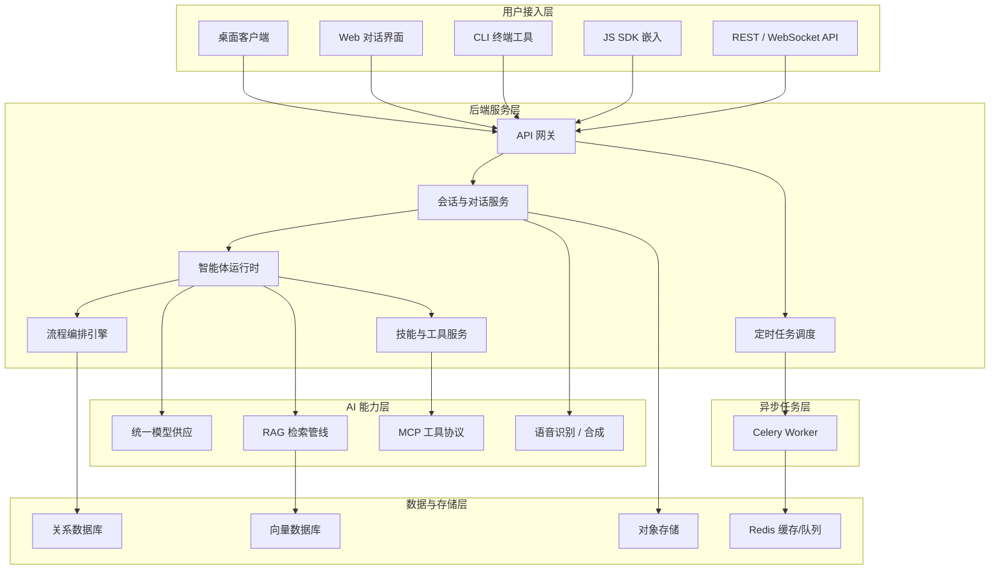
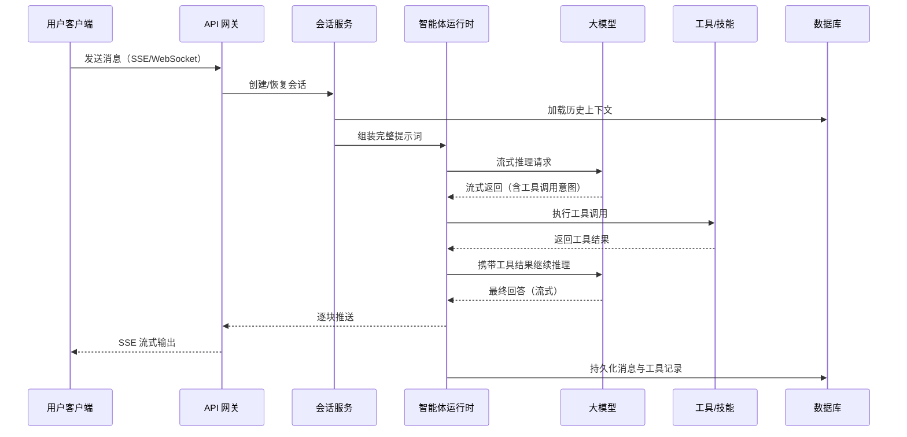
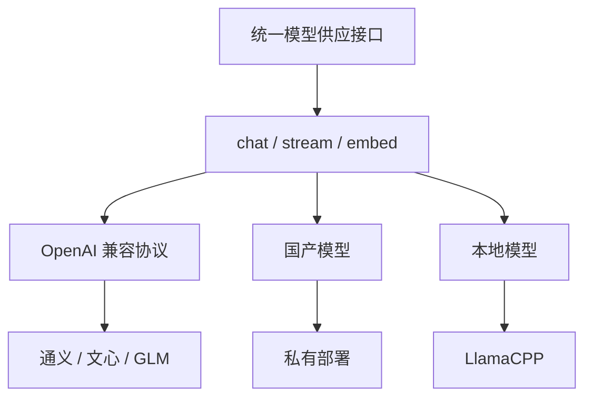
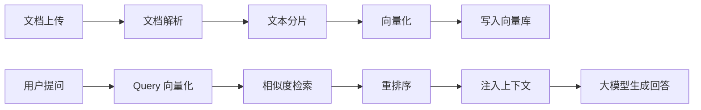

# 技术架构概览

> 这篇文档帮助技术决策者和集成开发者在 5 分钟内理解太乙智启的系统组成、模块职责和数据流向。

## 整体架构

太乙智启采用**前后端分离 + 分布式任务队列**的架构，核心设计原则：

- **模型无关**：通过统一模型供应层对接任意大模型，切换模型不改业务代码
- **存储无关**：向量存储、关系数据库均可替换，不绑定特定厂商
- **水平可扩展**：工作节点独立部署，按需增减

## 产品组件

| 组件 | 技术栈 | 职责 | 部署形态 |
|------|--------|------|----------|
| **后端服务** | Python 3.12 / FastAPI | 核心引擎：对话、编排、检索、工具调用 | 单机或 K8s 集群 |
| **管理后台** | Vue 3 + Quasar 2 | 可视化流程设计器、用户/模型/知识库管理 | 静态资源，Nginx 托管 |
| **对话前端** | Vue 3 + Quasar 2 | 员工日常对话入口（Web 版） | 静态资源，Nginx 托管 |
| **桌面客户端** | 桌面端应用 | 本地文件操作、浏览器自动化、语音交互 | 用户本机安装 |
| **CLI 工具** | Go | 终端智能体、脚本集成、CI/CD 场景 | 用户本机安装 |
| **工作节点** | Python / Celery | 长时间耗时任务（文档解析、批量处理） | 独立部署，可水平扩展 |
| **JS SDK** | TypeScript | 将对话能力嵌入第三方 Web 系统 | 由集成方引入 |

## 后端核心模块

后端按职责划分为以下服务模块：

| 模块 | 职责说明 |
|------|----------|
| **API 层** | RESTful 接口 + SSE 流式推送 + WebSocket 实时通道 |
| **会话服务** | 会话生命周期管理、消息持久化、上下文窗口裁剪 |
| **智能体运行时** | 提示词组装、工具调度、多轮推理循环、子任务分发 |
| **流程编排引擎** | 图结构（Graph → Vertex → Edge → State）驱动的多步骤执行 |
| **统一模型供应** | 统一接口对接 OpenAI 兼容 / 国产大模型，支持多模型并行 |
| **RAG 管线** | 文档加载 → 分片 → 向量化 → 检索 → 重排序 → 注入上下文 |
| **MCP 工具服务** | 实现 Model Context Protocol，让智能体调用外部工具 |
| **技能系统** | SKILL.md 解析、技能注入、技能仓库管理 |
| **定时任务** | Cron / 间隔 / 一次性任务调度，支持独立会话执行 |
| **语音服务** | ASR 语音识别 + TTS 语音合成，支持实时对话 |
| **认证与鉴权** | 用户认证、API Key 管理、多租户隔离 |
| **遥测与追踪** | 调用链追踪、Token 用量统计、性能监控 |

## 数据流：一次对话请求的完整链路

## 流程编排引擎

流程编排是太乙智启的核心能力之一，采用**有向图**模型：

| 概念 | 说明 |
|------|------|
| **Graph** | 一个完整的 AI 流程，包含多个节点和连线 |
| **Vertex（节点）** | 一个执行单元：模型调用、知识检索、条件判断、代码执行、工具调用等 |
| **Edge（边）** | 节点间的连接关系，支持条件分支 |
| **State（状态）** | 流程执行过程中的共享数据上下文 |

支持的节点类型：

| 类别 | 示例节点 |
|------|----------|
| 输入/输出 | 文本输入、文件上传、API 触发、文本输出、文件导出 |
| 模型 | 大模型调用（支持任意 Provider）、提示词模板 |
| 检索 | 向量检索、关键词检索、混合检索、重排序 |
| 逻辑 | 条件分支、循环、并行、人工审核 |
| 工具 | MCP 工具、HTTP 请求、代码执行、数据库查询 |
| 数据处理 | 文档解析、文本分片、格式转换 |

## 统一模型供应

太乙智启不绑定任何特定大模型厂商。所有模型调用通过统一的供应接口：

- 同一流程中不同节点可使用不同模型
- 切换模型只需修改配置，业务代码零改动
- 支持 Embedding 模型独立配置（检索与生成可用不同厂商）

## RAG 检索管线

| 环节 | 可替换组件 |
|------|-----------|
| 文档解析 | 内置解析器、Pandoc、自定义 Loader |
| 向量数据库 | Milvus（默认）、Chroma、PGVector 等 |
| Embedding 模型 | 任意支持向量化的模型 |
| 检索策略 | 纯向量、纯关键词、混合检索 |

## 部署架构

### 最小部署（单机）

适用于 POC 验证和小团队使用（≤ 20 人）：

| 组件 | 最低配置 |
|------|----------|
| 后端服务 + 管理后台 + 对话前端 | 4C 8G |
| 关系数据库（PostgreSQL） | 同上或独立 2C 4G |
| 向量数据库（Milvus Lite） | 同上 |
| Redis | 同上 |

### 生产部署（集群）

适用于正式生产环境：

| 组件 | 建议配置 |
|------|----------|
| 后端服务 | 2+ 实例，K8s Deployment |
| 工作节点 | 按任务量独立扩缩 |
| PostgreSQL | 主从或云数据库 |
| Milvus | 独立集群 |
| Redis | 哨兵或集群模式 |
| Nginx / 网关 | 负载均衡 + SSL 终止 |

### 离线部署

太乙智启支持完全离线环境：

- 所有组件容器化，镜像离线导入
- 大模型使用本地部署（如 LlamaCPP、vLLM）
- 无需外网连接，满足等保和信创要求

## 技术栈总览

| 层级 | 技术选型 |
|------|----------|
| 后端框架 | Python 3.12 + FastAPI + Uvicorn |
| 任务队列 | Celery + Redis |
| 数据库迁移 | Alembic + SQLAlchemy |
| 管理前端 | Vue 3 + Quasar 2 |
| 对话前端 | Vue 3 + Quasar 2 |
| 桌面客户端 | 桌面端应用 |
| CLI | Go |
| 向量数据库 | Milvus（默认） |
| 关系数据库 | PostgreSQL |
| 缓存/消息 | Redis |
| 容器化 | Docker + Docker Compose / K8s |

## 下一步

| 你的角色 | 推荐阅读 |
|----------|----------|
| 想快速体验 | [10 分钟体验](/quick-start/for-business-user) |
| 想集成到自己的系统 | [集成方式选型](/integration/overview) |
| 想开发技能扩展能力 | [技能是什么](/skill-development/skill-basics) |
| 想了解 API 细节 | [流式对话接口](/reference/api/stream) |
