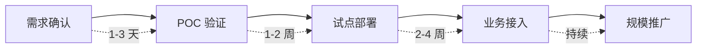

# 为什么选择太乙智启

> 这篇文档帮助技术选型负责人在 5 分钟内理解太乙智启的差异化优势，以及它与其他方案的本质区别。

## 选型时你关心的三件事

| 关心的问题 | 太乙智启的回答 |
|-----------|---------------|
| 数据安全吗？ | 私有化部署，数据不出内网，支持离线环境 |
| 会不会被锁定？ | 模型层、存储层、部署层全部可替换，不绑定任何厂商 |
| 能不能真正用起来？ | 可视化编排 + 多端覆盖 + 技能扩展，不只是"能跑"，而是"能用" |

## 与其他方案的对比

### 对比一：直接调用大模型 API

| 维度 | 直接调 API | 太乙智启 |
|------|-----------|----------|
| 知识增强 | 需要自己搭 RAG 管线 | 内置知识库管理，上传即用 |
| 流程编排 | 自己写代码串联 | 可视化拖拽编排 |
| 多模型切换 | 改代码 | 后台配置切换，业务无感 |
| 数据安全 | 数据发给第三方 | 私有化部署，数据不出内网 |
| 多端支持 | 自己做前端 | 桌面/Web/CLI 开箱即用 |
| 运维成本 | 自己维护 | 统一管理后台、监控、配额 |

**结论**：如果你只是做个 Demo，直接调 API 够了。如果你要在企业里真正跑起来，太乙智启帮你省掉 80% 的基建工作。

### 对比二：其他 AI 应用平台

| 维度 | 典型 SaaS 平台 | 太乙智启 |
|------|---------------|----------|
| 部署方式 | 只能用对方云 | 私有化 / 混合云 / 离线均可 |
| 模型选择 | 限定几家 | 任意模型，国产/国际均可 |
| 数据归属 | 在对方服务器 | 在你自己的服务器 |
| 定制深度 | 有限配置项 | 核心代码可改，技能可扩展 |
| 信创合规 | 通常不支持 | 支持国产化环境部署 |
| 成本模型 | 按调用量持续付费 | 一次部署，边际成本趋零 |

**结论**：SaaS 平台适合"试试看"，太乙智启适合"认真用"。

### 对比三：自研 AI 中台

| 维度 | 自研 | 太乙智启 |
|------|------|----------|
| 启动周期 | 3-6 个月搭基建 | 1 天部署，1 周跑通业务 |
| 团队要求 | 需要 AI 工程团队 | 运维 + 业务人员即可 |
| 维护成本 | 持续投入研发资源 | 社区维护 + 企业版支持 |
| 能力完整性 | 逐步补齐 | 编排/检索/对话/技能一步到位 |
| 风险 | 人员流动导致项目停滞 | 标准化平台，不依赖个人 |

**结论**：除非你有 10 人以上的专职 AI 平台团队，否则基于太乙智启二次开发是更经济的选择。

## 六大核心优势详解

### 1. 自主可控

- 核心代码自主研发，能力对标大厂
- 满足信创、等保、行业合规对"自主可控"的要求
- 即使上游模型厂商停止服务，平台本身不受影响

### 2. 模型不锁定

- 支持同时接入多个大模型（如通义千问、文心一言、GLM、Llama、GPT 等）
- 不同流程节点可以使用不同模型（如：检索用轻量模型，生成用旗舰模型）
- 切换模型只需后台配置，业务代码零修改

### 3. 私有化部署

- 支持 Docker 单机部署（最小 4C8G）
- 支持 Kubernetes 集群部署（生产环境）
- 支持完全离线环境（无外网依赖）
- 数据全链路留在企业内网

### 4. 可视化编排

- 拖拽式流程设计器，业务人员也能搭建 AI 流程
- 支持条件分支、循环、并行、人工审核等节点
- 流程版本管理，支持灰度发布和回滚

### 5. 多端覆盖

- 桌面客户端（Windows / macOS / Linux）
- Web 对话界面（可嵌入现有系统）
- CLI 终端工具（开发者友好）
- JS SDK（5 分钟嵌入任意 Web 页面）

### 6. 技能扩展

- 用一份 Markdown 文件定义新技能，无需写代码
- 支持 MCP 协议接入外部工具
- 技能仓库机制，团队内共享复用

## 典型客户决策路径

| 阶段 | 你需要做什么 | 太乙智启提供什么 |
|------|-------------|-----------------|
| 需求确认 | 明确 1-2 个优先场景 | 场景方案文档 + 售前咨询 |
| POC 验证 | 提供测试数据和环境 | 部署支持 + 场景配置 |
| 试点部署 | 指定试点部门和用户 | 管理后台 + 权限配置 |
| 业务接入 | 对接现有系统 | API/SDK + 集成文档 |
| 规模推广 | 制定推广计划 | 运维支持 + 最佳实践 |

## 下一步

- 想看具体场景怎么落地 → [场景方案](/scenarios/)
- 想直接动手试试 → [快速上手](/quick-start/)
- 想了解技术架构 → [架构概览](/overview/architecture-overview)
- 想了解版本和授权 → [版本与授权](/overview/editions-and-licensing)
