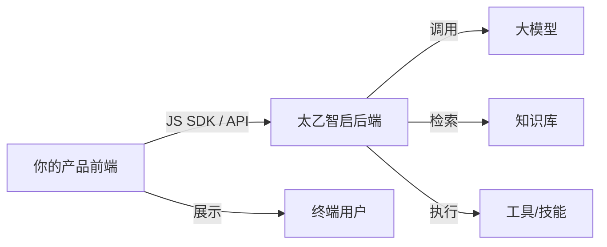

# 厂商 / 集成商快速上手

> 目标：2 小时内搭建一个最小集成 Demo，验证太乙智启可以嵌入你的产品。
> 前提：你已获取太乙智启的部署环境或开发授权。

## 厂商集成全景



作为厂商，你的核心工作是：**把太乙智启的 AI 能力，包装成你产品的一部分**。

## 第 1 步：明确集成模式（10 分钟）

| 集成模式 | 适合场景 | 复杂度 |
|----------|----------|--------|
| **嵌入式对话** | 在你的产品里加一个 AI 对话窗口 | ⭐ 低 |
| **API 后端集成** | 你的后端调用太乙智启，前端自己渲染 | ⭐⭐ 中 |
| **流程编排集成** | 在你的业务流程中嵌入 AI 节点 | ⭐⭐⭐ 高 |
| **OEM 整体交付** | 把太乙智启作为你方案的一部分交付给客户 | ⭐⭐⭐ 高 |

:::tip 建议
第一次集成，从「嵌入式对话」开始，最快看到效果。
:::

## 第 2 步：搭建开发环境（20 分钟）

### 方式 A：使用已有部署环境

向太乙智启团队或你的客户获取：
- API 地址
- 开发者 Token
- 可用的智能体（Flow）列表

### 方式 B：本地搭建开发环境

```bash
# 克隆并启动（参考管理员部署指南）
git clone https://github.com/snz1/taiyiflow.git
cd taiyiflow
cp .env.example .env
# 编辑 .env 配置模型 API Key
docker compose up -d
```

## 第 3 步：跑通核心 API（30 分钟）

### 3.1 认证

```bash
# 获取 Token（具体方式见认证文档）
curl -X POST "http://localhost:8000/api/v1/auth/token" \
  -H "Content-Type: application/json" \
  -d '{"client_id": "your-client-id", "client_secret": "your-secret"}'
```

### 3.2 流式对话

```bash
curl -N -X POST "http://localhost:8000/api/v1/stream" \
  -H "Content-Type: application/json" \
  -H "Authorization: Bearer YOUR_TOKEN" \
  -d '{
    "input": "你好",
    "session_id": "vendor-demo-001"
  }'
```

### 3.3 会话管理

```bash
# 创建会话分组
curl -X POST "http://localhost:8000/api/v1/sessions" \
  -H "Authorization: Bearer YOUR_TOKEN" \
  -H "Content-Type: application/json" \
  -d '{"title": "客户咨询会话"}'

# 获取会话历史
curl "http://localhost:8000/api/v1/sessions/{session_id}/messages" \
  -H "Authorization: Bearer YOUR_TOKEN"
```

## 第 4 步：嵌入前端页面（30 分钟）

### 使用 JS SDK（最快）

```html
<!DOCTYPE html>
<html>
<head>
  <title>我的产品 - AI 助手</title>
</head>
<body>
  <div id="taiyi-chat" style="width: 400px; height: 600px;"></div>

  <script src="https://your-cdn/taiyiflow-jssdk/dist/index.umd.js"></script>
  <script>
    TaiyiChat.init({
      container: '#taiyi-chat',
      apiBase: 'http://localhost:8000',
      token: 'YOUR_TOKEN',
      theme: {
        primaryColor: '#1890ff',  // 匹配你的产品品牌色
        borderRadius: '8px'
      }
    });
  </script>
</body>
</html>
```

### 使用 API 自定义 UI

如果你需要完全自定义界面，参考 [流式对话 API](/integration/stream-api) 自行实现前端渲染。

## 第 5 步：验证 Demo（20 分钟）

验收清单：

- [ ] 对话窗口正常显示在你的页面中
- [ ] 发送消息后收到流式回复
- [ ] 品牌色 / Logo 已替换为你的
- [ ] 会话可以保持上下文（多轮对话）
- [ ] 错误场景有友好提示（网络断开、Token 过期）

## 厂商关注的关键问题

| 问题 | 答案 | 详细文档 |
|------|------|----------|
| 能否贴牌？ | 支持白标定制，替换品牌元素 | [白标定制](/vendor-guide/white-label) |
| 多租户怎么隔离？ | 支持数据/配额/品牌三层隔离 | [多租户架构](/vendor-guide/multi-tenancy) |
| 如何计费？ | 支持按调用量/席位/时间多种模型 | [计费与配额](/vendor-guide/billing-and-quota) |
| 客户数据在哪？ | 私有化部署，数据在客户环境 | [安全说明](/admin-guide/security) |
| 能否离线交付？ | 支持完全离线部署 | [离线部署](/admin-guide/deployment/air-gap-deploy) |

## ✅ 里程碑达成

- [x] 明确了集成模式
- [x] 跑通了核心 API（认证 + 流式对话 + 会话管理）
- [x] 成功在页面中嵌入对话组件
- [x] 完成 Demo 验收清单

## 下一步

- 🏢 深入了解厂商集成 → [厂商指南](/vendor-guide/)
- 🔌 完整集成文档 → [集成方式总览](/integration/overview)
- 📐 多租户设计 → [多租户架构](/vendor-guide/multi-tenancy)
- 💰 商业模式设计 → [计费与配额](/vendor-guide/billing-and-quota)
