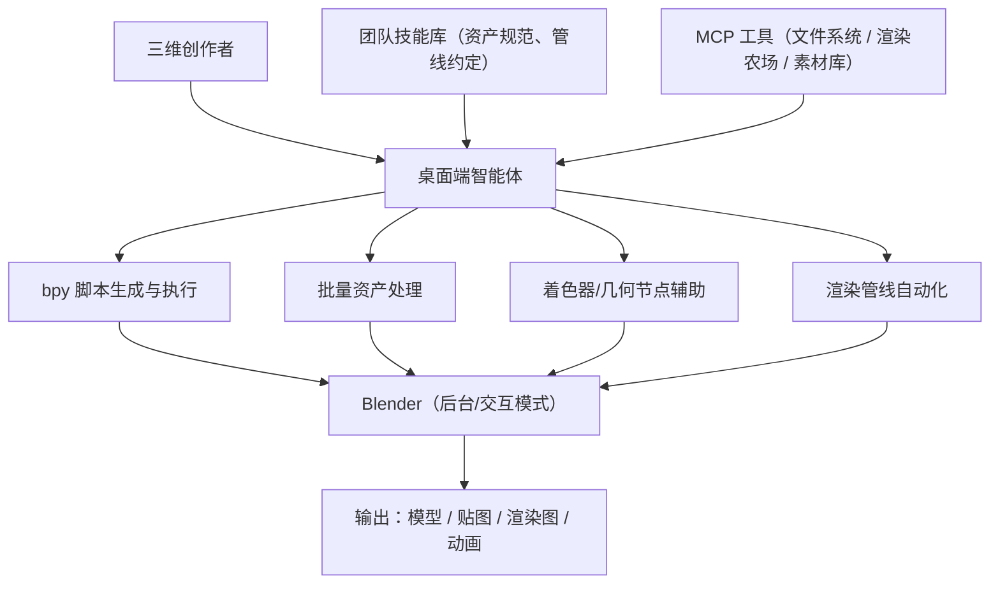

# Blender 三维创作助手

> 场景定位：让 AI 成为三维美术的"技术助理"——通过 Blender Python API 自动建模、批量处理素材、编写着色器与脚本，创作者专注审美与创意决策。

## 业务痛点

| 痛点 | 具体表现 |
|------|----------|
| 重复性建模劳动多 | 场景填充、批量改名、材质替换等机械操作占据大量时间 |
| Python API 学习曲线陡 | `bpy` 接口庞杂，美术人员不熟悉脚本，查文档耗时 |
| 批处理管线靠手工 | 多个 .blend 文件的渲染、导出、格式转换需要逐个打开操作 |
| 着色器与几何节点门槛高 | Shader / Geometry Nodes 调试全靠试错，缺少即时反馈 |
| 资产规范难统一 | 团队内命名、层级、单位、原点对齐等规范执行参差 |
| 插件与脚本维护难 | 自研小工具脚本散落各处，无人维护、无人敢改 |

## 解决方案

**核心能力**：
- **桌面端智能体**：在图形化对话界面里直接提需求，AI 生成 `bpy` 脚本，以 `blender --background --python` 无头执行或注入交互会话，执行结果（日志、截图、导出文件）自动回收验证；桌面端内置完整本地工具运行时（Shell、文件操作），高风险操作有审批确认，无需任何命令行基础
- **技能系统**：把团队资产规范（命名、单位、原点、层级）与渲染管线约定封装为技能，AI 生成的每个脚本自动遵守
- **MCP 工具对接**：连接素材库、渲染农场、项目管理等基础设施，实现从素材入库到成片输出的全链路自动化

## 典型子场景

### 子场景 1：程序化建模与场景生成

| 任务 | 用法示例 |
|------|----------|
| 批量生成 | "用脚本生成 50 栋随机高度的低多边形建筑，按网格排布并共享材质" |
| 程序化地形 | "基于高度图贴图生成地形网格，并按坡度自动分布植被实例" |
| 场景填充 | "读取这份 CSV 里的坐标和模型名，把对应资产批量摆进场景" |
| 修改迭代 | "把刚才生成的楼群间距调大一倍，屋顶换成平顶" |

AI 生成脚本 → 后台执行 → 渲染预览图回传确认，迭代以分钟计。

### 子场景 2：批量资产处理管线

1. 把需求描述给桌面端智能体："把这批 .blend 文件里的所有材质贴图路径重定向到 textures/ 目录，统一单位为米，按规范重命名后导出 FBX"
2. AI 编写批处理脚本，遍历目录逐个无头执行
3. 输出处理报告：成功清单、失败文件与原因
4. 失败项自动分析日志、修正脚本后重跑

### 子场景 3：着色器与几何节点辅助

- "写一个程序化生锈金属着色器，锈蚀程度用贴图遮罩控制"——AI 生成节点搭建脚本并渲染球体预览
- "用 Geometry Nodes 做一根沿曲线生长的藤蔓，叶子随机朝向"——AI 输出节点树脚本 + 效果截图
- 调试时把报错日志丢给 AI，直接定位到具体节点或 API 调用

### 子场景 4：渲染与出图自动化

- 定时任务：每晚自动拉取最新场景文件，切换渲染引擎与采样参数，出多分辨率测试图
- 批量出图：按镜头清单（CSV/表格）自动设置相机、输出命名、提交渲染队列
- 渲染完成后 AI 检查输出（缺帧、黑帧、异常尺寸）并播报结果

### 子场景 5：插件与工具脚本开发

- 描述需求即可开发小插件："做一个面板，一键把选中物体按材质分组合并"
- AI 遵循 Blender 插件规范（`bl_info`、注册/注销、面板绘制）生成完整代码
- 已有插件的 bug 修复与版本适配（如 4.x API 变更迁移）交给 AI 处理

## 实施步骤

### 第 1 步：安装与接入（半天）

1. 在创作工作站上安装太乙智启桌面客户端（见[安装指南](/getting-started/installation)），图形界面开箱即用，无需配置命令行环境
2. 确认本机 Blender 可执行文件路径，配置到技能或环境变量中
3. 试运行一个最小脚本（如后台打开 .blend 并打印场景物体清单），验证执行链路

### 第 2 步：沉淀团队技能（2-3 天）

把工作室约定写成技能（`SKILL.md`），放入项目 `.snz1dp/skills/` 目录：

| 技能示例 | 内容 |
|----------|------|
| 资产规范 | 命名约定、单位、原点、层级结构、面数预算 |
| 渲染管线 | 引擎选择、采样参数、输出命名、目录结构 |
| 导出规范 | FBX/glTF 导出参数、贴图打包规则 |
| 常用脚本库 | 高频批处理脚本模板与使用条件 |

技能随项目文件一起纳入版本管理，全团队共享、持续迭代。

### 第 3 步：对接周边设施（按需，1-3 天）

通过 MCP 工具连接：

| 系统 | 用途 |
|------|------|
| 素材库 / NAS | 检索、拉取、回传资产文件 |
| 渲染农场 | 提交任务、查询进度、回收结果 |
| 项目管理 | 读取镜头/资产任务卡，更新完成状态 |
| 版本管理（Git/SVN） | 脚本与 .blend 增量文件的提交记录 |

### 第 4 步：试点推广（2-4 周）

- 从低风险任务开始：批量重命名、贴图重定向、格式转换
- 逐步放开：程序化建模、着色器生成、渲染自动化
- 收集美术团队反馈，迭代技能与脚本模板

### 第 5 步：度量与持续优化

| 指标 | 说明 |
|------|------|
| 机械操作耗时 | 批处理类任务的人工时间变化 |
| 脚本一次通过率 | AI 生成脚本无需人工修改即可运行的比例 |
| 管线覆盖率 | 已自动化环节占整条资产管线的比例 |
| 资产规范符合率 | 抽检资产的命名/单位/层级合规比例 |

## 效果参考

| 指标 | 实施前 | 实施后（参考值） |
|------|--------|-----------------|
| 批量资产处理 | 数小时~数天/批 | 分钟级脚本执行 + 抽检确认 |
| bpy 脚本开发 | 查文档半天起步 | 对话式生成，即时验证 |
| 场景填充/摆放 | 手工逐个操作 | CSV 驱动一键生成 |
| 插件小工具 | 依赖唯一会写脚本的 TD | 人人可对话式定制 |

:::warning 效果说明
以上为行业参考值。AI 生成的脚本应在测试文件或副本上先行验证，涉及覆盖原始 .blend 文件的批量操作务必保留备份；关键资产的最终效果由创作者人工确认。
:::

## 进阶玩法

| 进阶方向 | 说明 |
|----------|------|
| 无头渲染集群 | 多台机器并行执行 AI 生成的渲染脚本，定时任务统一调度 |
| 视口截图反馈闭环 | 脚本执行后自动截图回传，AI 依据画面继续调整参数 |
| 与 ComfyUI 联动 | AI 图像生成贴图 → Blender 自动上材质 → 渲染出图一条龙 |
| 资产入库质检 | 新资产入库时自动跑规范检查脚本，不合格项退回并附原因 |
| 教学与新人培养 | 新人用自然语言问 bpy 用法，AI 结合官方文档与团队技能作答 |

## 相关文档

- [桌面客户端使用指南](/user-guide/desktop-app) — 桌面端智能体完整用法
- [技能是什么](/skill-development/skill-basics) — 技能系统入门
- [SKILL.md 编写规范](/skill-development/skill-format) — 沉淀资产规范与管线约定
- [MCP 工具开发](/skill-development/mcp-tools) — 对接素材库与渲染农场
- [定时报告与监控播报](/scenarios/scheduled-reports) — 定时渲染与巡检任务
