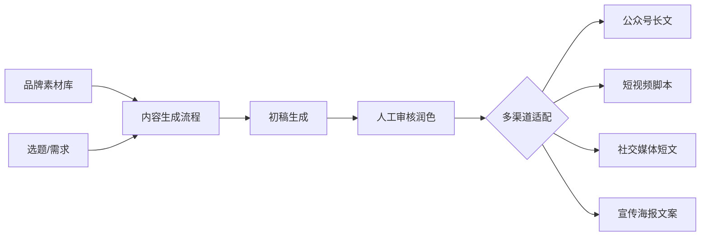
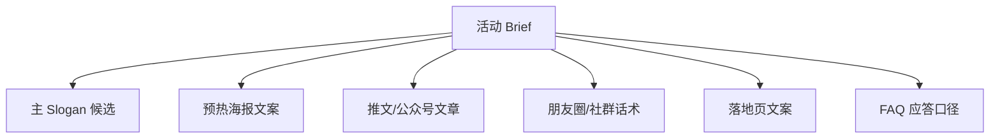

# 营销内容生成

> 场景定位：公众号、短视频脚本、产品文案、宣传物料——用 AI 把内容生产从"天"压缩到"小时"，同时保持品牌调性一致。

## 业务痛点

| 痛点 | 具体表现 |
|------|----------|
| 产出压力大 | 公众号要周更、短视频要日更，小编天天赶稿 |
| 调性不统一 | 多人写作风格各异，品牌形象模糊 |
| 创意枯竭 | 选题翻来覆去，标题起不出新意 |
| 一稿多改 | 同一内容要适配公众号/小红书/短视频多个渠道，手工改写费时 |
| 专业知识门槛 | 写产品文案要先懂产品，市场同学经常写不到点上 |

## 解决方案

**核心能力**：
- **品牌知识库**：产品资料、品牌手册、历史爆款文章沉淀为知识库，AI 写作有据可依
- **风格锁定**：通过技能封装品牌调性与写作规范，多人使用输出风格一致
- **一稿多发**：一次生成，自动改写适配不同渠道的格式与语感
- **图文视频联动**：结合图片生成与宣传视频能力，产出完整物料包

## 典型子场景

### 子场景 1：公众号/自媒体文章

1. 输入选题："介绍我们新品的三个核心卖点，面向中小企业主"
2. AI 检索产品知识库，确保功能描述准确
3. 按品牌写作规范生成初稿（结构、语气、禁用词都受技能约束）
4. 人工润色定稿，排版发布

### 子场景 2：短视频脚本与宣传视频

| 产出 | 说明 |
|------|------|
| 分镜脚本 | 镜头描述 + 口播文案 + 字幕 + 时长分配 |
| 口播文案 | 按 15/30/60 秒版本分别生成 |
| 宣传视频 | 结合 AI 视频生成能力，从脚本直接产出带配音的宣传短片 |

### 子场景 3：产品文案批量生成

- 电商场景：上传产品参数表，批量生成商品标题、卖点描述、详情页文案
- 多规格适配：同一产品按不同渠道字数限制（30 字标题 / 200 字卖点 / 2000 字详情）输出
- A/B 素材：一次生成 5-10 个不同角度的版本供投放测试

### 子场景 4：营销活动物料包

一次活动输入 brief，AI 输出整套物料：

## 实施步骤

### 第 1 步：建设品牌素材库（2-3 天）

| 素材类型 | 用途 |
|----------|------|
| 品牌手册 | 调性、视觉规范、禁用表述 |
| 产品资料 | 功能、参数、卖点、FAQ |
| 历史爆款 | 学习结构与语感 |
| 竞品资料 | 差异化定位参考 |
| 合规红线 | 广告法禁用词、行业监管要求 |

全部上传知识库，AI 生成时自动检索引用。

### 第 2 步：封装写作技能（1 天）

把写作规范写成技能（`SKILL.md`）：

- 各渠道的格式模板（公众号结构、脚本分镜表、小红书语气）
- 品牌语气词表（该用什么词、不该用什么词）
- 审核 checklist（广告法合规、数据准确性、品牌一致性）

### 第 3 步：搭建生成流程（半天）

流程设计器中配置：需求输入 → 知识库检索 → 按渠道模板生成 → 合规自检 → 输出。

### 第 4 步：试产与校准（1 周）

- 用真实选题试产 10-20 篇
- 对比人工稿件，校准提示词与技能规范
- 重点检查：事实准确性（产品参数不能编）、合规性（禁用词）

### 第 5 步：建立人机协作流程

:::tip 推荐的协作模式
AI 负责初稿（60-70% 工作量），人负责创意方向、事实核查与最终润色。不要追求"全自动发布"，人工审核环节是品牌安全的最后防线。
:::

## 效果参考

| 指标 | 实施前 | 实施后（参考值） |
|------|--------|-----------------|
| 公众号文章产出 | 1-2 天/篇 | 2-4 小时/篇（含润色） |
| 短视频脚本 | 半天/条 | 30 分钟/条 |
| 多渠道适配改写 | 1-2 小时/渠道 | 分钟级批量生成 |
| 内容产量 | 每周 2-3 篇 | 每周 8-10 篇 |

:::warning 效果说明
以上为行业参考值。AI 生成内容发布前必须人工审核：产品参数、价格、承诺类表述需逐一核实，避免事实错误与广告法风险。
:::

## 进阶玩法

| 进阶方向 | 说明 |
|----------|------|
| 爆款学习闭环 | 高互动内容回流素材库，持续优化生成策略 |
| 配图联动 | 文章生成同时产出配图（文生图） |
| 宣传视频流水线 | 脚本 → 分镜 → AI 视频生成 → 配音，一条龙产出 |
| 个性化内容 | 按客户分层生成差异化触达文案 |
| 多语言出海 | 内容一键改写为英文/东南亚语言版本 |

## 相关文档

- [企业知识问答 / 智能客服](/scenarios/intelligent-qa) — 品牌知识库搭建
- [自定义场景搭建](/scenarios/custom-scenario) — 生成流程设计
- [SKILL.md 编写规范](/skill-development/skill-format) — 封装写作技能
- [文档处理与报告生成](/scenarios/document-processing) — 长文成稿与导出
