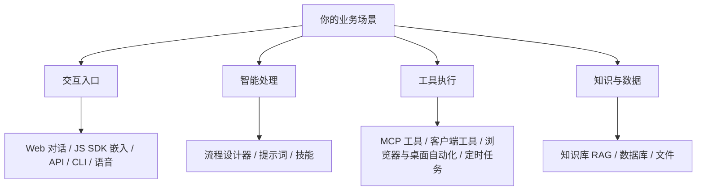
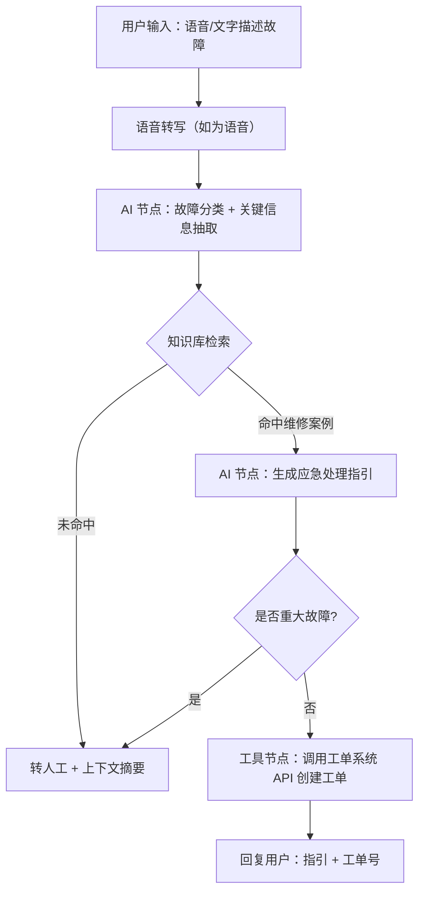

# 自定义场景搭建

> 场景定位：前面所有场景都只是起点——用流程设计器 + 技能系统 + 工具生态，你可以搭出任何适合自己业务的 AI 场景。

## 什么时候需要自定义场景

| 信号 | 说明 |
|------|------|
| 现成场景不完全匹配 | 业务有独特流程，标准方案覆盖 70%，剩下 30% 需要定制 |
| 有专属数据与系统 | 需要对接内部系统、私有数据源 |
| 有沉淀的方法论 | 团队专家经验希望固化为 AI 可执行的流程 |
| 想做产品化 | 基于太乙智启构建对外产品（见[厂商指南](/vendor-guide/)） |

## 平台能力地图

搭一个自定义场景，本质是把下面几类能力组合起来：

| 能力层 | 提供什么 | 对应文档 |
|--------|----------|----------|
| 交互入口 | 用户从哪里使用你的场景 | [集成方式选型](/integration/overview) |
| 智能处理 | AI 如何理解与决策 | 本文 + [技能是什么](/skill-development/skill-basics) |
| 工具执行 | AI 能操作哪些系统 | [MCP 工具开发](/skill-development/mcp-tools) |
| 知识与数据 | AI 依据什么回答 | [知识库管理](/user-guide/knowledge-base) |

## 搭建方法论：五步法

### 第 1 步：定义场景（1 天）

用一张表把场景说清楚：

| 要素 | 示例（设备报修助手） |
|------|---------------------|
| 用户是谁 | 车间一线工人 |
| 在什么情境下用 | 设备异常时，手机上语音描述故障 |
| 期望 AI 做什么 | 判断故障类型 → 给出应急处理指引 → 自动生成维修工单 |
| 成功标准 | 工单信息完整率 > 95%，应急指引准确率 > 90% |
| 边界（不做什么） | 不直接下发停机指令，重大故障必须转人工 |

:::tip 关键原则
先收窄场景。"做一个全能生产助手"会失败，"做设备报修的第一响应"能落地。跑通后再逐步扩展。
:::

### 第 2 步：准备知识与数据（1-3 天）

- 收集领域文档：设备手册、维修案例、操作规程 → 建知识库
- 整理结构化数据：设备台账、故障代码表
- 清洗与去重：过时资料先剔除，避免 AI 引用错误信息

### 第 3 步：设计流程（1-2 天）

在流程设计器中把场景拆成节点：

设计要点：

| 要点 | 说明 |
|------|------|
| AI 节点提示词 | 明确输入输出格式（建议 JSON）、判断标准、few-shot 示例 |
| 确定性优先 | 能用规则判断的不用 AI（如故障代码映射表） |
| 兜底分支 | 每个 AI 节点都要有"不确定时怎么办" |
| 人工出口 | 高风险动作必须留人工确认通道 |

### 第 4 步：接入工具与系统（按需，1-5 天）

| 需求 | 方案 |
|------|------|
| 调用内部系统 API | MCP 工具 或 客户端工具协议 |
| 操作网页系统（无 API） | 浏览器自动化 |
| 操作桌面软件 | 桌面自动化（Computer Use） |
| 周期性执行 | 定时任务 |
| 嵌入现有 App/网页 | JS SDK / 流式 API |

### 第 5 步：测试、上线、迭代（持续）

1. **测试集**：准备 30-50 个真实案例（含边界与异常输入）
2. **影子运行**：与人工并行跑 1-2 周，对比结果
3. **灰度上线**：先开放给小范围用户
4. **反馈闭环**：收集"答得不对"的案例 → 补知识库 / 改提示词 / 调流程
5. **指标监控**：准确率、自动处理率、用户满意度

## 场景设计模式参考

沉淀了几个常见的设计模式，可直接套用：

| 模式 | 结构 | 适用 |
|------|------|------|
| 问答型 | 知识库检索 → 生成回答 → 标注来源 | 客服、制度咨询 |
| 分类型 | 输入 → AI 分类打标 → 规则路由 | 工单、邮件、内容审核 |
| 抽取型 | 文档/消息 → 字段提取 → 写入系统 | 票据、简历、报修信息 |
| 生成型 | 模板 + 数据 → AI 成稿 → 人工复核 | 报告、文案、代码 |
| 执行型 | 指令 → AI 规划步骤 → 工具执行 → 回报结果 | RPA、运维操作 |
| 监控型 | 定时触发 → 数据采集 → 异常判断 → 告警 | 巡检、指标监控 |

## 常见踩坑

| 坑 | 避免方式 |
|----|----------|
| 场景贪大求全 | 第一期只做一个核心链路，跑通再扩 |
| 提示词含糊 | 用"输入格式 + 判断标准 + 输出格式 + 示例"四段式写提示词 |
| 没有兜底 | 每个 AI 节点配置失败/不确定分支 |
| 知识库塞垃圾 | 宁缺毋滥，过时和矛盾文档是准确率杀手 |
| 跳过影子运行 | 直接上线出错代价高，先并行对比再切换 |
| 上线后不管 | 建立每周复盘机制，持续用坏案例迭代 |

## 获取帮助

- 参考已完成的场景文档，找最接近的照着改
- 联系技术支持获取场景咨询与共建服务
- 想做对外产品 → [厂商合作总览](/vendor-guide/)

## 相关文档

- [核心概念](/getting-started/core-concepts) — 流程、技能、知识库基础
- [技能是什么](/skill-development/skill-basics) — 技能系统入门
- [MCP 工具开发](/skill-development/mcp-tools) — 工具接入
- [集成方式选型](/integration/overview) — 入口选择
- [厂商案例](/vendor-guide/case-studies) — 别人怎么搭的
