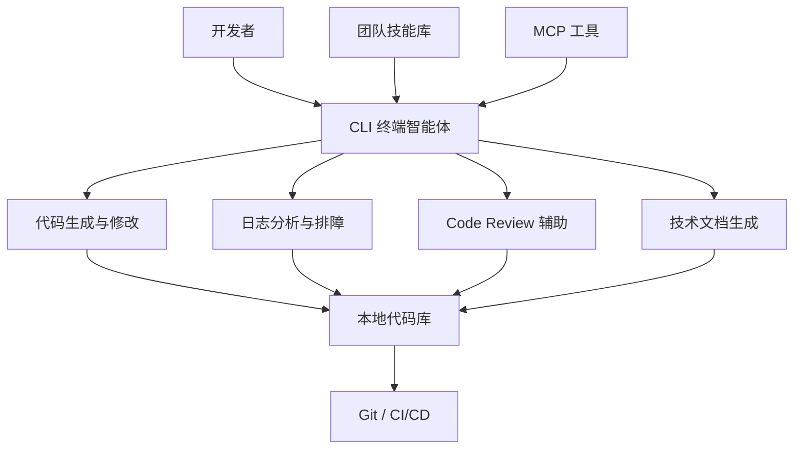

# 研发效能提升

> 场景定位：让 AI 成为研发团队的"第二双手"——写代码、查日志、做 Review、补文档，开发者专注设计与决策。

## 业务痛点

| 痛点 | 具体表现 |
|------|----------|
| 重复编码多 | CRUD、样板代码、配置脚本占据大量时间 |
| 排障靠翻日志 | 线上问题要在海量日志里人肉搜索，定位慢 |
| Code Review 瓶颈 | 资深工程师时间被 Review 占满，评审质量参差 |
| 文档永远滞后 | 代码改了文档没改，新人只能读代码猜逻辑 |
| 环境配置劝退 | 新人搭环境要一两周，踩坑全靠问老员工 |
| 知识随人走 | 核心模块只有一个人懂，离职即断层 |

## 解决方案

**核心能力**：
- **CLI 终端智能体**：在命令行直接对话，AI 可读代码、改文件、跑命令、查结果，全程在项目上下文中工作
- **技能系统**：把团队规范（代码风格、提交约定、部署流程）封装为技能，AI 自动遵守
- **MCP 工具对接**：连接 Git、CI/CD、监控、数据库等研发基础设施

## 典型子场景

### 子场景 1：代码生成与重构

| 任务 | 用法示例 |
|------|----------|
| 新功能开发 | "参照 user 模块的写法，新增一个 order 模块的 CRUD 接口" |
| 样板代码 | "给这个类补全单元测试，覆盖边界条件" |
| 重构 | "把这个函数拆分成职责单一的三个函数，保持接口兼容" |
| 跨语言转换 | "把这段 Python 脚本改写为 Go 实现" |

AI 直接在本地代码库上修改，改完自动跑测试验证，开发者只做最终确认。

### 子场景 2：日志分析与线上排障

1. 把报错日志/堆栈丢给 CLI 智能体
2. AI 结合本地代码定位可疑位置，给出根因假设
3. 按假设逐一验证（读代码、跑最小复现命令）
4. 输出修复建议，确认后直接修复并回归测试

### 子场景 3：Code Review 辅助

- 提交 MR/PR 前，先让 AI 按团队 Review checklist 自查一轮
- AI 输出：潜在 bug、规范违规、安全风险、可简化点
- 人工 Review 聚焦架构与业务逻辑，机械性问题已被前置拦截

### 子场景 4：技术文档自动生成

- "根据这个模块的代码，生成接口文档和使用说明"
- 代码变更后让 AI 对比 diff，更新受影响的文档章节
- 新人入职文档、架构说明、FAQ 持续保鲜

### 子场景 5：新人上手加速

- 新人直接在 CLI 里问："这个项目的部署流程是什么？""这个配置项是干嘛的？"
- AI 基于代码库和团队知识库回答，不用反复打扰老员工
- 环境搭建按技能中沉淀的步骤自动执行

## 实施步骤

### 第 1 步：安装与接入（半天）

1. 在开发机上安装太乙智启 CLI（见[安装指南](/getting-started/installation)）
2. 配置模型服务与认证
3. 在项目根目录试运行，让 AI 熟悉代码库结构

### 第 2 步：沉淀团队技能（2-3 天）

把团队约定写成技能（`SKILL.md`），放入项目 `.snz1dp/skills/` 目录：

| 技能示例 | 内容 |
|----------|------|
| 代码规范 | 命名约定、目录结构、错误处理模式 |
| 提交规范 | commit message 格式、分支策略 |
| 部署流程 | 构建命令、发布步骤、回滚方案 |
| 排障手册 | 常见报错的排查路径 |

技能随代码库一起提交到 Git，全团队共享、持续迭代。

### 第 3 步：对接研发基础设施（按需，1-3 天）

通过 MCP 工具连接：

| 系统 | 用途 |
|------|------|
| Git 平台 | 查 MR、读 diff、提交代码 |
| CI/CD | 查构建状态、触发流水线 |
| 监控/日志平台 | 拉取告警与日志用于排障 |
| 项目管理 | 读取需求卡片、更新任务状态 |

### 第 4 步：试点推广（2-4 周）

- 选 1-2 个小组试点，从低风险任务开始（写测试、补文档、查日志）
- 收集反馈，迭代技能与提示词
- 形成团队使用手册后全员推广

### 第 5 步：度量与持续优化

| 指标 | 说明 |
|------|------|
| AI 参与提交占比 | 有 AI 协助的 MR 比例 |
| Review 返工率 | 自查前置后，人工 Review 打回率变化 |
| 故障定位时长 | 排障平均耗时变化 |
| 新人上手周期 | 从入职到独立提交的时间 |

## 效果参考

| 指标 | 实施前 | 实施后（参考值） |
|------|--------|-----------------|
| 样板代码编写 | 数小时/模块 | 分钟级生成 + 人工确认 |
| 线上问题定位 | 1-4 小时 | 缩短 50%+ |
| 新人环境搭建 | 1-2 周 | 1-3 天 |
| 文档覆盖率 | < 30% 模块有文档 | 核心模块 80%+ |

:::warning 效果说明
以上为行业参考值。AI 生成代码必须经过测试与人工 Review 后合入，关键路径代码建议保持人工主导。
:::

## 进阶玩法

| 进阶方向 | 说明 |
|----------|------|
| 子任务并行 | 大型重构拆分为多个子任务并行执行，主任务汇总 |
| 定时巡检 | 定时跑依赖安全扫描、死链检查、测试覆盖率报告 |
| 跨仓库协作 | 前后端多个仓库联动修改（接口变更同步） |
| 私有技能仓库 | 团队技能统一发布到私有技能仓库，版本化管理 |
| 与 CI 集成 | 流水线中调用 AI 做自动化 Review 与变更摘要 |

## 相关文档

- [CLI 使用指南](/user-guide/cli-guide) — 终端智能体完整用法
- [技能是什么](/skill-development/skill-basics) — 技能系统入门
- [SKILL.md 编写规范](/skill-development/skill-format) — 沉淀团队规范
- [MCP 工具开发](/skill-development/mcp-tools) — 对接研发基础设施
- [定时报告与监控播报](/scenarios/scheduled-reports) — 定时巡检任务
