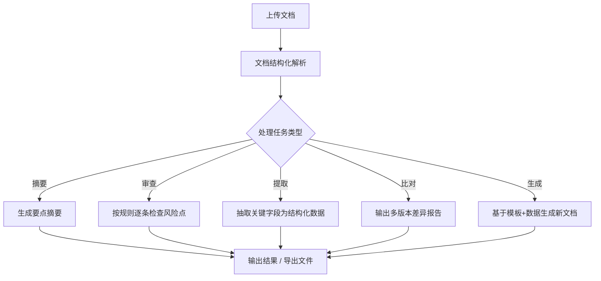
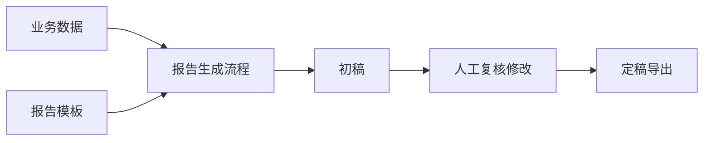

# 文档处理与报告生成

> 场景定位：让 AI 帮你读文档、写报告、审合同——把法务、财务、运营从"文档苦力"中解放出来。

## 业务痛点

| 痛点 | 具体表现 |
|------|----------|
| 合同审查耗时 | 一份几十页的合同，法务逐条核对要半天，还容易漏看 |
| 报告写作重复 | 周报/月报/项目总结格式雷同，每次都要从头拼凑 |
| 长文档读不完 | 招投标文件、行业研报动辄上百页，抓不住重点 |
| 文档比对困难 | 多版本合同/制度文件差异，肉眼逐行对比极易出错 |
| 信息提取靠手工 | 发票、简历、表单中的关键字段要一个个录入系统 |

## 解决方案

**核心能力**：
- **文档结构化**：PDF / Word / PPT / 扫描件自动解析为结构化内容（含表格）
- **长文档理解**：分段处理超长文档，全文级摘要不丢关键信息
- **模板化生成**：报告模板 + 业务数据 → 自动成稿，支持导出 Word / PDF / Markdown

## 典型子场景

### 子场景 1：合同审查

1. 上传合同文件（PDF / Word）
2. 配置审查规则清单（如：付款条款、违约责任、知识产权归属、争议解决方式）
3. AI 逐条比对规则，输出风险点报告：

| 检查项 | 结果 | 风险等级 | 原文位置 |
|--------|------|----------|----------|
| 违约金比例 | 超过合同总额 30% | 🔴 高 | 第 8.2 条 |
| 付款周期 | 验收后 90 天，偏长 | 🟡 中 | 第 5.1 条 |
| 知识产权归属 | 未明确约定 | 🔴 高 | 缺失 |

:::tip 审查规则从哪来
把公司历史审查经验整理成一份"合同审查 checklist"文档，上传到知识库，AI 审查时自动参照。团队经验从此沉淀为组织资产。
:::

### 子场景 2：长文档摘要与研报速读

- 上传上百页的招投标文件 / 行业研报 / 政策文件
- 指定摘要视角："站在投标方角度，列出资质要求、评分标准、废标条款"
- 输出分层摘要：全文概览 → 章节要点 → 关键数据表

### 子场景 3：报告自动生成

适合：项目周报、运营月报、巡检报告、经营分析报告。数据可以来自 Excel 上传、数据库查询（见[数据分析与洞察](/scenarios/data-analysis)）或定时任务自动采集（见[定时报告与监控播报](/scenarios/scheduled-reports)）。

### 子场景 4：文档版本比对

- 上传同一文档的两个版本
- AI 输出差异清单：新增条款、删除条款、修改内容（含修改前后对照）
- 适合合同谈判往返、制度修订评审

### 子场景 5：票据与信息提取

- 上传发票 / 简历 / 表单图片
- 自动提取关键字段（金额、日期、姓名、联系方式等）为 JSON / 表格
- 通过 API 回写到业务系统，替代人工录入

## 实施步骤

### 第 1 步：梳理文档处理需求（1 天）

| 问题 | 示例答案 |
|------|----------|
| 处理什么文档？ | 采购合同、投标文件、周报 |
| 要做什么处理？ | 风险审查、摘要、字段提取 |
| 输出给谁？ | 法务复核、管理层阅读、系统录入 |
| 量有多大？ | 每月 50 份合同、每周 10 份报告 |

### 第 2 步：准备模板与规则（1-2 天）

- 收集现有报告模板（Word 格式即可）
- 整理审查规则 / 提取字段清单
- 上传到知识库或直接配置在流程提示词中

### 第 3 步：配置处理流程（半天）

在**流程设计器**中搭建文档处理流程：

1. **解析节点**：接收上传文档，结构化提取正文与表格
2. **处理节点**：按任务类型配置提示词（审查规则 / 摘要视角 / 提取字段）
3. **输出节点**：格式化结果，支持导出文件

### 第 4 步：测试与调优（2-3 天）

- 用 10-20 份真实历史文档测试
- 对照人工处理结果，检查漏检率与误报率
- 调整提示词中的规则描述粒度（规则越具体，结果越稳定）

### 第 5 步：上线运行（1 周）

| 使用方式 | 适合场景 |
|----------|----------|
| Web 对话界面直接上传处理 | 低频、按需处理 |
| API 集成到 OA / 合同系统 | 高频、流程化处理 |
| 定时任务批量处理 | 周期性报告生成 |

## 效果参考

| 指标 | 实施前 | 实施后（参考值） |
|------|--------|-----------------|
| 单份合同初审时间 | 2-4 小时 | 10-20 分钟（AI 初审 + 人工复核） |
| 百页文档要点掌握 | 1-2 天 | 10 分钟 |
| 周报/月报编写 | 2-3 小时/份 | 15 分钟/份（含复核） |
| 票据字段录入 | 5 分钟/张 | 秒级自动提取 |

:::warning 效果说明
以上为行业参考值。合同审查等高风险场景，AI 结果必须经专业人员复核后使用，AI 定位是"初审助手"而非"最终决策者"。
:::

## 进阶玩法

| 进阶方向 | 说明 |
|----------|------|
| 批量处理 | 通过 API + 脚本对文件夹内文档批量执行同一处理流程 |
| 审查规则知识库化 | 规则沉淀到知识库，随案例积累持续更新 |
| 多文档交叉分析 | 同时上传多份文档，做横向对比（如多家供应商标书对比） |
| 与流程自动化联动 | 提取结果自动触发下游流程（如发票提取后自动发起报销审批） |
| 自定义导出格式 | 按公司 VI 模板导出带页眉页脚的正式 Word/PDF |

## 相关文档

- [文件处理](/user-guide/file-handling) — 文档上传与解析能力说明
- [知识库管理](/user-guide/knowledge-base) — 规则与模板的沉淀
- [数据分析与洞察](/scenarios/data-analysis) — 报告数据来源
- [定时报告与监控播报](/scenarios/scheduled-reports) — 周期性报告自动化
- [REST API 参考](/integration/rest-api) — 集成到业务系统
