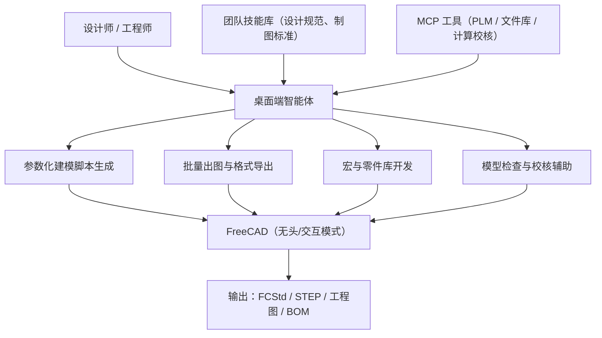

# FreeCAD 参数化设计助手

> 场景定位：让 AI 成为机械/建筑设计师的"参数化编程搭档"——通过 FreeCAD Python API 与宏脚本自动建模、批量出图、参数化改型，工程师专注设计意图与校核。

## 业务痛点

| 痛点 | 具体表现 |
|------|----------|
| 参数化改型繁琐 | 一个尺寸变更牵动整棵特征树，手工重建耗时易错 |
| Python API 门槛高 | FreeCAD 脚本接口（Part/PartDesign/Draft/Spreadsheet）文档分散，学习成本高 |
| 批量出图靠手工 | 多个零件的工程图、BOM、STEP 导出需要逐个打开操作 |
| 标准件库维护难 | 自建参数化零件库（螺栓、型材、法兰）编写与维护依赖少数熟手 |
| 宏脚本无人敢改 | 历史遗留宏散落各处，缺注释、缺测试，改一处坏一片 |
| 版本间 API 差异 | 0.21 → 1.0 的 API 与对象模型变化导致旧脚本失效 |

## 解决方案

**核心能力**：
- **桌面端智能体**：在图形化对话界面里直接提需求，AI 生成 FreeCAD Python 脚本，以 `freecadcmd` 无头执行或在交互控制台注入，执行日志、导出结果自动回收验证；桌面端内置完整本地工具运行时（Shell、文件操作），高风险操作有审批确认，无需任何命令行基础
- **技能系统**：把设计规范（制图标准、公差标注习惯、命名规则、单位制）封装为技能，AI 生成的模型与图纸自动遵守
- **MCP 工具对接**：连接 PLM/PDM、共享文件库、强度校核计算等工程基础设施

## 典型子场景

### 子场景 1：参数化建模与改型

| 任务 | 用法示例 |
|------|----------|
| 新建参数化零件 | "用 Spreadsheet 工作台建一个法兰零件，外径、螺栓孔数、孔距全部参数驱动" |
| 系列化改型 | "把这份参数表里的 8 个规格批量生成法兰模型并导出 STEP" |
| 特征修改 | "把这个支架的加强筋厚度从 3mm 改成 4mm，重建后检查干涉" |
| 装配生成 | "按这份 BOM 把零件装配起来，螺栓连接自动匹配标准件库" |

AI 生成脚本 → 无头执行 → 输出重建日志与模型截图供确认。

### 子场景 2：批量出图与数据导出

1. 把需求交给桌面端智能体："遍历项目目录所有 FCStd，按制图模板生成三视图工程图，导出 PDF 和 DXF，同时汇总 BOM 到 Excel"
2. AI 编写批处理脚本，用 TechDraw 工作台无头执行
3. 输出处理报告：成功清单、重建失败文件与原因
4. 失败项自动分析错误日志、修正后重跑

### 子场景 3：宏与标准件库开发

- "写一个宏：选中两个面，自动创建垂直于两面的连接销"——AI 按 FreeCAD 宏规范生成完整代码并测试
- 自建参数化标准件库：型材、紧固件、管件的尺寸表驱动建模
- 旧宏迁移：把 0.21 版本的宏批量适配到 1.0 的新 API，AI 逐个改写并回归验证

### 子场景 4：模型检查与质量把关

- 定时/入库检查：体积、质量属性、干涉检测、命名规范、单位一致性
- 导出前校验：STEP 导出后重新导入比对几何有效性，防止破面
- 检查结果汇总成报告，异常项自动通知责任人

### 子场景 5：设计知识问答

- 新人直接在桌面端对话里问："Draft 工作台和 Sketcher 的区别？""怎么让阵列特征跟随 Spreadsheet 参数？"
- AI 结合 FreeCAD 官方文档、社区 Wiki 与团队技能库回答，并给出可运行的示例脚本

## 实施步骤

### 第 1 步：安装与接入（半天）

1. 在设计工作站上安装太乙智启桌面客户端（见[安装指南](/getting-started/installation)），图形界面开箱即用，无需配置命令行环境
2. 确认本机 FreeCAD / freecadcmd 可执行路径，配置到技能或环境变量
3. 试运行最小脚本（新建立方体并导出 STEP），验证无头执行链路

### 第 2 步：沉淀团队技能（2-3 天）

把设计约定写成技能（`SKILL.md`），放入项目 `.snz1dp/skills/` 目录：

| 技能示例 | 内容 |
|----------|------|
| 建模规范 | 特征树组织、命名规则、单位制、原点约定 |
| 制图标准 | 图框模板、视图布局、尺寸与公差标注习惯 |
| 导出规范 | STEP/PDF/DXF 导出参数与目录结构 |
| 标准件库约定 | 参数表格式、库文件组织、版本管理方式 |

技能随项目文件纳入版本管理，全团队共享、持续迭代。

### 第 3 步：对接工程基础设施（按需，1-3 天）

通过 MCP 工具连接：

| 系统 | 用途 |
|------|------|
| PLM / PDM | 检入检出模型、读取物料主数据 |
| 共享文件库 | 批量拉取/回传 FCStd 与导出文件 |
| 校核计算工具 | 把几何参数送入强度/热工计算并回收结果 |
| 项目管理 | 读取设计任务卡、更新进度状态 |

### 第 4 步：试点推广（2-4 周）

- 从低风险任务开始：批量导出、BOM 汇总、命名规范检查
- 逐步放开：参数化建模、宏开发、标准件库建设
- 收集工程师反馈，迭代技能与脚本模板

### 第 5 步：度量与持续优化

| 指标 | 说明 |
|------|------|
| 改型周期 | 参数化改型从需求到出图的时间变化 |
| 批处理覆盖率 | 已自动化的出图/导出环节占比 |
| 脚本一次通过率 | AI 生成脚本无需人工修改即可运行的比例 |
| 模型合规率 | 入库检查通过率变化 |

## 自定义工具对接搭建

> 第 3 步是用现成 MCP 工具连接 PLM、文件库等周边系统。若要进一步把 FreeCAD 的脚本执行能力封装成自定义 MCP 工具，或直接接入社区现成的 FreeCAD MCP 服务器（GUI socket 模式 / freecadcmd 无头模式），见独立章节 [专用工具 MCP 对接开发](/scenarios/tool-mcp-integration)——含社区项目盘点、接入注册方式、自研封装骨架与安全注意事项。

## 效果参考

| 指标 | 实施前 | 实施后（参考值） |
|------|--------|-----------------|
| 系列化改型出图 | 数天/系列 | 小时级批量生成 + 人工校核 |
| FreeCAD 脚本开发 | 查 Wiki 半天起步 | 对话式生成，即时验证 |
| 标准件库建设 | 依赖专职熟手 | 尺寸表驱动，人人可维护 |
| 旧宏迁移适配 | 逐个手工排查 | AI 批量改写 + 回归验证 |

:::warning 效果说明
以上为行业参考值。AI 生成的模型与图纸必须经过工程师校核（尺寸、公差、干涉、强度）后方可用于生产；批量操作原始 FCStd 文件前务必保留备份。
:::

## 进阶玩法

| 进阶方向 | 说明 |
|----------|------|
| 尺寸表驱动产品线 | Excel/CSV 参数表一键生成全系列产品模型与图纸 |
| 设计-校核闭环 | AI 建模 → 调用校核计算 → 依据结果自动调整参数再建模 |
| 定时入库质检 | 定时扫描共享库新增模型，自动跑规范检查并播报 |
| 与 3D 打印管线联动 | 模型自动修复（网格封闭性）→ 切片参数生成 → 打印任务提交 |
| 教学与新人培养 | 新人用自然语言学 FreeCAD 脚本，AI 结合官方 Wiki 与团队技能作答 |

## 相关文档

- [桌面客户端使用指南](/user-guide/desktop-app) — 桌面端智能体完整用法
- [技能是什么](/skill-development/skill-basics) — 技能系统入门
- [SKILL.md 编写规范](/skill-development/skill-format) — 沉淀设计规范与制图标准
- [专用工具 MCP 对接开发](/scenarios/tool-mcp-integration) — 社区 FreeCAD MCP 盘点与自研封装
- [MCP 工具开发](/skill-development/mcp-tools) — 封装自定义工具，对接 PLM 与校核计算
- [客户端工具开发](/skill-development/client-tools) — 本地执行工具与回调协议
- [定时报告与监控播报](/scenarios/scheduled-reports) — 定时质检与播报任务
