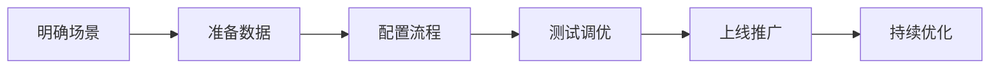
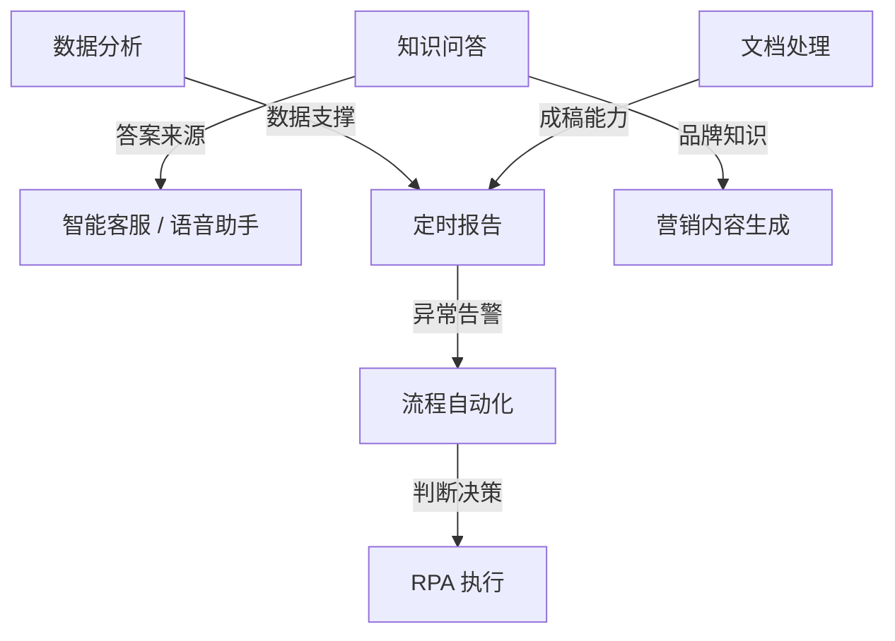

# 场景方案总览

> 太乙智启不是一个"通用 AI 工具"，而是针对具体业务场景的解决方案平台。以下是已验证的典型场景。

## 按业务需求选择

| 场景 | 解决什么问题 | 适合谁 | 状态 |
|------|-------------|--------|------|
| 🤖 [企业知识问答 / 智能客服](/scenarios/intelligent-qa) | 减少重复咨询，让员工/客户自助获取答案 | 所有企业 | ✅ 完整方案 |
| 📄 [文档处理与报告生成](/scenarios/document-processing) | 合同审查、报告摘要、文档比对、信息提取 | 法务、财务、运营 | ✅ 完整方案 |
| ⚙️ [业务流程自动化](/scenarios/workflow-automation) | 工单分类、审批辅助、邮件自动回复 | 运营、客服、行政 | ✅ 完整方案 |
| 🚀 [研发效能提升](/scenarios/dev-assistant) | 代码生成、排障、Review 辅助、技术文档 | 研发团队 | ✅ 完整方案 |
| 📊 [数据分析与洞察](/scenarios/data-analysis) | 自然语言查数据、报表生成、归因分析 | 数据团队、业务分析 | ✅ 完整方案 |
| 🎙 [会议纪要与语音助手](/scenarios/meeting-voice-assistant) | 录音转写、纪要成稿、待办提取、语音交互 | 所有团队 | ✅ 完整方案 |
| ✍️ [营销内容生成](/scenarios/content-marketing) | 公众号、短视频脚本、产品文案、活动物料 | 市场、品牌、电商 | ✅ 完整方案 |
| 🖱 [办公自动化 RPA](/scenarios/office-rpa) | 跨系统录入、网页巡检、批量操作、桌面自动化 | 运营、财务、行政 | ✅ 完整方案 |
| ⏰ [定时报告与监控播报](/scenarios/scheduled-reports) | 日报周报自动生成、定时巡检、异常告警 | 管理层、运维、运营 | ✅ 完整方案 |
| 🛠 [自定义场景搭建](/scenarios/custom-scenario) | 用流程设计器搭建你自己的场景 | 所有管理员 | ✅ 完整方案 |

## 按角色选择

| 角色 | 最先看的场景 |
|------|-------------|
| 管理层 | 定时报告与监控播报 → 数据分析与洞察 |
| HR / 行政 | 企业知识问答 → 会议纪要与语音助手 |
| 市场 / 品牌 | 营销内容生成 → 文档处理与报告生成 |
| 客服 / 运营 | 企业知识问答 → 业务流程自动化 → 办公自动化 RPA |
| 法务 / 财务 | 文档处理与报告生成 → 数据分析与洞察 |
| 研发 / 运维 | 研发效能提升 → 定时报告与监控播报 → 办公自动化 RPA |
| 数据分析师 | 数据分析与洞察 → 文档处理与报告生成 |

## 按行业选择

| 行业 | 推荐场景组合 |
|------|-------------|
| 金融 | 知识问答（合规咨询）+ 文档处理（合同审查）+ 定时报告（风控指标监控） |
| 制造 | 知识问答（设备手册）+ 语音助手（车间免手操作）+ RPA（生产系统巡检）+ 报告生成（质检报告） |
| 教育 | 知识问答（课程助手）+ 语音助手（培训转课件）+ 营销内容（招生文案） |
| 政务 | 知识问答（政策检索）+ 文档处理（公文辅助）+ 定时报告（舆情摘要） |
| 软件/互联网 | 研发提效 + 知识问答（技术文档）+ 定时报告（服务巡检） |
| 零售/电商 | 营销内容（商品文案）+ 智能客服 + 数据分析（经营简报） |
| 医疗 | 知识问答（文献检索）+ 文档处理（病历结构化）+ 会议纪要（查房记录） |
| 法律 | 文档处理（合同比对）+ 知识问答（法规检索）+ 营销内容（专业文章） |
| 物流/供应链 | 流程自动化（运单处理）+ RPA（多系统录入）+ 定时报告（调度日报） |

## 场景能力矩阵

各场景依赖的平台核心能力一览，便于评估实施准备工作：

| 场景 | 知识库 | 流程设计器 | 工具/MCP | 浏览器/桌面自动化 | 定时任务 | 语音 |
|------|:---:|:---:|:---:|:---:|:---:|:---:|
| 企业知识问答 | ● | ● | ○ | | | ○ |
| 文档处理与报告生成 | ● | ● | ○ | | ○ | |
| 业务流程自动化 | ○ | ● | ● | ○ | ○ | |
| 研发效能提升 | ○ | | ● | ○ | ○ | |
| 数据分析与洞察 | ● | ○ | ● | | ○ | |
| 会议纪要与语音助手 | ○ | ● | | | ○ | ● |
| 营销内容生成 | ● | ● | ○ | | | |
| 办公自动化 RPA | | ○ | ○ | ● | ● | |
| 定时报告与监控播报 | ○ | ○ | ● | ○ | ● | ○ |

● 核心依赖 ○ 可选增强

## 场景落地通用路径

每个场景文档都包含：
1. **业务痛点** — 你面临的问题
2. **解决方案** — 太乙智启如何解决
3. **实施步骤** — 分步操作指南
4. **效果参考** — 可量化的收益指标
5. **进阶玩法** — 如何进一步优化

## 场景组合建议

单个场景解决单点问题，组合使用价值翻倍：

**经典组合**：
- **数字员工**：定时任务 + 数据分析 + RPA + 报告生成 = 无人值守的日常运营
- **智能客服中台**：知识库 + 流程自动化 + 语音 + JS SDK 嵌入 = 全渠道客户服务
- **会议闭环**：语音转写 + 纪要生成 + 待办提取 + 定时提醒 = 从开会到落实全链路

## 没找到你的场景？

- 查看[自定义场景搭建指南](/scenarios/custom-scenario)，用流程设计器自己搭
- 浏览[典型应用场景](/overview/use-cases)，按行业找灵感
- 联系技术支持获取场景咨询
