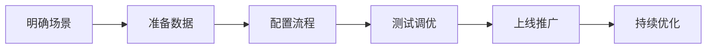

# 场景方案总览

> 太乙智启不是一个"通用 AI 工具"，而是针对具体业务场景的解决方案平台。以下是已验证的典型场景。

## 按业务需求选择

| 场景 | 解决什么问题 | 适合谁 | 状态 |
|------|-------------|--------|------|
| 🤖 [企业知识问答 / 智能客服](/scenarios/intelligent-qa) | 减少重复咨询，让员工/客户自助获取答案 | 所有企业 | ✅ 完整方案 |
| 📄 [文档处理与报告生成](/scenarios/document-processing) | 合同审查、报告摘要、文档比对 | 法务、财务、运营 | 📝 编写中 |
| ⚙️ [业务流程自动化](/scenarios/workflow-automation) | 工单分类、审批辅助、邮件自动回复 | 运营、客服、行政 | 📝 编写中 |
| 🚀 [研发效能提升](/scenarios/dev-assistant) | 代码生成、Review 辅助、技术文档 | 研发团队 | 📝 编写中 |
| 📊 [数据分析与洞察](/scenarios/data-analysis) | 自然语言查数据、报表生成 | 数据团队、业务分析 | 📝 编写中 |
| 🛠 [自定义场景搭建](/scenarios/custom-scenario) | 用流程设计器搭建你自己的场景 | 所有管理员 | 📝 编写中 |

## 按行业选择

| 行业 | 推荐场景组合 |
|------|-------------|
| 金融 | 知识问答 + 文档处理（合同审查）+ 合规辅助 |
| 制造 | 知识问答（设备手册）+ 工单自动化 + 报告生成 |
| 教育 | 知识问答 + 研发提效（课件生成）|
| 政务 | 知识问答（政策检索）+ 公文辅助 |
| 软件/互联网 | 研发提效 + 知识问答（技术文档）|

## 场景落地通用路径

每个场景文档都包含：
1. **业务痛点** — 你面临的问题
2. **解决方案** — 太乙智启如何解决
3. **实施步骤** — 分步操作指南
4. **效果参考** — 可量化的收益指标
5. **进阶玩法** — 如何进一步优化

## 没找到你的场景？

- 查看[自定义场景搭建指南](/scenarios/custom-scenario)，用流程设计器自己搭
- 联系技术支持获取场景咨询
