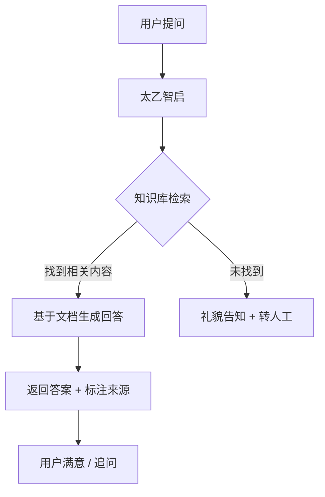

# 企业知识问答 / 智能客服

> 场景定位：让员工和客户用自然语言获取准确答案，减少重复咨询，降低人力成本。

## 业务痛点

| 痛点 | 具体表现 |
|------|----------|
| 重复咨询多 | 员工反复问"报销流程是什么""年假怎么算"，HR/行政疲于应付 |
| 知识分散 | 制度在 OA、文档在网盘、经验在老员工脑子里，找不到 |
| 响应慢 | 客户咨询要等人工回复，高峰期排队 |
| 答案不一致 | 不同人回答不一样，缺乏统一口径 |
| 新人上手慢 | 新员工花几周才能熟悉公司制度和流程 |

## 解决方案

**核心原理**：RAG（检索增强生成）——先从你的文档中找到相关内容，再让 AI 基于这些内容组织回答。AI 不会"瞎编"，因为每个回答都有据可查。

## 实施步骤

### 第 1 步：准备知识文档（1-2 天）

收集需要纳入问答的文档：

| 文档类型 | 示例 | 格式要求 |
|----------|------|----------|
| 制度文件 | 员工手册、考勤制度、报销规范 | PDF / Word / Markdown |
| 流程说明 | 审批流程、入职流程、采购流程 | PDF / Word / 网页 |
| 产品资料 | 产品手册、FAQ、技术规格 | PDF / Word |
| 培训材料 | 新人培训 PPT、操作指南 | PDF / PPT |

:::tip 文档质量建议
- 一份文档只讲一个主题，避免大杂烩
- 段落清晰，有小标题
- 过时的文档先清理，避免 AI 给出过期信息
:::

### 第 2 步：创建知识库（30 分钟）

1. 登录管理后台 → **知识库管理**
2. 点击「创建知识库」，填写名称（如"公司制度库"）
3. 上传文档（支持批量上传）
4. 等待向量化完成（根据文档量，通常几分钟到几十分钟）
5. 在知识库详情页确认文档状态为"已就绪"

### 第 3 步：配置问答流程（30 分钟）

进入 **流程设计器**，创建问答流程：

1. 新建流程，选择「知识问答」模板
2. 配置节点：
   - **检索节点**：选择刚创建的知识库，设置返回条数（建议 3-5 条）
   - **生成节点**：选择模型，编写提示词模板
   - **兜底节点**：未检索到内容时的回复策略
3. 保存并发布

### 第 4 步：测试与调优（1-2 天）

准备 20-30 个典型问题测试：

| 测试维度 | 示例问题 | 关注点 |
|----------|----------|--------|
| 能答对 | "年假有几天？" | 答案准确、来源正确 |
| 边界情况 | "如果年假和病假重叠怎么算？" | 文档没覆盖时如何处理 |
| 无关问题 | "今天天气怎么样？" | 是否正确拒绝或转人工 |
| 模糊表述 | "请假怎么弄" | 能否理解口语化表达 |

根据测试结果调整：
- 答不上来 → 补充文档
- 答错了 → 检查文档是否有歧义，或调整检索参数
- 回答太长 → 调整提示词，限制回答长度

### 第 5 步：上线与推广（1 周）

| 渠道 | 方式 | 适合场景 |
|------|------|----------|
| 内部对话界面 | 员工直接访问太乙智启 Web/桌面端 | 内部知识问答 |
| 嵌入现有系统 | JS SDK 嵌入 OA / 企业微信 / 钉钉 | 不改变员工习惯 |
| 对外客服 | API 集成到官网/小程序 | 客户自助服务 |

## 效果参考

| 指标 | 实施前 | 实施后（参考值） |
|------|--------|-----------------|
| 重复咨询处理时间 | 人均 30 分钟/天 | 减少 60-80% |
| 平均响应时间 | 2-4 小时（等人工） | < 5 秒 |
| 新人熟悉制度周期 | 2-3 周 | 3-5 天 |
| 客服人力成本 | 5 人团队 | 3 人 + AI 兜底 |

:::warning 效果说明
以上为行业参考值，实际效果取决于知识库质量、文档覆盖度和问题复杂度。建议以 2 周试运行数据为准。
:::

## 进阶玩法

| 进阶方向 | 说明 |
|----------|------|
| 多知识库路由 | 根据问题类型自动选择对应知识库（制度库/产品库/技术库） |
| 权限隔离 | 不同部门只能查到对应权限的文档 |
| 反馈闭环 | 用户标记"答案有用/没用"，持续优化 |
| 转人工 | AI 无法回答时自动转接人工客服 |
| 多语言 | 同一知识库支持中英文问答 |

## 相关文档

- [知识库管理](/admin-guide/knowledge-management) — 文档上传与向量化配置
- [流程设计器](/admin-guide/flow-designer) — 可视化搭建问答流程
- [流式对话 API](/integration/stream-api) — 集成到现有系统
- [JS SDK](/integration/jssdk) — 嵌入 Web 页面
