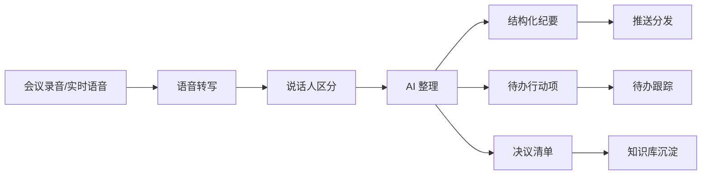

# 会议纪要与语音助手

> 场景定位：录音自动转文字、纪要自动成稿、待办自动提取——开完会 5 分钟，纪要已经发到群里。

## 业务痛点

| 痛点 | 具体表现 |
|------|----------|
| 纪要没人愿意写 | 1 小时的会，整理纪要要 1-2 小时，还经常拖到第二天 |
| 关键信息丢失 | 口头讨论的结论、承诺没有落到文字，事后扯皮 |
| 待办没人跟 | 会上说好的行动项，散会就忘，没人追踪 |
| 录音变"存档" | 录了音没人听，几十 GB 的录音躺在网盘里吃灰 |
| 跨会议检索难 | "上次讨论那个方案是在哪个会上定的？"——没人答得上来 |

## 解决方案



**核心能力**：
- **实时语音识别**：基于 WebSocket 的低延迟转写，边说边出字
- **离线转写**：上传录音文件批量处理，支持长音频
- **声纹识别**：区分说话人，纪要中按人名归属发言
- **智能整理**：从口语化讨论中提炼结论、决议、待办

## 典型子场景

### 子场景 1：会议纪要自动生成

上传录音后，AI 输出结构化纪要：

```markdown
## 项目周会纪要（2026-09-01）
**参会人**：张三、李四、王五

### 关键决议
1. 确认 v2.0 发布日期为 9 月 30 日
2. 预算方案 B 通过，由财务部本周内下发

### 待办事项
| 事项 | 负责人 | 截止时间 |
|------|--------|----------|
| 完成接口联调 | 李四 | 9 月 10 日 |
| 输出测试计划 | 王五 | 9 月 8 日 |

### 讨论摘要
（按议题分段的讨论要点...）
```

### 子场景 2：待办提取与跟踪

- AI 从讨论中识别所有"承诺型发言"（"我周五前给你""这个我来跟进"）
- 自动生成待办清单，标注负责人与时间
- 通过 API 同步到项目管理工具，或定时提醒跟进

### 子场景 3：会议知识库

- 所有纪要自动归档到知识库
- 之后可以直接问："Q3 营销预算是在哪次会议上定的？当时结论是什么？"
- AI 检索历史纪要，给出答案并标注来源会议

### 子场景 4：语音交互助手

- 开车、巡检、车间等不便打字的场景，语音直接提问
- 结合企业知识库，语音获取制度、流程、技术信息
- 语音播报回答，全程免手操作

## 实施步骤

### 第 1 步：确定会议类型与纪要模板（半天）

| 会议类型 | 纪要重点 |
|----------|----------|
| 项目例会 | 进度、风险、待办 |
| 决策会议 | 议题、讨论、决议 |
| 客户沟通 | 需求、承诺、跟进事项 |
| 头脑风暴 | 想法清单、初步筛选结果 |

为高频会议类型准备纪要模板，AI 按模板输出。

### 第 2 步：配置转写与整理流程（半天）

1. 上传录音文件（或使用实时转写）
2. 配置说话人区分（如需按人名归属，先完成声纹注册）
3. 在流程设计器中配置纪要整理节点：模板 + 提示词
4. 配置输出分发：邮件 / IM 群 / 知识库归档

### 第 3 步：试运行校准（1 周）

- 选 5-10 场真实会议试跑
- 对照人工纪要检查：决议有没有漏、待办负责人对不对
- 调整提示词（如明确"只提取明确承诺的事项，不推测"）

### 第 4 步：推广使用

| 方式 | 说明 |
|------|------|
| 会后上传录音 | 最简单，适合存量习惯 |
| 会议系统对接 | 通过 API 自动获取录音并触发流程 |
| 实时转写 | 会中同步出字，主持人现场确认决议 |

## 效果参考

| 指标 | 实施前 | 实施后（参考值） |
|------|--------|-----------------|
| 纪要产出时间 | 1-2 小时/场，常拖延 | 会后 5-10 分钟自动出稿 |
| 待办遗漏率 | 30%+ | < 5%（含人工确认） |
| 历史会议检索 | 翻录音/翻记录，小时级 | 一句话提问，秒级 |

:::warning 效果说明
转写准确率受录音质量影响明显（建议距说话人 1 米内拾音）；涉及重大决策的纪要建议主持人确认后再分发。请注意会议录音的合规要求，提前告知参会人。
:::

## 进阶玩法

| 进阶方向 | 说明 |
|----------|------|
| 多语言会议 | 中英混合会议转写与纪要 |
| 会前简报 | 结合日历，会前自动汇总相关历史会议与背景资料 |
| 待办自动提醒 | 定时任务扫描临期待办，主动提醒负责人 |
| 客户沟通质检 | 提取销售通话中的承诺与话术合规性检查 |
| 培训转课件 | 培训录音自动转为图文课件与 FAQ |

## 相关文档

- [语音对话](/user-guide/voice-interaction) — 语音输入、转写与音色管理
- [文件处理](/user-guide/file-handling) — 音频文件上传与解析
- [企业知识问答 / 智能客服](/scenarios/intelligent-qa) — 会议知识库问答
- [定时报告与监控播报](/scenarios/scheduled-reports) — 待办定时提醒
- [流式对话 API](/integration/stream-api) — 实时转写集成
