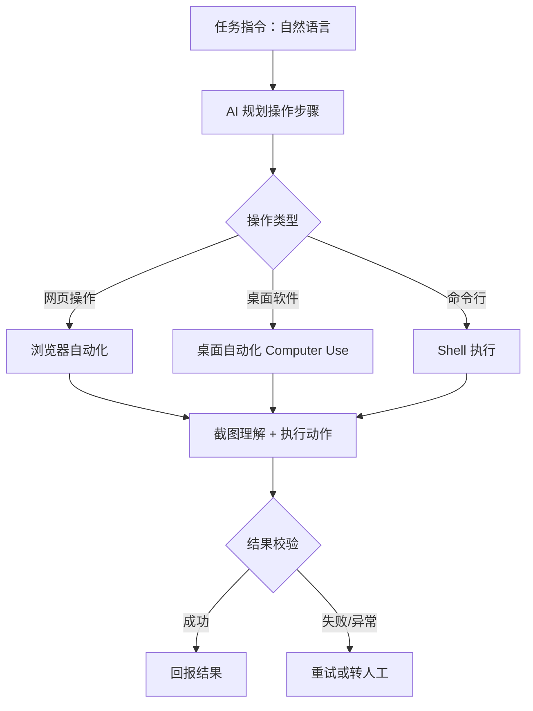

# 办公自动化 RPA

> 场景定位：AI 直接操作浏览器和桌面软件，替人完成跨系统录入、网页巡检、批量操作等"数字体力活"——没有 API 的老系统也能自动化。

## 业务痛点

| 痛点 | 具体表现 |
|------|----------|
| 跨系统搬运 | 从 ERP 导出数据，手工录入到另一个系统，每天重复 |
| 老系统没 API | 用了十年的内部系统，只能人点鼠标操作 |
| 网页巡检繁琐 | 每天要登录几个后台看数据、截图、汇报 |
| 批量操作低效 | 后台逐个改 200 条记录的状态，点到手酸 |
| 传统 RPA 太脆 | 页面稍一改版，录制的脚本就失效，维护成本高 |

## 解决方案



**与传统 RPA 的核心区别**：

| 维度 | 传统 RPA | 太乙智启 AI 自动化 |
|------|----------|-------------------|
| 定义方式 | 录制/编排固定脚本 | 自然语言描述任务，AI 自主规划步骤 |
| 页面变化 | 脚本失效，需重新录制 | 截图理解页面，自适应定位元素 |
| 异常处理 | 按预设分支，覆盖有限 | AI 判断现场情况，灵活处理或求助 |
| 上手成本 | 需要 RPA 工程师 | 业务人员描述需求即可 |

**核心能力**：
- **浏览器自动化**：打开页面、点击、输入、读取内容、截图，支持复用当前登录会话或独立环境
- **桌面自动化**：操作本机桌面应用——窗口定位、鼠标键盘、截图理解
- **截图增强理解**：每一步操作后截图并由 AI 理解页面状态，确认操作生效
- **定时触发**：结合定时任务实现无人值守巡检

## 典型子场景

### 子场景 1：跨系统数据录入

1. 从来源系统（Excel / 邮件 / 数据库）获取数据
2. AI 打开目标系统网页，逐条定位表单字段并填写
3. 每条提交后截图校验，失败自动重试
4. 完成后输出执行报告：成功 N 条、失败 M 条及原因

### 子场景 2：每日网页巡检

- 定时任务每天早上 8 点触发
- AI 依次登录 3-5 个管理后台，检查关键指标
- 截图存档 + 提取数据汇总成巡检报告
- 发现异常自动推送告警到 IM 群

### 子场景 3：批量后台操作

- "把这个列表里所有状态为'待审核'且超过 7 天的记录批量驳回，理由填'超时未处理'"
- AI 理解筛选条件 → 翻页遍历 → 逐条操作 → 汇总结果
- 高风险操作（删除、支付类）建议配置人工确认环节

### 子场景 4：桌面软件自动化

- 操作没有网页版的本地软件（财务客户端、行业专用工具）
- AI 通过窗口上下文 + 截图理解界面，执行菜单点击、表单填写
- 适合：批量打印、本地报表工具操作、老旧客户端数据导出

:::warning 权限与安全
- 桌面自动化受操作系统辅助功能权限约束，需用户明确授权
- 涉及资金、删除、对外发送等高风险动作，务必配置执行前人工确认
- 建议为自动化任务使用独立账号，权限最小化，操作全程留痕
:::

## 实施步骤

### 第 1 步：盘点自动化候选任务（1 天）

| 评估维度 | 好的候选 | 不适合的候选 |
|----------|----------|--------------|
| 重复性 | 每天/每周固定执行 | 一年做一次的临时任务 |
| 规则性 | 步骤和判断标准清晰 | 需要复杂人际判断 |
| 风险 | 出错可补救 | 涉及资金/不可逆操作 |
| 系统 | 页面相对稳定 | 频繁改版或有强反爬机制 |

### 第 2 步：环境准备（半天）

1. 安装太乙智启 CLI / 桌面端
2. 浏览器自动化：执行 `taiyiflow-cli browser install` 完成扩展安装
3. 桌面自动化：在系统设置中授予辅助功能权限，运行 `doctor` 自检
4. 准备自动化专用账号并配置登录态

### 第 3 步：编写任务技能（1-2 天）

把每类任务的操作规程写成技能：

```markdown
# 每日巡检任务
1. 打开 A 后台 → 检查"今日订单量"，截图
2. 打开 B 后台 → 导出昨日对账表
3. 汇总数据，与昨日对比，波动超过 20% 标红
4. 生成巡检报告推送到指定群
```

技能中明确：操作顺序、校验点、异常处理策略、输出格式。

### 第 4 步：试运行与加固（1 周）

- 人工监督下试跑，观察 AI 每一步的决策
- 针对易错环节在技能中补充说明（如"该页面加载慢，等待表格出现后再操作"）
- 配置失败告警：任务中断时通知负责人

### 第 5 步：定时化与规模化

- 稳定任务转为定时执行，无人值守
- 逐步增加任务数量，形成"数字员工"任务矩阵
- 建立每周巡检报告机制，监控各任务成功率

## 效果参考

| 指标 | 实施前 | 实施后（参考值） |
|------|--------|-----------------|
| 跨系统录入 | 2 小时/天人工 | 自动执行，人工仅抽检 |
| 每日巡检 | 30-60 分钟/天 | 自动完成，5 分钟看报告 |
| 批量操作 200 条 | 半天 | 1 小时内（含校验） |
| 页面改版适配 | 重录脚本 1-2 天 | 多数情况自适应，无需改动 |

:::warning 效果说明
以上为行业参考值。执行成功率受目标系统页面复杂度与稳定性影响；关键业务操作建议保留人工复核环节。
:::

## 进阶玩法

| 进阶方向 | 说明 |
|----------|------|
| 任务编排 | 多个自动化任务串联（取数 → 录入 → 报告 → 推送） |
| 与流程自动化联动 | AI 分类判断后触发 RPA 执行动作 |
| 多环境并行 | 独立浏览器环境同时跑多个任务 |
| 操作审计 | 全程截图留痕，满足合规要求 |
| 自愈能力 | 页面变化导致失败时，AI 尝试替代路径并报告 |

## 相关文档

- [CLI 使用指南](/user-guide/cli-guide) — 终端智能体与浏览器/桌面工具
- [业务流程自动化](/scenarios/workflow-automation) — 判断与执行链路编排
- [定时报告与监控播报](/scenarios/scheduled-reports) — 定时触发能力
- [自定义场景搭建](/scenarios/custom-scenario) — 任务技能设计方法
- [客户端工具协议](/integration/client-tool-protocol) — 有 API 时的优先方案
