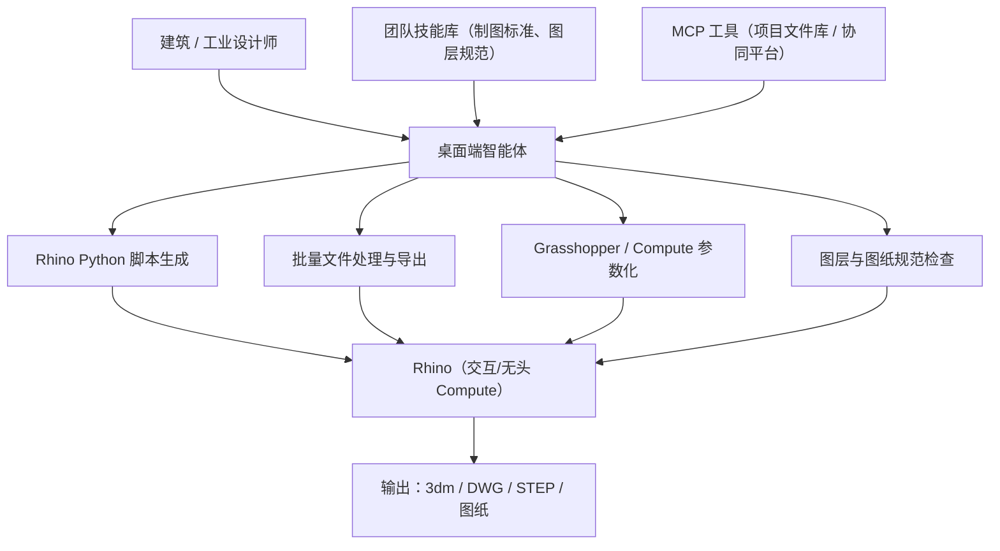

# Rhino 建筑与工业设计助手

> 场景定位：让 AI 成为建筑/工业设计师的"参数化脚本搭档"——通过 Rhino Python、RhinoScript 与 Grasshopper/Compute 自动生成曲面模型、批量处理图纸文件、驱动参数化设计，设计师专注形态创意与设计推敲。

## 业务痛点

| 痛点 | 具体表现 |
|------|----------|
| 异形建模重复劳动多 | 立面构件、幕墙划分、地形处理等批量几何操作靠手工点选 |
| 脚本 API 门槛高 | rhinoscriptsyntax / RhinoCommon 接口庞杂，设计师不熟悉编程 |
| Grasshopper 依赖熟手 | 参数化定义（.gh）只有少数人会搭，改动需求排队等 TD |
| 批量文件处理耗时 | 多个 .3dm 的图层清理、格式导出、图纸套图框逐个手工做 |
| 跨软件数据交换易错 | 与 Revit/SketchUp/CAD 的导入导出单位、层级常出问题 |
| 历史脚本无人维护 | 项目遗留的 RhinoScript/Python 脚本缺注释，改一处坏一片 |

## 解决方案

**核心能力**：
- **桌面端智能体**：在图形化对话界面里直接提需求，AI 生成 Rhino Python / RhinoScript 脚本，在 Rhino 交互会话中运行，或通过 Rhino.Compute 无头批量执行，日志与导出结果自动回收验证；桌面端内置完整本地工具运行时（Shell、文件操作），高风险操作有审批确认，无需任何命令行基础
- **技能系统**：把设计院/工作室规范（图层标准、命名规则、单位制、出图套框）封装为技能，AI 生成的模型与图纸自动遵守
- **MCP 工具对接**：连接项目文件库、协同平台等基础设施，实现从方案文件到交付图纸的批量自动化

## 典型子场景

### 子场景 1：批量几何生成与异形建模

| 任务 | 用法示例 |
|------|----------|
| 立面构件批量生成 | "沿这条曲面按 1.5m 间距生成竖向格栅，角度随曲面法线自适应" |
| 幕墙划分 | "把这个双曲面按四边形面板划分，输出每块面板的编号和面积表" |
| 地形处理 | "根据这些等高线生成地形曲面，并按高程做色带分层" |
| 参数化改型 | "把刚才的格栅间距改成 1.2m，截面换成工字型" |

AI 生成脚本 → 在 Rhino 中执行 → 视口截图回传确认，方案推敲以分钟计。

### 子场景 2：批量文件处理与格式导出

1. 把需求交给桌面端智能体："遍历项目目录所有 .3dm，清理空图层、按图层标准重命名、统一单位为毫米，导出 DWG 和 STEP"
2. AI 编写批处理脚本，通过 Rhino.Compute 无头执行
3. 输出处理报告：成功清单、失败文件与原因
4. 失败项自动分析日志、修正脚本后重跑

### 子场景 3：Grasshopper 与参数化设计辅助

- 用自然语言描述参数化逻辑，AI 生成对应的 Grasshopper Python 组件代码或 Compute 调用脚本
- "做一个参数化遮阳板：开口率随日照角度变化"——AI 输出可调参数的脚本，设计师只改数字
- 现有 .gh 定义的逻辑解读：AI 读取组件结构，解释数据流并给出简化建议

### 子场景 4：图纸与规范检查

- 出图前检查：图层归属、线型线宽、标注样式、单位与比例是否符合院标
- 批量套图框：按图幅清单自动排布视图、套图框、填图签
- 检查结果汇总成报告，不合规项列出对象编号供快速定位

### 子场景 5：设计知识问答与脚本维护

- 新人直接在桌面端对话里问："rhinoscriptsyntax 里怎么求两条曲线的交点？""Compute 和 RhinoCommon 什么关系？"
- AI 结合 Rhino 官方文档、McNeel 社区与团队技能库回答，附可运行示例
- 历史脚本的注释补全、bug 修复、Rhino 版本升级适配交给 AI 处理

## 实施步骤

### 第 1 步：安装与接入（半天）

1. 在设计工作站上安装太乙智启桌面客户端（见[安装指南](/getting-started/installation)），图形界面开箱即用，无需配置命令行环境
2. 确认本机 Rhino 版本与 Python 环境；如需无头批处理，部署 Rhino.Compute
3. 试运行最小脚本（新建文件、画一个立方体、导出 .3dm），验证执行链路

### 第 2 步：沉淀团队技能（2-3 天）

把设计院/工作室约定写成技能（`SKILL.md`），放入项目 `.snz1dp/skills/` 目录：

| 技能示例 | 内容 |
|----------|------|
| 图层标准 | 图层命名、颜色、线型、归属规则 |
| 建模规范 | 单位制、命名规则、曲面精度、分组组织 |
| 出图规范 | 图框模板、比例、标注样式、图签填写规则 |
| 交换规范 | DWG/STEP/IFC 导入导出参数与版本约定 |

技能随项目文件纳入版本管理，全团队共享、持续迭代。

### 第 3 步：对接周边设施（按需，1-3 天）

通过 MCP 工具连接：

| 系统 | 用途 |
|------|------|
| 项目文件库 / NAS | 批量拉取与回传 .3dm 及导出文件 |
| 协同平台 | 读取设计任务、同步进度状态 |
| 分析工具（日照/能耗） | 把几何数据送入分析引擎并回收结果 |
| 版本管理 | 脚本与交付文件的变更记录 |

### 第 4 步：试点推广（2-4 周）

- 从低风险任务开始：图层清理、批量导出、规范检查
- 逐步放开：批量几何生成、Grasshopper 脚本化、图纸自动套框
- 收集设计团队反馈，迭代技能与脚本模板

### 第 5 步：度量与持续优化

| 指标 | 说明 |
|------|------|
| 机械操作耗时 | 批处理与出图类任务的人工时间变化 |
| 脚本一次通过率 | AI 生成脚本无需人工修改即可运行的比例 |
| 出图合规率 | 图纸规范检查一次通过比例 |
| 方案推敲轮次 | 单日可完成的参数化改型迭代次数 |

## 自定义工具对接搭建

> 第 3 步是用现成 MCP 工具连接项目文件库、协同平台等周边系统。若要进一步把 Rhino 的脚本执行能力封装成自定义 MCP 工具，或直接接入社区现成的 Rhino / Grasshopper MCP 服务器（Rhino 内 socket 桥 / Rhino.Compute 无头方案），见独立章节 [专用工具 MCP 对接开发](/scenarios/tool-mcp-integration)——含社区项目盘点、接入注册方式、自研封装骨架与安全注意事项。

## 效果参考

| 指标 | 实施前 | 实施后（参考值） |
|------|--------|-----------------|
| 批量构件生成 | 数小时~数天 | 分钟级脚本执行 + 人工确认 |
| 批量文件导出 | 逐个打开手工导出 | 无头批处理，一次跑完 |
| 参数化设计门槛 | 依赖专职 GH 熟手 | 自然语言驱动，人人可用 |
| 出图规范检查 | 人工逐张抽查 | 全量自动检查 + 异常清单 |

:::warning 效果说明
以上为行业参考值。Rhino 为商业软件，使用前请确认授权合规；AI 生成的模型与图纸必须经设计师审核（尺寸、规范、可建造性）后方可交付；批量操作原始 .3dm 文件前务必保留备份。
:::

## 进阶玩法

| 进阶方向 | 说明 |
|----------|------|
| Compute 批处理集群 | 多台机器并行跑 AI 生成的无头脚本，定时任务统一调度 |
| 视口截图反馈闭环 | 脚本执行后自动截图回传，AI 依据画面继续调整参数 |
| 设计-分析闭环 | AI 建模 → 日照/能耗分析 → 依据结果自动调整形态参数 |
| 交付物自动打包 | 出图、导出、命名、归档一条龙，按交付清单自动组包 |
| 教学与新人培养 | 新人用自然语言问 Rhino 脚本用法，AI 结合官方文档与团队技能作答 |

## 相关文档

- [桌面客户端使用指南](/user-guide/desktop-app) — 桌面端智能体完整用法
- [技能是什么](/skill-development/skill-basics) — 技能系统入门
- [SKILL.md 编写规范](/skill-development/skill-format) — 沉淀图层标准与出图规范
- [专用工具 MCP 对接开发](/scenarios/tool-mcp-integration) — 社区 Rhino/Grasshopper MCP 盘点与自研封装
- [MCP 工具开发](/skill-development/mcp-tools) — 封装自定义工具，对接项目文件库与协同平台
- [客户端工具开发](/skill-development/client-tools) — 本地执行工具与回调协议
- [定时报告与监控播报](/scenarios/scheduled-reports) — 定时批处理与播报任务
