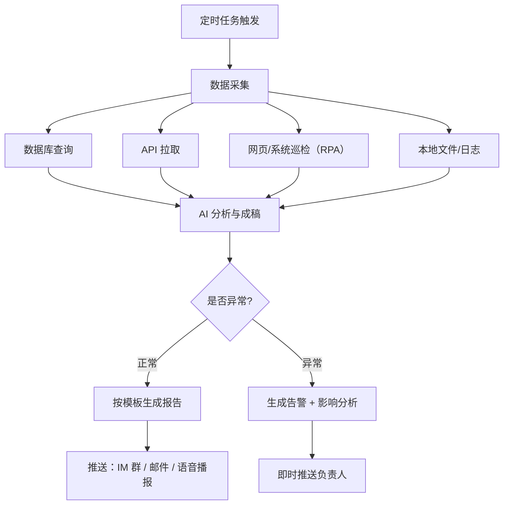

# 定时报告与监控播报

> 场景定位：日报、周报、巡检、指标监控——设定一次，AI 按时自动执行、自动成稿、自动推送，人只看结果和处理异常。

## 业务痛点

| 痛点 | 具体表现 |
|------|----------|
| 日报周报靠催 | 每天/每周固定要交的报表，总有人忘、总有人拖 |
| 手工汇总费时 | 从多个系统导数据、拼表格、写说明，2 小时起步 |
| 巡检走过场 | 每日巡检项靠人逐项检查，忙起来就漏检 |
| 异常发现滞后 | 指标出问题了，等到周报才看见，错过处理窗口 |
| 播报不及时 | 重要通知/战报要人工整理后逐个群转发 |

## 解决方案



**核心能力**：
- **定时调度**：支持 cron 表达式、固定间隔、一次性执行三种调度方式
- **智能体执行**：定时触发的是完整智能体任务——可查数据、跑命令、操作网页、生成文档
- **多渠道推送**：报告自动推送到 IM 群、邮件，或通过语音播报到指定终端
- **异常驱动**：正常时静默或简报，异常时即时告警，避免"报告疲劳"

## 典型子场景

### 子场景 1：每日经营简报

| 要素 | 配置 |
|------|------|
| 触发时间 | 每个工作日 08:30 |
| 任务内容 | 查询昨日核心指标（销售额、订单量、活跃用户）→ 与前日/上周同期对比 → 生成简报 |
| 输出 | Markdown 简报 + 趋势图，推送到管理层 IM 群 |
| 异常策略 | 任一指标波动超 20%，简报置顶标注并 @ 相关负责人 |

### 子场景 2：周报/月报自动生成

- 每周五 17:00 触发，汇总本周数据与关键事件
- 按固定模板成稿：核心指标 → 本周进展 → 问题与风险 → 下周计划
- 生成 Word/PDF 文档归档，摘要版推送群内
- 人工只需复核补充定性内容

### 子场景 3：系统与业务巡检

- 每小时/每天定时检查：服务健康状态、证书有效期、磁盘空间、关键业务队列积压
- 结合浏览器自动化巡检没有 API 的后台页面（见[办公自动化 RPA](/scenarios/office-rpa)）
- 巡检项全部通过 → 静默或发一行"✅ 今日巡检正常"
- 任一项异常 → 立即告警，附现场数据与建议处理动作

### 子场景 4：语音播报

- 车间大屏、值班室终端配置语音连接
- 定时任务产出结果通过 TTS 播报：早会数据播报、告警语音提醒
- 适合不便看屏幕的场景（产线、驾驶、值班）

### 子场景 5：情报与舆情定时摘要

- 每天早上定时搜索行业新闻、竞品动态、政策变化
- AI 筛选与业务相关的内容，生成摘要简报
- 按主题分类推送给不同团队

## 实施步骤

### 第 1 步：盘点周期性任务（半天）

列出团队所有"固定周期要做的事"：

| 任务 | 频率 | 当前耗时 | 自动化优先级 |
|------|------|----------|--------------|
| 经营日报 | 每日 | 1 小时 | 高 |
| 系统巡检 | 每日 | 30 分钟 | 高 |
| 项目周报 | 每周 | 2 小时 | 中 |
| 月度对账汇总 | 每月 | 半天 | 中 |

### 第 2 步：准备数据通道（1-2 天）

- 数据库：只读账号 + 数据字典（见[数据分析与洞察](/scenarios/data-analysis)）
- 网页系统：浏览器自动化环境 + 登录态
- API：认证凭据配置
- 报告模板：固定格式写入技能或提示词

### 第 3 步：编写任务提示词（半天）

每个定时任务一段完整的任务描述，包含：

```markdown
任务：生成每日经营简报
1. 查询昨日销售额、订单量、活跃用户数（口径见数据字典）
2. 与前日、上周同期对比，计算环比/同比
3. 波动超过 20% 的指标标注 ⚠️ 并给出可能原因
4. 按简报模板输出，推送到指定群
失败处理：数据查询失败时重试 1 次，仍失败则推送故障通知
```

### 第 4 步：配置定时调度

| 调度类型 | 适用 | 示例 |
|----------|------|------|
| cron 表达式 | 固定时间点 | `30 8 * * 1-5`（工作日 8:30） |
| 固定间隔 | 周期性巡检 | 每 3600 秒（每小时） |
| 一次性 | 临时任务 | 指定时间执行一次 |

### 第 5 步：试运行与调优（1-2 周）

- 检查每期报告：数据准确性、格式稳定性、推送及时性
- 查看执行记录：失败任务及时排查（凭据过期、页面改版、数据源变更）
- 建立报告质量反馈机制，持续优化提示词

## 效果参考

| 指标 | 实施前 | 实施后（参考值） |
|------|--------|-----------------|
| 日报产出 | 人工 1 小时，偶有遗漏 | 自动 5 分钟，零遗漏 |
| 巡检覆盖 | 每日 1 次人工 | 每小时自动，覆盖率 100% |
| 异常发现时效 | 天级（等报告） | 分钟级（即时告警） |
| 周报准备 | 半天汇总 | 自动成稿 + 30 分钟人工补充 |

:::warning 效果说明
以上为行业参考值。定时任务依赖数据源与凭据的稳定性，建议为关键任务配置失败告警，避免"静默失败"——任务挂了没人知道，比没有任务更危险。
:::

## 进阶玩法

| 进阶方向 | 说明 |
|----------|------|
| 异常升级链 | 告警 10 分钟无人响应 → 升级到上级负责人 |
| 报告分级 | 管理层看摘要版，执行层看明细版，同一数据多视角输出 |
| 任务编排 | 采集任务 → 分析任务 → 推送任务串联成流水线 |
| 智能频率 | 平时每日一次，指标异常期自动加密到每小时 |
| 归档检索 | 历史报告自动入知识库，可随时提问"上个月哪周销售额最高" |

## 相关文档

- [数据分析与洞察](/scenarios/data-analysis) — 报告数据来源与口径
- [办公自动化 RPA](/scenarios/office-rpa) — 无 API 系统的巡检执行
- [文档处理与报告生成](/scenarios/document-processing) — 报告成稿与导出
- [语音对话](/user-guide/voice-interaction) — 语音播报能力
- [CLI 使用指南](/user-guide/cli-guide) — 定时任务管理命令
