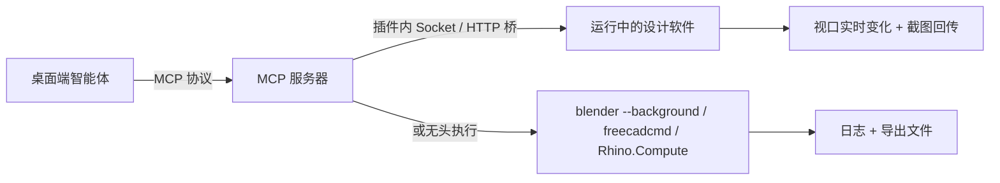

# 专用工具 MCP 对接开发

> 本章是[专用工具场景](/scenarios/)的开发篇：如何把 Blender、FreeCAD、Rhino 等专业设计软件接入太乙智启。两条路线——**直接接入社区现成的 MCP 服务器**（快，当天可用），或**自研封装 MCP 工具**（贴合团队管线，长期可控）。
>
> 除三个样板软件外，本章还盘点了建筑 BIM、机械 CAD、EDA 电子、CAE 仿真、游戏引擎、影视 DCC、3D 打印、UI 创意、音频 DAW 等 **12 个品类、80+ 个专用软件的 MCP 方案**，对接方法完全通用。

## 为什么专用软件适合走 MCP

Blender、FreeCAD、Rhino 都提供成熟的脚本 API（`bpy`、FreeCAD Python、RhinoCommon/rhinoscriptsyntax），这正是 MCP 工具最擅长封装的对象。同样的逻辑适用于 Revit、Unity、KiCad、COMSOL、Figma 等几乎所有具备脚本接口或开放 API 的专业软件：



社区已经验证了两种主流桥接模式：

| 模式 | 原理 | 优点 | 局限 |
|------|------|------|------|
| **插件 + Socket 桥** | 在软件内装一个插件（Blender addon / FreeCAD Mod / Rhino 插件），插件起 TCP/HTTP 服务；MCP 服务器把工具调用转发进去 | 操作运行中的 GUI 实例，视口实时可见，支持截图反馈闭环 | 软件必须保持打开；插件需随软件版本维护 |
| **无头执行** | MCP 服务器直接以 `blender --background --python`、`freecadcmd`、Rhino.Compute 等方式跑脚本 | 可批量、可定时、可上集群，不依赖 GUI | 看不到实时视口，需靠导出产物验证 |

多数成熟项目两种模式都支持（如 FreeCAD MCP 的 GUI 模式 + headless 回退），按任务性质自动选择。

### 桥接方式取决于目标软件的 API 形态

不同专用软件暴露的脚本接口差异很大，这决定了 MCP 服务器怎么写。盘点社区项目后可以归为六类：

| API 形态 | 代表软件 | 桥接做法 | 平台限制 |
|----------|----------|----------|----------|
| **内嵌 Python** | Blender（`bpy`）、FreeCAD、Houdini、Unreal（Python Remote Execution）、Godot（GDScript/C#） | 插件内起 Socket/HTTP 服务，或直接用软件自带的远程执行协议 | 跨平台 |
| **内置命令端口** | Maya（command port）、Rhino（`Rhino.Compute` / 脚本 socket） | 无需装插件，连上端口即可下发命令 | 跨平台 |
| **Windows COM / .NET** | AutoCAD、Civil 3D、SolidWorks、CATIA、Revit、Tekla、nanoCAD | `pywin32` / PythonNET 调 COM，或装 .NET 插件暴露 API | **仅 Windows** |
| **专有脚本语言** | AutoCAD（AutoLISP）、Altium（DelphiScript）、3ds Max（MAXScript）、SketchUp（Ruby） | MCP 生成对应语言代码，再经桥接层投递执行 | 视软件而定 |
| **云端 REST API** | Onshape、Figma、Canva、Sketchfab、Jama、Atlassian | 直接封装 HTTP API，无需本地软件 | 跨平台，需 API Key / OAuth |
| **命令行无头** | OpenSCAD、build123d、CadQuery、ezdxf、kicad-cli、freecadcmd、PrusaSlicer | `subprocess` 直接跑，天然适合批量与 CI | 跨平台 |

:::tip 对接前先确认三件事
1. **目标软件有没有内嵌 Python**——有，优先走内嵌 Python，跨平台且生态最成熟
2. **是不是 Windows COM 路线**——是，则 MCP 服务器必须跑在 Windows 上，太乙智启桌面端需部署在对应机器
3. **有没有官方 MCP**——有，优先官方（Autodesk、PTC、MathWorks、Bentley、Figma、Penpot、nanoCAD 均已提供），社区项目作为补充
:::

## 社区现成 MCP 服务器盘点

以下均为公开开源项目或官方服务，接入前请自行评估许可证、维护活跃度与安全性。

### Blender

| 项目 | 特点 |
|------|------|
| [ahujasid/blender-mcp](https://github.com/ahujasid/blender-mcp) | 社区最流行的 Blender MCP（约 2 万 star），addon + TCP socket 架构，支持场景操作、材质、渲染、Python 代码执行，可选 PolyHaven / Sketchfab / Hyper3D 资产集成 |
| [kleer001/blender-mcp](https://github.com/kleer001/blender-mcp) | 175 个细粒度类型化工具，覆盖对象、材质、着色器节点、几何节点、修改器、动画、绑定、物理、合成等 25 个领域，不依赖"万能代码执行"工具 |
| [djeada/blender-mcp-server](https://github.com/djeada/blender-mcp-server) | 27 个工具 / 7 个命名空间，stdio 传输，含异步任务管理 |
| [zorak1103/blender-mcp](https://github.com/zorak1103/blender-mcp) | addon 直接暴露 Streamable HTTP MCP 端点（`localhost:8400/mcp`），带 Bearer Token 鉴权，另提供 stdio-to-HTTP 代理 |
| 官方 Blender MCP | Blender 基金会旗下 Blender Lab 已推出官方 MCP 服务器（Anthropic 企业赞助级合作），2026 年 4 月随 "Claude for Creative Work" 发布 |

### FreeCAD

| 项目 | 特点 |
|------|------|
| [neka-nat/freecad-mcp](https://github.com/neka-nat/freecad-mcp) | 最流行的开源 CAD MCP 之一，FreeCAD 插件起 RPC 服务 + `uvx freecad-mcp` 一键运行，10 个核心工具（建模、代码执行、零件库、视图截图），MIT 协议 |
| [sergiudanstan/freecad-mcp](https://github.com/sergiudanstan/freecad-mcp) | 165 个工具 / 15 个模块，覆盖文档、图元、布尔、草图、PartDesign、网格、FEM、BIM；GUI 模式（socket 宏）+ headless 模式（freecadcmd）自动切换 |
| [yuri-schmaltz/mcp_freecad](https://github.com/yuri-schmaltz/mcp_freecad) | 53 个工具，工程化程度高：TLS + Bearer 鉴权、execute_code 黑名单、熔断重试、Prometheus 指标、CAM 刀路、FEM（CalculiX）分析 |
| [blwfish/freecad-mcp](https://github.com/blwfish/freecad-mcp) | 32 个工具，面向日常实战（参数化设计、CNC 刀路、网格），支持 Docker 无头部署 |
| [lucygoodchild/freecad-mcp-server](https://github.com/lucygoodchild/freecad-mcp-server) | TypeScript 实现，图元创建、布尔运算、文档管理、自定义脚本执行，自动探测 FreeCAD 安装路径 |

### Rhino / Grasshopper

| 项目 | 特点 |
|------|------|
| [jingcheng-chen/rhinomcp](https://github.com/jingcheng-chen/rhinomcp) | REER 公司开源，Rhino 内脚本起 socket 服务 + FastMCP 服务器三层架构，支持对象/图层操作、场景检查（含截图）、Rhino 与 Grasshopper 代码执行，提供 stdio 与 SSE 两种传输 |
| [goldsmith323/rhino_gh_mcp](https://github.com/goldsmith323/rhino_gh_mcp) | MIT AAG2025 工作坊项目，30+ 工具，HTTP 桥解决 MCP（Python 3.10+）与 Rhino IronPython 的版本兼容，支持跨文件几何传输与工作流建议 |
| [dongwoosuk/rhino-grasshopper-mcp](https://github.com/dongwoosuk/rhino-grasshopper-mcp) | 侧重 Grasshopper：解析 .gh/.ghx 文件、500+ 组件知识库、GHPython/C# 代码生成，含 ML 自动布局优化 |
| [alfredatnycu/grasshopper-mcp](https://github.com/alfredatnycu/grasshopper-mcp) | GH_MCP.gha 组件（TCP 服务）+ Python 桥，组件知识库驱动的高层意图识别，`pip install grasshopper-mcp` 即装 |

### 更多专用软件生态盘点

Blender / FreeCAD / Rhino 只是三个样板。同一套「插件 + Socket 桥」或「无头执行」的对接方法，适用于下面所有品类。以下均为公开开源项目或厂商官方服务，star 数为 2026 年 8～9 月检索快照，接入前请自行核对许可证、维护活跃度与安全性。

#### 建筑 AEC / BIM

| 软件 | 代表项目 | 特点 |
|------|----------|------|
| Revit | [revit-mcp/revit-mcp](https://github.com/revit-mcp/revit-mcp) | 16 个工具：视图/构件查询、点线面三类构件创建、`send_code_to_revit` 执行 C#/Python、AI 构件过滤、墙体批量标注 |
| Revit | [ZedMoster/revit-mcp](https://github.com/ZedMoster/revit-mcp) | Python 包形态，MIT，命令下发 + 建筑模型自动化 |
| Revit | [LuDattilo/mcp-servers-for-revit](https://github.com/LuDattilo/mcp-servers-for-revit) | 支持 Revit 2023–2027，构件增删改查实时生效 |
| Revit | Autodesk 官方 Revit MCP | 读工具为主，公开测试版；厂商背书，企业环境优先 |
| ArchiCAD | [SzamosiMate/tapir-archicad-MCP](https://github.com/SzamosiMate/tapir-archicad-MCP) | 需装 Tapir 插件，语义化工具发现（AI 自行匹配意图到工具） |
| Tekla Structures | 社区 tekla-mcp | 钢结构深化：构件插入 + 语义属性映射（MiniLM + LLM 回退）、碰撞检测、布尔切割、图纸修订标记；建筑类目前最活跃的项目 |
| Civil 3D | [antonhofstader/Civil3D-mcp-python-COM](https://github.com/antonhofstader/Civil3D-mcp-python-COM) | 19 个工具，COM 自动化，COGO 点 / 曲面 / 走廊，2026 年 4 月首个 Civil 3D MCP |
| Civil 3D | DaniGhosy/civil3d-mcp | 曲面、线形、纵断、走廊、管网、AutoCAD 几何，MIT |
| SketchUp | [mhyrr/sketchup-mcp](https://github.com/mhyrr/sketchup-mcp) | 约 267 star，Python↔Ruby TCP 双向桥，8 个工具 + `eval_ruby`；另有官方连接器 |
| OpenBIM / IFC | [JotaDeRodriguez/Bonsai_mcp](https://github.com/JotaDeRodriguez/Bonsai_mcp) | Blender + Bonsai（原 BlenderBIM）插件 + IfcOpenShell，11 个 IFC 工具：项目信息、实体列表、属性、空间结构、工程量 |
| OpenBIM / IFC | [smartaec/ifcMCP](https://github.com/smartaec/ifcMCP) | Streamable HTTP 传输，厂商中立的 IFC 原生操作 |
| OpenBIM / IFC | [helenkwok/openbim-mcp](https://github.com/helenkwok/openbim-mcp) | TypeScript + web-ifc，IFC → fragment 转换、按类别取构件 |
| OpenBIM / IFC | [xupeiwust/ifc-bonsai-mcp](https://github.com/xupeiwust/ifc-bonsai-mcp) | MCP4IFC 学术框架配套实现，50+ 工具 + 本地向量索引检索 IFC/IfcOpenShell 文档 |

#### 机械 CAD

| 软件 | 代表项目 | 特点 |
|------|----------|------|
| AutoCAD / 浩辰 / 中望 | [daobataotie/CAD-MCP](https://github.com/daobataotie/CAD-MCP) | 492 star，AutoLISP 代码生成路线，7 个统一工具覆盖 55 条 CAD 命令，块属性 / 图层 / 实体 / 数据导出 |
| AutoCAD | [puran-water/autocad-mcp](https://github.com/puran-water/autocad-mcp) | 440 star，**双后端**：AutoCAD LT 2024+ 文件 IPC，或 ezdxf 无头生成 DXF（跨平台，不需要装 CAD） |
| AutoCAD | [zh19980811/Easy-MCP-AutoCad](https://github.com/zh19980811/Easy-MCP-AutoCad) | 232 star，Windows COM + pyautocad + SQLite |
| AutoCAD（只读） | DWG MCP Server（npm） | 只读检查 DWG 内容，`DWG_MCP_HOST_FOLDERS` 限定可访问目录，适合图纸审查场景 |
| Fusion | Autodesk 官方 MCP 全家桶 | Fusion 本地运行时自带 MCP 服务器（GA）+ Fusion Data MCP（远程协作/项目管理）+ Product Help MCP（110+ 产品文档检索） |
| Fusion | [ArchimedesCrypto/fusion360-mcp-server](https://github.com/ArchimedesCrypto/fusion360-mcp-server) | 82 star，MIT，2026 年 6 月仍在更新，自然语言 → Fusion API Python 脚本 |
| SolidWorks | [eyfel/mcp-server-solidworks](https://github.com/eyfel/mcp-server-solidworks) | 202 star，**AGPL-3.0**（商用需注意），PythonNET + COM 适配 |
| SolidWorks | vespo92/SolidworksMCP-TS | Node.js/TypeScript，40+ 工具，智能 COM 桥 |
| Onshape | PTC 官方 FeatureScript MCP | 免费 hobbyist/maker 账号可用，云端 API-first 架构 |
| Onshape | jarvis-onshape-mcp | 约 60 工具：草图、拉伸、圆角、配合、参数变量、自定义 FeatureScript |
| CATIA V5/V6 | tongriyaotxt/catia-mcp、alex-darrous/catia-v5-mcp | 均为 Windows COM；后者带 `knowledge/` 设计规则库供 AI 参考 |
| nanoCAD | nanocad 官方 MCP | **208 个工具**，2D/3D 绘图、工程符号、标注、钣金、装配、MultiCAD API，需 .NET 插件 |
| KOMPAS-3D | Napetc/KOMPAS-3D-MCP | 俄罗斯主流 CAD，Windows 包 + config.json |

#### 代码化 CAD（无 GUI，最适合无头 / 定时 / CI）

| 项目 | 特点 |
|------|------|
| [jhacksman/OpenSCAD-MCP-Server](https://github.com/jhacksman/OpenSCAD-MCP-Server) | 176 star，文本/图片转 3D + 多视图重建，导出 CSG/AMF/3MF/SCAD，可选 3D 打印机发现与直连打印 |
| xintlabs/build123d-mcp | build123d 参数化 CAD，Python 脚本直接产出 STEP/STL/SVG，`CAD_WORKSPACE` 指定输出目录 |
| pzfreo/build123d-mcp | 同类实现，额外支持渲染 PNG/SVG 视图与几何测量，便于 AI 自检 |
| CadQuery 系（Forge / CAiD / Blok 等） | 把 CAD 内核整体暴露为 MCP 工具，AI-first、CLI-first，带视觉反馈 |

#### EDA 电子设计

| 软件 | 代表项目 | 特点 |
|------|----------|------|
| KiCad | [mixelpixx/KiCAD-MCP-Server](https://github.com/mixelpixx/KiCAD-MCP-Server) | **约 1.9k star，146 工具 / 13 类**，原理图编辑、PCB 布局、Freerouting 自动布线、JLCPCB 250 万+ 元件查询、Gerber 导出；MIT，492 次提交仍在活跃 |
| KiCad | [lamaalrajih/kicad-mcp](https://github.com/lamaalrajih/kicad-mcp) | 493 star，侧重项目管理与 BOM，含电路拓扑识别（自动识别 buck/boost/线性稳压） |
| KiCad | [Seeed-Studio/kicad-mcp-server](https://github.com/Seeed-Studio/kicad-mcp-server) | 40+ 工具，走 pcbnew API 做精确走线长度、信号/电源完整性分析，ERC/DRC 通过 kicad-cli 无头执行（CI 友好） |
| KiCad | [SaeronLab/eda-mcp](https://github.com/SaeronLab/eda-mcp) | 39 工具，Core / 原理图 / PCB / 导出四组，Gerber 导出受 DRC 门禁保护 |
| Altium Designer | [coffeenmusic/altium-mcp](https://github.com/coffeenmusic/altium-mcp) | DelphiScript 桥，可从数据手册生成原理图符号与 PCB 封装、复制选中布局、PCB 截图回传，提供 `.dxt` 桌面扩展一键安装 |
| Altium Designer | [truebest/altium-mcp](https://github.com/truebest/altium-mcp) | Output Job 批量执行、网络类创建、层显示控制、元件属性查询 |

#### CAE 仿真与工程计算

| 软件 | 代表项目 | 特点 |
|------|----------|------|
| MATLAB | [matlab/matlab-mcp-core-server](https://github.com/matlab/matlab-mcp-core-server) | **MathWorks 官方**，企业环境首选 |
| COMSOL Multiphysics | [Zhangyoupeng1996/Codex_MCP_Comsol](https://github.com/Zhangyoupeng1996/Codex_MCP_Comsol) | 模型管理/版本、几何、物理场与边界条件、网格、稳态与瞬态求解、结果表达式求值与出图，内置指南 + PDF 语义检索 |
| OpenFOAM | [webworn/openfoam-mcp-server](https://github.com/webworn/openfoam-mcp-server) | CFD 工作流；学术侧另有 MetaOpenFOAM、Foam-Agent 2.0、ChatCFD、CFDagent 等多智能体框架 |
| Abaqus | [jianzhichun/abaqus-mcp-server](https://github.com/jianzhichun/abaqus-mcp-server) | 有限元前处理与求解自动化 |
| Ansys Fluent | [jiweiqi/fluent-mcp-server](https://github.com/jiweiqi/fluent-mcp-server) | 流体仿真自动化 |
| Bentley STAAD | Bentley 官方 MCP | 结构工程，2026 年 5 月发布到开放 MCP Registry，需商业授权 |
| Ansys AGI STK | STK-MCP | 数字任务工程（轨道/链路分析） |

#### 游戏引擎

| 引擎 | 代表项目 | 特点 |
|------|----------|------|
| Unity | [CoderGamester/mcp-unity](https://github.com/CoderGamester/mcp-unity) | Unity 包 + Node.js 桥，MIT；执行菜单项、GameObject/组件增改、Package Manager、Test Runner，资源侧提供层级/日志/资产/测试查询；自动把 `Library/PackedCache` 加入工作区提升 AI 代码智能 |
| Unity | [justinpbarnett/unity-mcp](https://github.com/justinpbarnett/unity-mcp) | 约 2k star，`manage_scene/asset/shader/gameobject/script/editor` 等 8 大工具，可选 Roslyn 做严格 C# 编译诊断，编辑器内一键 Auto Configure |
| Unreal Engine 5 | [Hengle/unreal-mcp](https://github.com/Hengle/unreal-mcp) | 走 UE **内置** Python Remote Execution，无需装新插件、无需 C++，`npx -y @runreal/unreal-mcp` 即跑，覆盖完整 UE Python API |
| Unreal Engine 5 | [ShawnOotter/unreal-engine-mcp](https://github.com/ShawnOotter/unreal-engine-mcp) | UE 5.5+，蓝图/Actor/关卡/材质（PBR 全参数）/截图，集成 Microsoft Trellis 文生 3D，已衍生出自主 Agent |
| Godot | [Vollkorn-Games/godot-mcp](https://github.com/Vollkorn-Games/godot-mcp) | 75 工具覆盖完整游戏开发环；**交互式试玩**（运行游戏、注入键鼠手柄输入、查询实时状态、等待信号、截取视口）、批量测试序列、只读模式与工具集过滤，184 个针对真实无头 Godot 的自动化测试 |
| Godot | IvanMurzak/Godot-MCP | C# 编辑器插件，42 工具 / 12 族，与 Unity-MCP 共享 MCP/反射栈；需 Godot 4.3+ 的 .NET 版 |
| Godot | DemZem「Godot AI Workbench」 | 129 工具，已上架 Godot 官方资产库，Apache-2.0，默认只监听 127.0.0.1 |

#### 影视动画 DCC

| 软件 | 代表项目 | 特点 |
|------|----------|------|
| Maya | aydji/maya-mcp-server | 30+ 工具，走 Maya **内置 command port**，无需装插件；19 种基本体、挤出/倒角/平滑/布尔、材质灯光、程序化阵列、动画关键帧、变形器 |
| Maya | chadrik/maya-mcp-server | 多 Maya 会话管理、任意 Python 执行、流式输出捕获 |
| 3ds Max / Cinema 4D / Houdini | 社区 MCP | 普遍为 TCP socket 执行 MAXScript / Python 路线；另有 team-plask/3D-MCP 尝试做跨 DCC 的统一语义层 |
| DaVinci Resolve | [samuelgursky/davinci-resolve-mcp](https://github.com/samuelgursky/davinci-resolve-mcp) | 视频剪辑、调色、媒体管理、工程控制 |
| TouchDesigner | [Pantani/tdmcp](https://github.com/Pantani/tdmcp) | 描述视觉效果 → AI 直接搭出可播放的节点网络（音频反应、生成式、粒子、3D、反馈系统），含 MIDI/OSC/DMX，并自检与预览 |

#### 3D 打印 / 增材制造

| 项目 | 特点 |
|------|------|
| [DMontgomery40/mcp-3d-printer-server](https://github.com/DMontgomery40/mcp-3d-printer-server) | 153 star，GPL-2.0；覆盖 OctoPrint / Klipper(Moonraker) / Duet / Repetier / Bambu / Prusa Connect / Creality；STL 缩放旋转平移、截面编辑、加底改善附着、切片、多角度 SVG 可视化、Bambu 通过 MQTT 直打 .3mf |
| OctoEverywhere 官方 3D Printer MCP | Apache-2.0，云端打印管理 |
| hunter-stradley/bambustudio-mcp | 端到端闭环：建模 → 缩放 → 切片 → 打印 → 监控 → 缺陷检测 → 迭代改进 |
| [VisualBoy/ai-slicer-mcp-server](https://github.com/VisualBoy/ai-slicer-mcp-server) | PrusaSlicer CLI 切片 + OctoPrint API 管理，Python + uv |

#### UI / 平面创意设计

| 软件 | 代表项目 | 特点 |
|------|----------|------|
| Figma | Figma 官方 Dev Mode MCP | 本地 `http://127.0.0.1:3845/mcp`（需桌面版 + Dev/Full 席位）与远程 `https://mcp.figma.com/mcp`（OAuth，全席位可用）；`get_design_context` / `get_variable_defs` / `get_code_connect_map` / `get_screenshot`，2026 年 3 月起支持写回画布 |
| Figma | Framelink MCP for Figma | **约 12.2k star**，社区最流行，把 Figma API 响应精简为 AI 易读格式 |
| Figma | [sethford/mcp-figma](https://github.com/sethford/mcp-figma) | 44 工具，Figma 插件 + WebSocket 双向，支持创建/修改图元、组件实例与覆盖、Auto Layout、原型连接 |
| Penpot | [penpot/penpot-mcp](https://github.com/penpot/penpot-mcp) | **官方**，220 star，已并入主仓库；TypeScript + 插件 API + WebSocket，设计↔代码↔文档↔设计系统四向流转，完全开源可自托管 |
| Canva / Adobe | Canva 官方 MCP、Adobe MCP | Canva：模板搜索 + AI 生成 + 资产导出；Adobe：Photoshop / Illustrator / Premiere 脚本执行（Illustrator 走 JavaScript + AppleScript，Photoshop 社区实现多为 Windows only） |
| Aseprite | ext-sakamoro/aseprite-mcp-tools | 像素画，Python，支持 Docker 部署与 SteamCMD 自动安装 Aseprite，`ASEPRITE_PATH` 指定二进制 |
| Miro / Framer / XMind / Storybook | 官方或社区 MCP | 白板协作、原型动画、思维导图、设计系统组件文档 |

#### 音频 DAW

| 软件 | 代表项目 | 特点 |
|------|----------|------|
| REAPER | [TwelveTake-Studios/reaper-mcp](https://github.com/TwelveTake-Studios/reaper-mcp) | **129 个工具**，混音、母带、MIDI 作曲、完整音乐制作 |
| FL Studio | [rosasynthesiz/flstudio-mcp](https://github.com/rosasynthesiz/flstudio-mcp) | 67 个工具，DAW 内混音（Mix Doctor、增益架构、EQ/压缩/混响、参考曲匹配）、路由与编曲 |

#### 3D 资产平台与生成

| 项目 | 特点 |
|------|------|
| Sketchfab MCP（gregkop） | 搜索 / 查看详情 / 下载 3D 模型，需 `SKETCHFAB_API_KEY` |
| Trellis MCP + TRELLIS Blender 插件 | 文生 3D / 图生 3D，可直接导入 Blender |
| Poly Haven / Hyper3D Rodin / Hunyuan3D / Meshy | 多已内置在 Blender MCP 中：免费 HDRI 与贴图下载、AI 3D 生成与轮询导入 |

#### 其他工程工具链

Jama Connect（官方）、Atlassian Rovo（官方远程 MCP）、Dassault Cameo（[ajhcs/cameo-mcp-bridge](https://github.com/ajhcs/cameo-mcp-bridge)，MBSE 系统建模）、Vector CANoe（车载测试）、Autodesk Platform Services CLI（Rust 实现，带 MCP 支持）、GitHub / GitLab / SonarQube（官方 MCP，研发链路）。

:::warning 选型避坑：star 数 ≠ 维护状态
有评测用 GitHub API 拉取 2026 年 8 月数据发现：bonninr/freecad_mcp（216 star）最后提交停在 2025 年 3 月、jhacksman/OpenSCAD-MCP-Server（176 star）同样 2025 年 3 月、BLamy/onshape-mcp 2025 年 4 月、daobataotie/CAD-MCP 2025 年 7 月——合计上千 star，但都停留在已经演进的旧版 MCP 规范上，未针对当前客户端测试过。

同类陷阱还有：`ahujasid/blender-mcp` 已迁移到 MCPBlender 组织（旧链接会重定向），且**该项目与 Blender 基金会无关**，官方 `blender_mcp` 是另一个独立项目——名字相近，选型时务必分清。

判断一个项目是否可用，优先看**最后一次提交时间**与**是否跟进当前 MCP 规范版本**，其次才看 star。
:::

:::tip 选型建议
- **个人 / 小团队快速上手**：选 star 数高、`uvx`/`npx`/`pip` 一键运行且近期有提交的项目（Blender 选 MCPBlender，FreeCAD 选 neka-nat，Rhino 选 rhinomcp，Unity 选 CoderGamester，UE 选 Hengle/unreal-mcp，KiCad 选 mixelpixx）
- **企业生产环境**：优先带鉴权（TLS/Bearer）、工具白名单、只读模式、审计日志的工程化项目（如 yuri-schmaltz/mcp_freecad、Vollkorn-Games/godot-mcp），或按下文自研封装
- **商业软件**（Rhino、Autodesk 系、SolidWorks、CATIA、Altium、Ansys、Bentley）：确认授权合规，**优先厂商官方 MCP**（Autodesk Fusion/Revit、PTC Onshape、MathWorks MATLAB、Bentley STAAD、nanoCAD、Penpot、Figma 均已有官方实现）
- **许可证陷阱**：SolidWorks 的 eyfel/mcp-server-solidworks 是 AGPL-3.0，3D 打印的 DMontgomery40 是 GPL-2.0，闭源商用前必须评估传染性条款
- **无 GUI 场景**（定时任务、CI、集群批处理）：优先代码化 CAD（OpenSCAD / build123d / CadQuery）、ezdxf 无头后端、kicad-cli ERC/DRC、freecadcmd、`blender --background`
:::

## 接入太乙智启

社区 MCP 服务器接入太乙智启桌面端与自研工具完全一致，按传输类型注册即可（详见 [MCP 工具开发](/skill-development/mcp-tools)）：

| 传输类型 | 注册示例 |
|----------|----------|
| stdio | `stdio://uvx freecad-mcp` 或 `stdio://python3 /path/to/server.py` |
| Streamable HTTP | `http://localhost:8400/mcp`（如 zorak1103/blender-mcp 的 addon 端点） |
| SSE | `http://localhost:8000/sse`（如 rhinomcp 的 SSE 服务器） |

两种注册方式：

1. **对话里让 AI 自助注册**：直接说"帮我添加一个 MCP 服务，地址是 …"，AI 调用内置 MCP 管理工具完成
2. **持久化注册**：`taiyiflow-cli mcp add --name blender --url "stdio://uvx blender-mcp" --type stdio`，之后每次会话自动连接

接入后建议立即编写配套技能（`SKILL.md`），约定何时调用哪些工具、参数怎么填、结果如何解读——MCP 工具解决"AI 能做到"，技能解决"AI 知道何时做、怎么做"。

## 自研封装：把脚本执行做成 MCP 工具

现成服务器不满足团队管线（资产规范、目录约定、审批策略）时，自研一个最小封装往往只需几十行代码。通用骨架（Python 官方 SDK，stdio 传输）：

```python
# design_tool_mcp_server.py
import os
import subprocess
import tempfile
from mcp.server.fastmcp import FastMCP

mcp = FastMCP("design-tool")


@mcp.tool()
def run_script(script: str, source_file: str = "", timeout: int = 300) -> dict:
    """无头执行一段设计软件脚本，返回退出码与日志。
    描述里写清：做什么 + 什么时候用 + 参数含义，这是 AI 决定调用的唯一依据。

    Args:
        script: 脚本内容（bpy / FreeCAD Python / RhinoCommon）
        source_file: 可选，先打开的源文件路径
        timeout: 执行超时秒数
    """
    with tempfile.NamedTemporaryFile("w", suffix=".py", delete=False, encoding="utf-8") as f:
        f.write(script)
        script_path = f.name
    cmd = build_command(script_path, source_file)  # 按目标软件拼装
    try:
        proc = subprocess.run(cmd, capture_output=True, text=True, timeout=timeout)
        return {"returncode": proc.returncode,
                "stdout": proc.stdout[-4000:],
                "stderr": proc.stderr[-4000:]}
    finally:
        os.unlink(script_path)
```

`build_command` 按目标软件拼装，常见形态：

| 软件 | 无头执行命令 | 备注 |
|------|-------------|------|
| Blender | `blender --background [file.blend] --python script.py` | 可执行路径用 `BLENDER_PATH` 环境变量固化 |
| FreeCAD | `freecadcmd script.py` | 需要打开文档时在脚本头部拼 `FreeCAD.openDocument(...)` |
| Rhino | HTTP 提交到 Rhino.Compute 服务 | Rhino 无 GUI 进程可后台拉起，Compute 是官方无头方案；端点与鉴权以实际部署为准 |
| OpenSCAD | `openscad -o out.stl model.scad` | 纯文本输入，最适合 AI 生成 + 无头渲染 |
| KiCad | `kicad-cli pcb drc / sch erc / pcb export gerber` | 官方 CLI，ERC/DRC 门禁可直接做 CI 卡点 |
| 切片器 | `prusa-slicer --export-gcode --load-config profile.ini model.stl` | OrcaSlicer / Cura / Slic3r 同类参数 |
| AutoCAD（无 CAD 环境） | 改用 `ezdxf` Python 库直接生成 DXF | 跨平台，不需要装 AutoCAD；需要读写 DWG 时才走 COM |
| Windows COM 系 | `python -c "import win32com.client; ..."` | AutoCAD / SolidWorks / CATIA / Civil 3D / Tekla，**仅 Windows** |

若要操作**运行中的 GUI 实例**（视口实时反馈），参照社区项目的插件 + Socket 桥模式：在软件内装插件起 TCP 服务，MCP 工具把脚本 POST 进去执行。

### 开发与验证流程

1. **实现**：按上述骨架编写，工具的 `description` 是最重要的代码
2. **调试**：MCP Inspector（`npx @modelcontextprotocol/inspector`）单工具调通
3. **注册**：桌面端对话自助注册或 `taiyiflow-cli mcp add` 持久化
4. **配套技能**：把调用时机、参数约定、结果解读写进 `SKILL.md`
5. **验证闭环**：对话里让 AI 实际调用 → 检查工具调用记录核对参数与结果

## 安全注意事项

:::warning 必读
几乎所有设计软件 MCP 都涉及**任意代码执行**（execute_code 类工具），社区项目自身也普遍标注安全警告：

- **网络边界**：插件的 Socket/HTTP 服务只监听 localhost；远程访问必须加鉴权（Bearer Token / TLS），部分项目默认无鉴权，接入前先检查
- **目录范围**：限制脚本可访问的目录，配合平台 `external_resource_access_policy` 控制越界访问
- **写操作审批**：配合 `write_confirmation_policy`，覆盖写原始 .blend / .FCStd / .3dm 文件等高风险动作必须人工确认
- **备份先行**：批量操作前保留源文件备份；AI 生成的模型与图纸必须经设计师校核后方可交付
- **许可证与授权**：核对开源项目许可证（MIT / GPLv3 等）；Rhino、Autodesk 系、SolidWorks 等商业软件确认授权合规
:::

## 相关文档

- [Blender 三维创作助手](/scenarios/blender) — Blender 场景方案
- [FreeCAD 参数化设计助手](/scenarios/freecad) — FreeCAD 场景方案
- [Rhino 建筑与工业设计助手](/scenarios/rhino) — Rhino 场景方案
- [MCP 工具开发](/skill-development/mcp-tools) — MCP 协议、注册与调试完整指南
- [SKILL.md 编写规范](/skill-development/skill-format) — 配套技能编写
- [客户端工具开发](/skill-development/client-tools) — 本地执行工具的另一种路线
