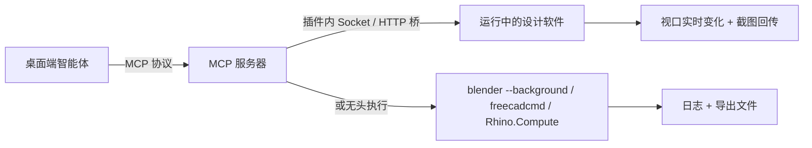

# 专用工具 MCP 对接开发

> 本章是[专用工具场景](/scenarios/)的开发篇：如何把 Blender、FreeCAD、Rhino 等专业设计软件接入太乙智启。两条路线——**直接接入社区现成的 MCP 服务器**（快，当天可用），或**自研封装 MCP 工具**（贴合团队管线，长期可控）。

## 为什么设计软件适合走 MCP

Blender、FreeCAD、Rhino 都提供成熟的脚本 API（`bpy`、FreeCAD Python、RhinoCommon/rhinoscriptsyntax），这正是 MCP 工具最擅长封装的对象：



社区已经验证了两种主流桥接模式：

| 模式 | 原理 | 优点 | 局限 |
|------|------|------|------|
| **插件 + Socket 桥** | 在软件内装一个插件（Blender addon / FreeCAD Mod / Rhino 插件），插件起 TCP/HTTP 服务；MCP 服务器把工具调用转发进去 | 操作运行中的 GUI 实例，视口实时可见，支持截图反馈闭环 | 软件必须保持打开；插件需随软件版本维护 |
| **无头执行** | MCP 服务器直接以 `blender --background --python`、`freecadcmd`、Rhino.Compute 等方式跑脚本 | 可批量、可定时、可上集群，不依赖 GUI | 看不到实时视口，需靠导出产物验证 |

多数成熟项目两种模式都支持（如 FreeCAD MCP 的 GUI 模式 + headless 回退），按任务性质自动选择。

## 社区现成 MCP 服务器盘点

以下均为公开开源项目或官方服务，接入前请自行评估许可证、维护活跃度与安全性。

### Blender

| 项目 | 特点 |
|------|------|
| [ahujasid/blender-mcp](https://github.com/ahujasid/blender-mcp) | 社区最流行的 Blender MCP（约 2 万 star），addon + TCP socket 架构，支持场景操作、材质、渲染、Python 代码执行，可选 PolyHaven / Sketchfab / Hyper3D 资产集成 |
| [kleer001/blender-mcp](https://github.com/kleer001/blender-mcp) | 175 个细粒度类型化工具，覆盖对象、材质、着色器节点、几何节点、修改器、动画、绑定、物理、合成等 25 个领域，不依赖"万能代码执行"工具 |
| [djeada/blender-mcp-server](https://github.com/djeada/blender-mcp-server) | 27 个工具 / 7 个命名空间，stdio 传输，含异步任务管理 |
| [zorak1103/blender-mcp](https://github.com/zorak1103/blender-mcp) | addon 直接暴露 Streamable HTTP MCP 端点（`localhost:8400/mcp`），带 Bearer Token 鉴权，另提供 stdio-to-HTTP 代理 |
| 官方 Blender MCP | Blender 基金会旗下 Blender Lab 已推出官方 MCP 服务器（Anthropic 企业赞助级合作），2026 年 4 月随 "Claude for Creative Work" 发布 |

### FreeCAD

| 项目 | 特点 |
|------|------|
| [neka-nat/freecad-mcp](https://github.com/neka-nat/freecad-mcp) | 最流行的开源 CAD MCP 之一，FreeCAD 插件起 RPC 服务 + `uvx freecad-mcp` 一键运行，10 个核心工具（建模、代码执行、零件库、视图截图），MIT 协议 |
| [sergiudanstan/freecad-mcp](https://github.com/sergiudanstan/freecad-mcp) | 165 个工具 / 15 个模块，覆盖文档、图元、布尔、草图、PartDesign、网格、FEM、BIM；GUI 模式（socket 宏）+ headless 模式（freecadcmd）自动切换 |
| [yuri-schmaltz/mcp_freecad](https://github.com/yuri-schmaltz/mcp_freecad) | 53 个工具，工程化程度高：TLS + Bearer 鉴权、execute_code 黑名单、熔断重试、Prometheus 指标、CAM 刀路、FEM（CalculiX）分析 |
| [blwfish/freecad-mcp](https://github.com/blwfish/freecad-mcp) | 32 个工具，面向日常实战（参数化设计、CNC 刀路、网格），支持 Docker 无头部署 |
| [lucygoodchild/freecad-mcp-server](https://github.com/lucygoodchild/freecad-mcp-server) | TypeScript 实现，图元创建、布尔运算、文档管理、自定义脚本执行，自动探测 FreeCAD 安装路径 |

### Rhino / Grasshopper

| 项目 | 特点 |
|------|------|
| [jingcheng-chen/rhinomcp](https://github.com/jingcheng-chen/rhinomcp) | REER 公司开源，Rhino 内脚本起 socket 服务 + FastMCP 服务器三层架构，支持对象/图层操作、场景检查（含截图）、Rhino 与 Grasshopper 代码执行，提供 stdio 与 SSE 两种传输 |
| [goldsmith323/rhino_gh_mcp](https://github.com/goldsmith323/rhino_gh_mcp) | MIT AAG2025 工作坊项目，30+ 工具，HTTP 桥解决 MCP（Python 3.10+）与 Rhino IronPython 的版本兼容，支持跨文件几何传输与工作流建议 |
| [dongwoosuk/rhino-grasshopper-mcp](https://github.com/dongwoosuk/rhino-grasshopper-mcp) | 侧重 Grasshopper：解析 .gh/.ghx 文件、500+ 组件知识库、GHPython/C# 代码生成，含 ML 自动布局优化 |
| [alfredatnycu/grasshopper-mcp](https://github.com/alfredatnycu/grasshopper-mcp) | GH_MCP.gha 组件（TCP 服务）+ Python 桥，组件知识库驱动的高层意图识别，`pip install grasshopper-mcp` 即装 |

### 其他专业设计工具（同一套对接方法均适用）

| 工具 | MCP 方案 |
|------|----------|
| Autodesk Fusion | **官方 MCP**：Fusion 本地运行时自带 MCP 服务器（GA），另有 Fusion Data MCP（远程协作/项目管理）与 Product Help MCP（110+ 产品文档检索） |
| Autodesk Revit | Revit 2027 官方 MCP（读工具，公开测试版）；社区另有 revit-mcp |
| SketchUp | 官方连接器（2026 年 4 月发布）；社区 [mhyrr/sketchup-mcp](https://github.com/mhyrr/sketchup-mcp)，Python-Ruby TCP 桥 |
| AutoCAD / GstarCAD / ZWCAD | [daobataotie/CAD-MCP](https://github.com/daobataotie/CAD-MCP)，AutoLISP 代码生成路线，35+ 绘图工具 |
| SolidWorks | 社区 mcp-server-solidworks，PythonNET + COM 适配 |
| Onshape | 社区 onshape-mcp（TypeScript），走 Onshape 云 API |
| CATIA V5/V6 | 社区 MCP，Windows COM 自动化 |
| 3ds Max | 社区 3dsmax-mcp，TCP socket 执行 MAXScript / Python |
| Houdini / Unreal Engine 5 / Unity | 均有社区 MCP 服务器，游戏与影视管线可用 |
| OpenSCAD | [jhacksman/OpenSCAD-MCP-Server](https://github.com/jhacksman/OpenSCAD-MCP-Server)，文本转 3D，支持 CSG/AMF/3MF 导出与 3D 打印机直连 |
| KiCad | 官方生态 MCP，原理图 / PCB 分析与引脚级连接追踪 |
| build123d | 代码化参数 CAD，Python 脚本直接生成 STEP/STL/SVG |

:::tip 选型建议
- **个人 / 小团队快速上手**：选 star 数高、`uvx`/`pip` 一键运行的项目（Blender 选 ahujasid，FreeCAD 选 neka-nat，Rhino 选 rhinomcp）
- **企业生产环境**：优先带鉴权（TLS/Bearer）、工具白名单、审计日志的工程化项目，或按下文自研封装
- **商业软件**（Rhino、Autodesk 系、SolidWorks、CATIA）：确认授权合规，优先官方 MCP
:::

## 接入太乙智启

社区 MCP 服务器接入太乙智启桌面端与自研工具完全一致，按传输类型注册即可（详见 [MCP 工具开发](/skill-development/mcp-tools)）：

| 传输类型 | 注册示例 |
|----------|----------|
| stdio | `stdio://uvx freecad-mcp` 或 `stdio://python3 /path/to/server.py` |
| Streamable HTTP | `http://localhost:8400/mcp`（如 zorak1103/blender-mcp 的 addon 端点） |
| SSE | `http://localhost:8000/sse`（如 rhinomcp 的 SSE 服务器） |

两种注册方式：

1. **对话里让 AI 自助注册**：直接说"帮我添加一个 MCP 服务，地址是 …"，AI 调用内置 MCP 管理工具完成
2. **持久化注册**：`taiyiflow-cli mcp add --name blender --url "stdio://uvx blender-mcp" --type stdio`，之后每次会话自动连接

接入后建议立即编写配套技能（`SKILL.md`），约定何时调用哪些工具、参数怎么填、结果如何解读——MCP 工具解决"AI 能做到"，技能解决"AI 知道何时做、怎么做"。

## 自研封装：把脚本执行做成 MCP 工具

现成服务器不满足团队管线（资产规范、目录约定、审批策略）时，自研一个最小封装往往只需几十行代码。通用骨架（Python 官方 SDK，stdio 传输）：

```python
# design_tool_mcp_server.py
import os
import subprocess
import tempfile
from mcp.server.fastmcp import FastMCP

mcp = FastMCP("design-tool")


@mcp.tool()
def run_script(script: str, source_file: str = "", timeout: int = 300) -> dict:
    """无头执行一段设计软件脚本，返回退出码与日志。
    描述里写清：做什么 + 什么时候用 + 参数含义，这是 AI 决定调用的唯一依据。

    Args:
        script: 脚本内容（bpy / FreeCAD Python / RhinoCommon）
        source_file: 可选，先打开的源文件路径
        timeout: 执行超时秒数
    """
    with tempfile.NamedTemporaryFile("w", suffix=".py", delete=False, encoding="utf-8") as f:
        f.write(script)
        script_path = f.name
    cmd = build_command(script_path, source_file)  # 按目标软件拼装
    try:
        proc = subprocess.run(cmd, capture_output=True, text=True, timeout=timeout)
        return {"returncode": proc.returncode,
                "stdout": proc.stdout[-4000:],
                "stderr": proc.stderr[-4000:]}
    finally:
        os.unlink(script_path)
```

三个软件的 `build_command` 差异：

| 软件 | 无头执行命令 | 备注 |
|------|-------------|------|
| Blender | `blender --background [file.blend] --python script.py` | 可执行路径用 `BLENDER_PATH` 环境变量固化 |
| FreeCAD | `freecadcmd script.py` | 需要打开文档时在脚本头部拼 `FreeCAD.openDocument(...)` |
| Rhino | HTTP 提交到 Rhino.Compute 服务 | Rhino 无 GUI 进程可后台拉起，Compute 是官方无头方案；端点与鉴权以实际部署为准 |

若要操作**运行中的 GUI 实例**（视口实时反馈），参照社区项目的插件 + Socket 桥模式：在软件内装插件起 TCP 服务，MCP 工具把脚本 POST 进去执行。

### 开发与验证流程

1. **实现**：按上述骨架编写，工具的 `description` 是最重要的代码
2. **调试**：MCP Inspector（`npx @modelcontextprotocol/inspector`）单工具调通
3. **注册**：桌面端对话自助注册或 `taiyiflow-cli mcp add` 持久化
4. **配套技能**：把调用时机、参数约定、结果解读写进 `SKILL.md`
5. **验证闭环**：对话里让 AI 实际调用 → 检查工具调用记录核对参数与结果

## 安全注意事项

:::warning 必读
几乎所有设计软件 MCP 都涉及**任意代码执行**（execute_code 类工具），社区项目自身也普遍标注安全警告：

- **网络边界**：插件的 Socket/HTTP 服务只监听 localhost；远程访问必须加鉴权（Bearer Token / TLS），部分项目默认无鉴权，接入前先检查
- **目录范围**：限制脚本可访问的目录，配合平台 `external_resource_access_policy` 控制越界访问
- **写操作审批**：配合 `write_confirmation_policy`，覆盖写原始 .blend / .FCStd / .3dm 文件等高风险动作必须人工确认
- **备份先行**：批量操作前保留源文件备份；AI 生成的模型与图纸必须经设计师校核后方可交付
- **许可证与授权**：核对开源项目许可证（MIT / GPLv3 等）；Rhino、Autodesk 系、SolidWorks 等商业软件确认授权合规
:::

## 相关文档

- [Blender 三维创作助手](/scenarios/blender) — Blender 场景方案
- [FreeCAD 参数化设计助手](/scenarios/freecad) — FreeCAD 场景方案
- [Rhino 建筑与工业设计助手](/scenarios/rhino) — Rhino 场景方案
- [MCP 工具开发](/skill-development/mcp-tools) — MCP 协议、注册与调试完整指南
- [SKILL.md 编写规范](/skill-development/skill-format) — 配套技能编写
- [客户端工具开发](/skill-development/client-tools) — 本地执行工具的另一种路线
