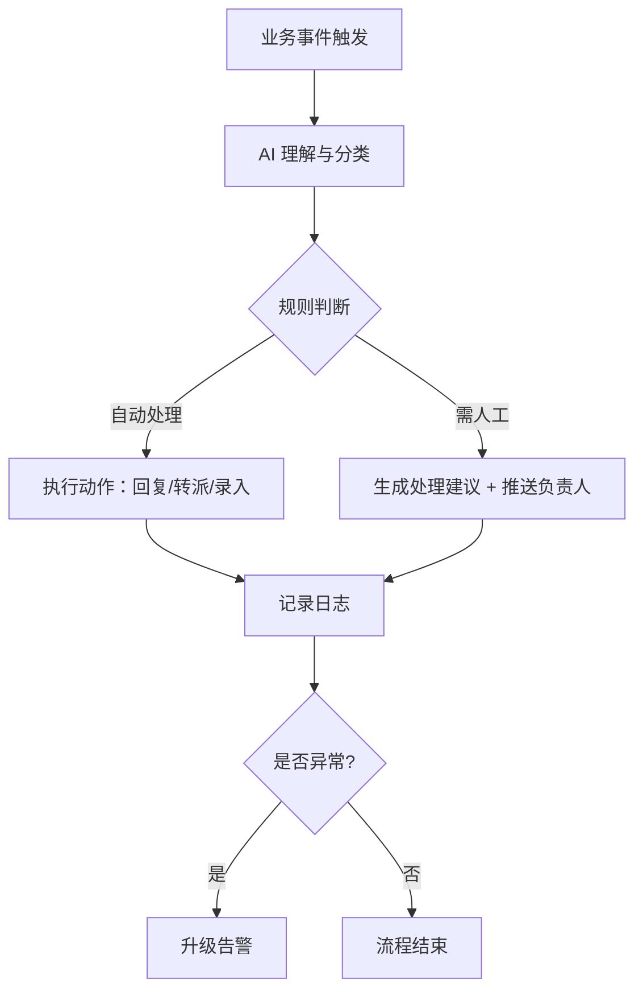

# 业务流程自动化

> 场景定位：用流程设计器把"接收 → 分类 → 判断 → 执行 → 通知"的重复业务链路交给 AI 自动跑，人只处理例外。

## 业务痛点

| 痛点 | 具体表现 |
|------|----------|
| 工单靠人分 | 客服/运维工单靠值班人员肉眼分类转派，高峰期积压 |
| 审批走形式 | 大量低风险审批仍需逐级人工点，审批人疲于奔命 |
| 邮件回复重复 | 咨询邮件 70% 是重复问题，每封都要手写回复 |
| 信息搬运 | 从 A 系统抄数据到 B 系统，纯体力活还容易抄错 |
| 例外没人管 | 异常情况淹没在正常流量里，发现时已经造成影响 |

## 解决方案

**核心原理**：流程设计器把业务链路拆成可视化节点，AI 负责其中需要"理解与判断"的环节（分类、抽取、生成建议），确定性环节仍走规则，两者结合既灵活又可控。

## 典型子场景

### 子场景 1：工单智能分类与转派

1. 工单进入（邮件 / 表单 / API）
2. AI 阅读工单内容，输出：类别、紧急程度、关键信息摘要
3. 按分类规则自动转派到对应处理组
4. 模糊工单附上 AI 分类依据，供人工快速确认

| 工单原文 | AI 分类 | 紧急度 | 转派 |
|----------|---------|--------|------|
| "系统登录一直转圈" | 账号/登录类 | 高 | 平台运维组 |
| "想开一张上个月的发票" | 财务类 | 低 | 财务共享中心 |

### 子场景 2：审批辅助

- AI 预审申请材料：完整性检查（缺件提醒）、合规性检查（对照制度知识库）、风险摘要
- 低风险且材料齐全 → 自动通过或推荐通过
- 有风险点 → 高亮标注后提交人工审批，审批人只看重点

### 子场景 3：邮件/消息自动回复

- 咨询邮件进入后 AI 判断意图
- 命中知识库 → 自动生成回复草稿（可配置为直接发送或人工确认后发送）
- 未命中 → 转人工并附上上下文摘要

### 子场景 4：跨系统信息流转

- AI 从非结构化输入（邮件、聊天、文档）中提取结构化字段
- 通过 API / RPA 写入目标系统（详见[办公自动化 RPA](/scenarios/office-rpa)）
- 替代"人肉复制粘贴"

## 实施步骤

### 第 1 步：选择切入流程（1 天）

:::tip 选流程的标准
优先选择**量大、规则相对清晰、出错代价低**的流程切入，例如工单分类。不要一上来就自动化核心审批链路。
:::

| 评估维度 | 问题 |
|----------|------|
| 量 | 每天/每周处理多少件？ |
| 规则 | 现有处理逻辑能否写成 checklist？ |
| 风险 | AI 判断错了，最坏后果是什么？能否人工兜底？ |
| 数据 | 历史处理记录能否拿到（用于测试）？ |

### 第 2 步：梳理流程节点（1-2 天）

把现有流程画出来，标注每个节点：

- **确定性节点**（规则判断、系统调用）→ 流程设计器规则节点
- **理解性节点**（分类、抽取、生成）→ AI 节点 + 提示词
- **人工节点**（复核、例外处理）→ 推送 + 待办

### 第 3 步：在流程设计器中搭建（1-2 天）

1. 新建流程，按梳理结果拖拽节点连线
2. 为每个 AI 节点编写提示词（明确输入格式、输出格式、判断标准）
3. 配置失败分支：AI 不确定 / 节点报错时走人工兜底
4. 保存并发布到测试环境

### 第 4 步：影子运行与调优（1-2 周）

- **影子模式**：AI 流程与人工并行跑，只记录不生效
- 对比 AI 结果与人工结果，统计准确率
- 准确率达标（建议 ≥ 95%）后切换为 AI 主导 + 人工抽检

### 第 5 步：正式上线与监控

| 监控项 | 说明 |
|--------|------|
| 自动处理率 | AI 独立完成的占比，反映自动化深度 |
| 人工介入率 | 转人工的占比，持续优化应使其下降 |
| 错误率 | 抽检发现的 AI 误判，需及时修正规则或提示词 |
| 处理时效 | 从触发到完成的平均时长 |

## 效果参考

| 指标 | 实施前 | 实施后（参考值） |
|------|--------|-----------------|
| 工单分类转派时效 | 30 分钟 - 数小时 | < 1 分钟 |
| 重复邮件回复人力 | 2 人/天 | 减少 70%+ |
| 审批平均时长 | 1-2 天 | 低风险件 < 1 小时 |
| 例外发现时效 | 事后发现 | 实时告警 |

:::warning 效果说明
以上为行业参考值。自动化效果高度依赖流程规则的清晰度和测试调优的充分程度，建议保留至少 2 周影子运行期。
:::

## 进阶玩法

| 进阶方向 | 说明 |
|----------|------|
| 定时触发 | 结合定时任务，周期性自动执行流程（如每日巡检） |
| 多流程编排 | 一个流程的输出作为另一个流程的输入，串成业务链 |
| 人机协同待办 | AI 处理建议推送为待办，人工一键确认后执行 |
| 数据回流优化 | 人工修正的结果回流为示例，持续改进提示词 |
| 全链路审计 | 每个节点的输入输出留痕，满足合规审计要求 |

## 相关文档

- [自定义场景搭建](/scenarios/custom-scenario) — 流程设计器使用入门
- [办公自动化 RPA](/scenarios/office-rpa) — 浏览器/桌面自动化执行动作
- [定时报告与监控播报](/scenarios/scheduled-reports) — 定时触发能力
- [企业知识问答 / 智能客服](/scenarios/intelligent-qa) — 自动回复的知识来源
- [客户端工具协议](/integration/client-tool-protocol) — 对接业务系统
