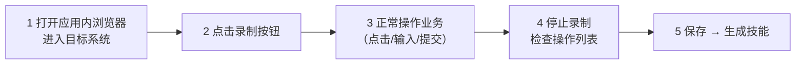
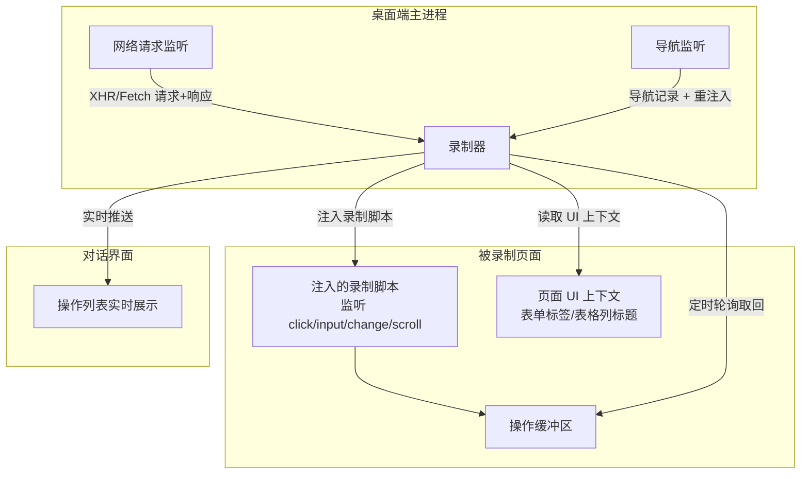
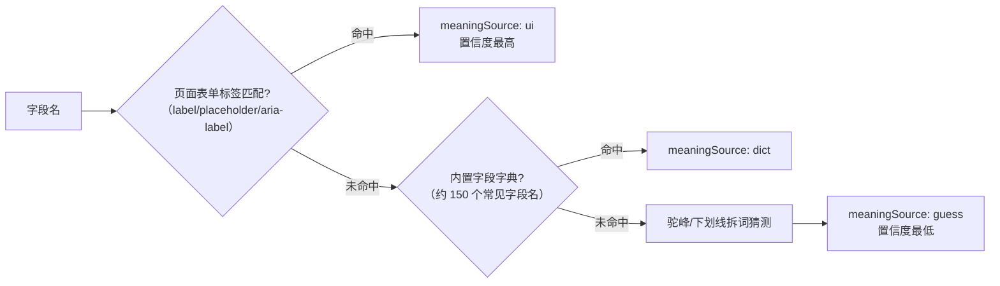
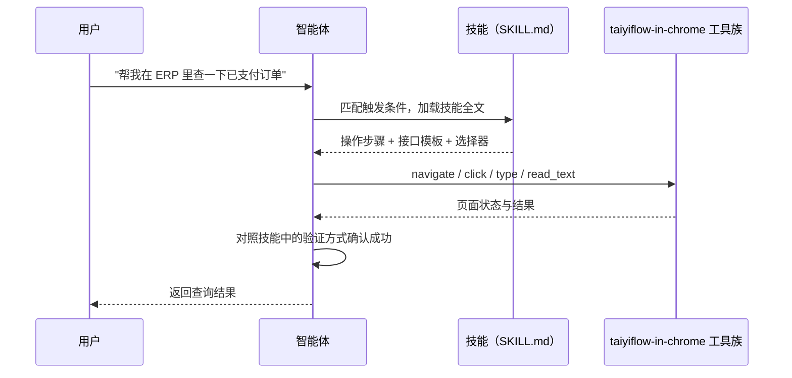

# 浏览器录制固化技能

> 这篇文档讲解太乙智启桌面端（ChatUI）最新实现的**应用内浏览器录制**能力：你像平常一样在浏览器里操作一遍业务，平台把你的每一步点击、输入和背后的 REST 请求全部录下来，然后一键让 AI 把录制数据"归纳"成一个可复用的自动化技能。

## 一句话理解

**录制 = 给 AI 看一遍你怎么干活；固化 = AI 把你的操作写成技能手册，以后它自己照着干。**

传统 RPA 录制生成的是"死脚本"——页面稍一改版就失效。太乙智启的录制生成的是**技能（提示词 + 参考脚本 + 原始录制数据）**，执行时由 AI 结合浏览器自动化工具（`taiyiflow-in-chrome__*`）理解页面、自适应执行，既有录制的精确性，又有 AI 的容错性。

## 为什么需要它

| 痛点 | 录制固化如何解决 |
|------|------------------|
| 内部系统没有 API 文档，AI 不知道怎么调接口 | 录制自动捕获页面背后的 REST 请求（URL、参数、响应结构），并推断字段含义 |
| 手写浏览器自动化脚本门槛高 | 操作一遍即生成，CSS 选择器自动提取，无需懂前端 |
| 业务流程在老员工脑子里 | 录制数据 + 归纳出的技能就是可传承的"操作手册" |
| AI 凭空猜测页面元素，经常点错 | 技能中的选择器和接口来自真实录制，提示词明确约束"不要猜测" |

## 五分钟上手

前提：使用 **桌面端**，且浏览器模式为 `builtin`（应用内浏览器）。



1. **打开浏览器**：在工作区面板新建浏览器标签，导航到目标系统并完成登录
2. **开始录制**：点击浏览器工具栏上的红色录制按钮（`fiber_manual_record` 图标），出现"录制中"状态与操作计数
3. **正常操作**：像平时一样完成一遍业务流程。录制期间每一条操作会实时出现在操作列表中
4. **停止与整理**：停止录制后可展开操作列表逐条检查，**删除误操作**（如无关点击），删除后序号自动重排
5. **保存并固化**：点击保存，录制数据写入工作区（文件名形如 `录制_20260906_201500.json`）；随后弹出"生成技能"确认框，选择模式后，录制文件以 @标签形式插入对话输入框，归纳提示词自动填好——**你可以先编辑提示词再发送**，AI 随即开始生成技能

### 两种固化模式

| 模式 | 产物 | 适合 |
|------|------|------|
| **桌面端模式** | 完整技能包：`SKILL.md` + `scripts/api-calls.js` + `scripts/page-actions.js` + `references/recording-data.json` | 在桌面端/CLI 中复用，AI 通过 `skill_create`、`write_file` 工具落盘 |
| **WEB 端模式** | 单份自包含 Markdown 技能文档（接口模板、操作步骤全部内联） | 通过 JS SDK `registerSkill()` 注入纯 Web 环境的智能体 |

## 录制到底录了什么

录制数据是一个按时间排序的操作序列，共 7 种条目类型：

| 类型 | 含义 | 关键字段 |
|------|------|----------|
| `navigate` | 页面导航 | `url` |
| `click` | 点击 | `selector`、`text`（元素文本前 50 字）、坐标 |
| `type` | 输入（防抖 500ms 合并连续键入） | `selector`、`value`（前 200 字） |
| `select` | 下拉选择 | `selector`、`value`、选中文本 |
| `scroll` | 滚动（节流 300ms） | `direction`、`distance` |
| `wait` | 等待（操作间隔 > 2s 自动插入） | `duration` |
| `rest_request` | 页面发出的 XHR/Fetch 请求 | `method`、`url`、`headers`、`requestBody`、`statusCode`、`responseBody`、`duration`、`fieldAnalysis` |

每条记录带自增 `seq` 序号和时间戳 `ts`；`rest_request` 还带 `triggerAction` 字段，指向触发它的最近一次用户操作序号——这就是"点了哪个按钮 → 发了哪个请求"的因果链。

### 录制数据示例（节选）

```json
{
  "sessionId": "view-1",
  "url": "https://erp.example.com/order/list",
  "startTime": "2026-09-06T11:58:02.113Z",
  "endTime": "2026-09-06T12:01:47.890Z",
  "actions": [
    { "seq": 1, "type": "navigate", "url": "https://erp.example.com/order/list" },
    { "seq": 2, "type": "click", "selector": "[data-testid=\"search-btn\"]", "text": "查询" },
    { "seq": 3, "type": "wait", "duration": 2350 },
    {
      "seq": 4,
      "type": "rest_request",
      "method": "POST",
      "url": "https://erp.example.com/api/order/query",
      "requestBody": { "status": "PAID", "pageNum": 1 },
      "statusCode": 200,
      "triggerAction": 2,
      "fieldAnalysis": {
        "request": {
          "status": { "meaning": "订单状态", "valueType": "string", "meaningSource": "ui", "sample": "PAID" },
          "pageNum": { "meaning": "页码", "valueType": "integer", "meaningSource": "dict", "sample": 1 }
        },
        "summary": "POST /api/order/query → 创建/提交操作，成功（页面：订单管理）"
      }
    }
  ]
}
```

## 深入原理：录制是怎么实现的

录制器运行在**桌面端主进程**，由三条并行管线组成：



### 管线一：页面操作捕获（注入脚本）

录制开始时，主进程向页面动态注入一段录制脚本。选择运行时注入而非预加载方式，是因为它对**任意远程页面**生效且不受页面 CSP（内容安全策略）限制。注入脚本做三件事：

**1. 监听用户操作**（全部在捕获阶段监听，先于页面自身逻辑）：

- `click`：记录目标元素的选择器、文本、坐标
- `input`：500ms 防抖——连续键入"张三丰"只产生一条 `type` 记录，而不是三条
- `change`（SELECT）：记录选中值与文本
- `scroll`：300ms 节流，位移超过 10px 才记录方向与距离

**2. 生成稳定的 CSS 选择器**。这是录制质量的核心，优先级从高到低：

| 优先级 | 选择器形式 | 为什么 |
|--------|-----------|--------|
| 1 | `#id` | 最稳定 |
| 2 | `[data-testid="..."]` | 测试属性，改版时通常保留 |
| 3 | `[data-id="..."]` | 业务标识属性 |
| 4 | `[aria-label="..."]` | 无障碍属性，语义稳定 |
| 5 | `tag.class1.class2:nth-of-type(n)` | class 组合唯一时直接使用，否则加兄弟序号 |
| 6 | 标签路径（最多 4 层） | 兜底方案，稳定性最差 |

**3. 收集页面 UI 上下文**：扫描页面上的表单标签（`label[for]`、label 包裹、placeholder、aria-label 四种形式）和表格列标题，并在 DOM 变化后延迟重新收集——这是后文"字段含义推断"的关键输入。

操作先存入页面内缓冲区（上限 500 条，超限裁剪到 300 条），主进程定时轮询取回并清空，逐条编号后实时推给对话界面展示。轮询带互斥保护，上一轮未完成时跳过，避免并发读写。

### 管线二：REST 请求捕获

主进程通过调试协议监听页面网络活动，将 XHR/Fetch 请求与响应合并成 `rest_request` 记录。工程细节：

| 机制 | 规则 | 目的 |
|------|------|------|
| 静态资源过滤 | 按资源类型 + 扩展名双重过滤 | 只留业务接口，不录 CSS/JS/图片 |
| 轮询去重 | 同 `method:url` 在 1s 窗口内只录一次 | 前端轮询接口不会刷屏 |
| 体积截断 | 请求体 4KB / 响应体 8KB | 防止大响应占用过多内存 |
| 缓存上限 | 等待响应的请求最多缓存 100 条，超限淘汰最早 | 响应永不到达时防泄漏 |

### 管线三：导航捕获与脚本重注入

主进程监听页面导航事件并记录 `navigate` 操作。关键难点：**硬导航后页面 JS 环境被整体重建，注入的录制脚本会丢失**。处理方式是等导航后页面加载完成、再延迟片刻（等页面框架初始化）重新注入脚本，保证跨页面录制不中断。

### 字段含义推断（fieldAnalysis）

录到 `POST /api/order/query {"status": "PAID"}` 后，AI 怎么知道 `status` 是"订单状态"而不是别的？录制器在每条 REST 记录上附加 `fieldAnalysis`，按四级优先级推断每个字段的含义：



- **UI 上下文匹配**：字段名与表单 input 的 `name`/`id` 精确或模糊匹配（如 `userName` 匹配到标签"用户名"）；表格字段则与列标题做拆词关联
- **字段字典**：内置约 150 个常见字段名映射（`pageNum`→页码、`orderId`→订单编号、`createdAt`→创建时间……）
- **值格式识别**：自动标注 UUID、ISO 日期、URL、邮箱等格式
- **接口摘要**：按 HTTP 方法生成一句话用途（GET→查询、POST→创建/提交……），并附页面标题帮助理解业务场景

`meaningSource` 标注让 AI 归纳技能时能判断置信度——`ui` 来源的含义可直接采用，`guess` 来源的则需要谨慎或向用户确认。

### 安全与隐私：录制数据的脱敏

录制会不可避免地碰到敏感信息，录制器做了两层防护：

| 层 | 规则 |
|----|------|
| **请求头脱敏** | `authorization`、`cookie`、`set-cookie`、`x-api-key`、`x-token` 的值一律替换为 `[REDACTED]` |
| **敏感字段脱敏** | 字段名匹配 `password/passwd/secret/token/authorization/credential/api_key` 模式时，样本值替换为 `[REDACTED]` 并标注 `sensitive: true` |

归纳提示词中还明确要求 AI：**生成脚本时敏感字段的值必须替换为参数占位符**，不允许把录制到的明文密码写进技能。

:::warning 仍需注意
- 脱敏基于字段名模式，**业务数据本身**（如请求体里的客户姓名、金额）不会被脱敏。录制文件保存在你的工作区目录，分享技能前请人工检查 `references/recording-data.json`
- 不要在录制期间输入你不希望被记录的敏感信息（如银行卡号）
:::

### 资源保护

长时间录制不会拖垮应用：

- 单次录制最多保留 **2000 条**操作，超限丢弃最早的（主进程与渲染进程双侧限制）
- 页面缓冲区上限 500 条
- 视图销毁时自动调用 `cleanupRecorder`：停止轮询定时器、移除 CDP 监听与导航监听、释放 debugger
- 切换对话会话时自动保存/恢复**会话级录制快照**——每个会话的录制数据互相隔离，切走时若仍在录制会自动停止并通知主进程释放资源

## 从录制数据到技能：归纳发生了什么

点击"生成技能"后，ChatUI 并不在本地做模板拼接，而是**把归纳工作交给 AI**：录制文件以 @标签插入输入框，同时填入一份精心设计的归纳提示词（可编辑），发送后由智能体执行。

桌面端模式的提示词要求 AI 分五步产出完整技能包：

```
my-recorded-skill/
├── SKILL.md                      # 技能主文件：触发条件、执行步骤、验证方式
├── scripts/
│   ├── api-calls.js              # 每个 rest_request → 一个导出函数（参数化）
│   └── page-actions.js           # UI 操作序列 → 浏览器自动化步骤
└── references/
    └── recording-data.json       # 原始录制数据（完整保真）
```

提示词中的关键约束（也是你手工归纳时应遵守的原则）：

- **不要凭记忆重写接口逻辑**，必须从录制数据中原样提取
- **CSS 选择器必须来自录制数据**，不要猜测
- 请求体中的具体值替换为函数参数（用户名、订单号等变量化）
- 利用 `fieldAnalysis` 为脚本生成准确注释
- 敏感字段的值必须替换为参数占位符

WEB 端模式则要求输出**单份自包含 Markdown**：接口参考（含 `{{参数名}}` 占位模板）、页面操作步骤、`taiyiflow-in-chrome` 工具调用示例、变量清单——因为没有文件系统，所有信息必须内联在技能文本里，最终通过 `sdk.registerSkill()` 注入。

### 执行闭环

固化出的技能如何被执行？以桌面端为例：



`builtin` 浏览器模式下，`taiyiflow-in-chrome__*` 工具在主进程内部直接路由到应用内浏览器的 WebContentsView——**AI 操作的就是你录制时的那个浏览器**，登录态（每个对话会话独立的 `persist:inapp-browser-{sessionId}` Session 分区）天然复用，不需要重新认证。

## 录出高质量技能的建议

| 建议 | 原因 |
|------|------|
| 录制前先想好"这个技能叫什么、干什么" | 一次录制只覆盖一个业务场景（单一职责），别把三个流程录在一起 |
| 操作节奏放慢，步骤间留 1-2 秒 | 间隔 > 2s 会自动插入 `wait`，回放时更稳定 |
| 避免误点后靠"删除单条操作"修正 | 误操作会污染 REST 捕获的 `triggerAction` 因果链 |
| 优先在带 `data-testid` / 规范 id 的系统上录制 | 选择器稳定性直接决定技能的存活周期 |
| 录制包含"提交"动作时，用测试数据 | 录制是真实操作，会真的提交到目标系统 |
| 保存后先人工浏览一遍录制 JSON | 确认无敏感业务数据，再交给 AI 归纳 |
| 归纳提示词可以编辑后再发送 | 例如补充"这个接口的 status 枚举值有 PAID/PENDING/CANCELLED" |

## 与其他技能开发方式的关系

| 方式 | 适合场景 | 文档 |
|------|----------|------|
| **手写 SKILL.md** | 知识型、规范型技能（写作风格、审查规则） | [SKILL.md 编写规范](/skill-development/skill-format) |
| **浏览器录制固化** | 操作型技能（Web 业务流程、内部系统接口） | 本篇 |
| **MCP 工具开发** | 需要精确、事务性执行的服务端能力 | [MCP 工具开发](/skill-development/mcp-tools) |

三者可以组合：录制固化的技能包中，`scripts/` 里的 API 函数如果调用频繁且需要强可靠性，可以进一步沉淀为 MCP 工具；技能正文则继续承担"何时用、怎么用"的提示词职责。

## 相关文档

- 技能基础概念 → [技能是什么](/skill-development/skill-basics)
- 技能包格式细节 → [SKILL.md 编写规范](/skill-development/skill-format)
- 浏览器工具族协议 → [客户端工具协议](/integration/client-tool-protocol)
