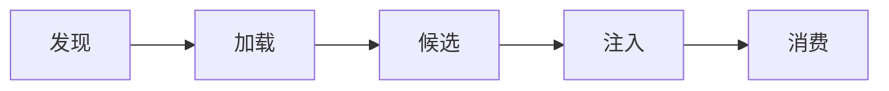

# 技能生命周期

> 这篇文档说明技能从发现到生效的完整生命周期。

## 生命周期概览



## 1. 发现

客户端启动时扫描以下目录：
- `~/.snz1dp/skills/`（用户级）
- `.snz1dp/skills/`（工作区级）

每个包含 `SKILL.md` 的子目录被识别为一个技能。

## 2. 加载

解析 `SKILL.md` 的 frontmatter 和正文：
- 提取 `name`、`description` 等元数据
- 读取正文内容
- 读取 `references/` 目录下的参考文件

## 3. 候选（渐进式披露）

未被显式禁用的技能纳入候选列表。客户端不会一次性注入所有技能，而是根据对话上下文按需选择。

## 4. 注入

发起流式对话时，选中的技能通过 `client_skill_packages` 字段上送：

```json
{
  "client_skill_packages": [
    {
      "name": "skill-name",
      "description": "技能描述",
      "content": "# 完整正文",
      "summary": "摘要",
      "metadata": { "request_types": ["agent"] }
    }
  ]
}
```

## 5. 消费

服务端收到技能包后：
- 将技能内容作为额外上下文注入到 AI 提示词中
- AI 在推理时参考技能指令
- 技能摘要出现在 AI 的可用技能列表中

## 管理操作

| 操作 | CLI 命令 | TUI 命令 |
|------|----------|----------|
| 查看列表 | `skills list` | `/skills` |
| 查看详情 | `skills view <name>` | `/skills` 中选择 |
| 启用 | `skills enable <name>` | `/skills` 中操作 |
| 禁用 | `skills disable <name>` | `/skills` 中操作 |
| 远程安装 | `skills install <name>` | `/skills` 远程标签页 |
