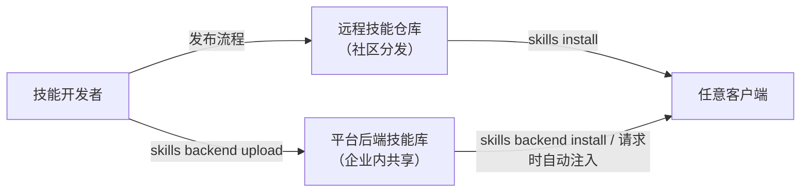

# 技能仓库与发布

> 这篇文档介绍太乙智启技能仓库的使用方法、技能发布流程与版本管理。

## 技能的两个流通体系

太乙智启中技能有两级流通范围，先分清你要发布到哪里：

| 体系 | 范围 | 存储 | 管理入口 |
|------|------|------|----------|
| **远程技能仓库** | 公开/社区，跨平台分发 | 远程仓库服务（默认 `https://mirror-cn.clawhub.com`） | `taiyiflow-cli skills search/install/...` |
| **后端技能包（SkillPackage）** | 你所在平台实例，按 app/flow/system 三级作用域授权 | 平台数据库 + 产物存储 | `taiyiflow-cli skills backend ...`、管理后台 |



## 远程技能仓库

### 仓库操作

```bash
# 搜索技能
taiyiflow-cli skills search <keyword>

# 查看远程技能详情
taiyiflow-cli skills view-remote <名称或ID>

# 安装到本地（默认按配置的 install scope 落盘）
taiyiflow-cli skills install <skill-name>

# 更新 / 删除
taiyiflow-cli skills update <skill-name>
taiyiflow-cli skills remove <skill-name>
```

### TUI / 桌面端操作

- CLI TUI：`/skills` 弹窗的"远程仓库"标签页，可浏览并执行安装、更新、删除
- 桌面端 ChatUI：技能管理面板提供同等能力

### 安装位置（install scope）

安装的技能按作用域落盘：

| 作用域 | 目录 | 生效范围 |
|--------|------|----------|
| 用户级（home） | `~/.snz1dp/skills/` | 当前用户所有项目 |
| 工作区级（workspace） | `<工作目录>/.snz1dp/skills/` | 仅当前项目 |

默认作用域由配置项 `skills.install_scope` 决定，安装命令也可临时指定。

### 仓库源切换

远程仓库地址可切换（如切到企业自建镜像源）：

- CLI 配置中修改技能仓库 source 地址
- `skills list` 输出会按来源分组显示（bundled 内置 / workspace 工作区 / home 用户级 / custom 自定义），便于确认技能实际来源

## 后端技能包（企业内共享）

平台后端维护 `SkillPackage` 技能库，适合**企业内部统一分发**：管理员上传一次，所有授权用户的客户端自动获得，无需每人手工安装。

### 管理命令

```bash
# 列出后端技能库
taiyiflow-cli skills backend list

# 查看详情 / 安装到本地 / 移除
taiyiflow-cli skills backend view <名称或ID>
taiyiflow-cli skills backend install <名称或ID>
taiyiflow-cli skills backend remove <名称或ID>

# 同步后端技能状态
taiyiflow-cli skills backend sync

# 上传：本地已创建的技能 / 直接上传技能文件（ZIP 或 SKILL.md）
taiyiflow-cli skills backend upload <本地技能名>
taiyiflow-cli skills backend upload-file <文件路径> [显示名称]

# 删除后端技能
taiyiflow-cli skills backend delete <技能ID>
```

### 作用域与访问控制

后端技能包关键字段（详见[技能注入机制](/integration/skill-injection)）：

| 字段 | 说明 |
|------|------|
| `scope` | `app`（应用级）/ `flow`（服务级）/ `system`（系统级） |
| `source_type` | `builtin` / `custom` / `marketplace` |
| `version` / `version_alias` | 版本号与别名 |
| `artifact_uri` / `artifact_hash` | 产物地址与完整性校验 |
| `requires_command_execution` | 需要命令执行能力的技能在 Web 端自动过滤 |
| `risk_level` | 风险等级，超出客户端允许等级时被门控拦截 |

配套 `SkillPackageAclRule` 提供细粒度访问控制（哪些用户/组织可见）。

## 发布技能

### 发布前检查

- [ ] SKILL.md frontmatter 格式正确（`name`、`description`、`category`、`metadata.request_types`）
- [ ] `name` 使用人类友好名称，slug（目录名）仅含小写字母、数字、连字符
- [ ] 技能内容经过真实对话测试验证（触发条件、执行步骤、边界情况）
- [ ] **无敏感信息泄露**：不含明文密钥、内网地址、客户数据；浏览器录制固化的技能需人工检查 `references/recording-data.json`
- [ ] 附属脚本（`scripts/`）标注运行环境要求（Python/Node 版本、依赖）
- [ ] 声明前置条件：需要的 MCP 工具、环境变量（`metadata.requires.env`）、系统权限

### 发布到后端技能库（企业内）

```bash
# 1. 本地创建并调试技能（目录含 SKILL.md）
# 2. 上传
taiyiflow-cli skills backend upload my-skill
# 3. 管理后台设置 scope 与 ACL 授权范围
# 4. 通知用户执行 skills backend sync 或等待自动注入
```

### 发布到远程仓库（社区）

远程仓库当前以镜像源形式提供分发；向公共仓库投稿技能请通过官方渠道提交技能包（ZIP），审核流程与收录规范以仓库站点说明为准。自建镜像源的团队可部署同协议的仓库服务并切换 source 地址。

## 版本管理

| 机制 | 说明 |
|------|------|
| `version` 字段 | frontmatter `metadata.version` 使用语义化版本（如 `1.2.0`） |
| 过期检测 | 客户端对比本地与远端版本号，`skills update` 拉取新版 |
| `artifact_hash` / `content_digest` | 后端技能包产物哈希校验，防止传输损坏与篡改 |
| 兼容策略 | 破坏性变更（工具依赖、参数含义变化）应升主版本号，并在 SKILL.md 中注明迁移说明 |

建议：技能源码用 Git 管理，CI 中校验 SKILL.md 格式后再执行 `skills backend upload`，让技能发布像代码发布一样可追溯。

## 相关文档

- [SKILL.md 编写规范](/skill-development/skill-format) — 格式与模板
- [技能生命周期](/skill-development/skill-lifecycle) — 从发现到注入
- [技能注入机制](/integration/skill-injection) — 服务端解析协议
- [浏览器录制固化技能](/skill-development/browser-recording-skill) — 录制生成技能的发布前检查重点
