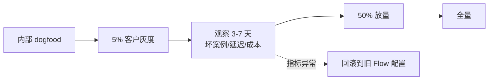

# 厂商集成最佳实践

> 这篇文档汇总厂商集成中的工程经验：**性能优化、错误处理、安全防护、灰度发布、可观测性**五个方面的具体做法，均来自平台协议约束与常见踩坑点。

## 一、性能优化

### 流式优先

- 面向用户的交互一律走流式（SSE `/run/{flow}/stream` 或 WebSocket），首 token 到达即开始渲染，体感延迟降低数倍
- 阻塞式简化运行接口（`POST /run/{flow}`）只用于后台批处理、健康探测等非交互场景
- 客户端通过 `GET /api/v1/settings/` 读取 `stream_protocol` 字段决定走 SSE 还是 WS，不要硬编码

### 网关与长连接配置

| 配置项 | 建议 |
|--------|------|
| Nginx / Ingress 读写超时 | ≥ 600s（Agent 多轮工具调用耗时可达分钟级） |
| WebSocket 透传 | `Upgrade` / `Connection` 头必须透传（`/run/{flow}/websocket`、`/agents/client/websocket`、`/asr/websocket`） |
| SSE 缓冲 | 关闭代理层缓冲（Nginx `proxy_buffering off`），否则流式变"批式" |
| 连接复用 | 后端调用平台 API 时使用 HTTP 连接池 |

### 会话与并发

- **同一会话同一时刻只允许一个执行**：前端在收到回复完成事件前锁定输入框，避免用户重复提交触发 409 / WS 关闭码 4009
- 高并发场景为不同用户分配独立 `session_id`，不要用共享会话
- 长耗时任务（文档批量解析等）由平台 Celery Worker 承担，独立扩缩，不要阻塞 API 实例

### 模型与提示词成本

- 按任务分级选模型：分类/抽取用小模型，复杂推理用大模型
- 技能注入利用**渐进式披露**：默认只注入技能摘要，AI 需要时再加载全文，控制提示词长度
- 客户端附加指令有上限（32000 字符，超限截断），不要塞超长文本，长知识放知识库

## 二、错误处理

### 错误码处理矩阵

| 错误 | 含义 | 厂商侧处理 |
|------|------|-----------|
| 400 | 参数错误 / flow_id 不存在 | 开发期问题，检查请求体与 Flow 配置 |
| 401 | 凭据缺失或过期 | 触发续期（持久令牌换牌）或引导重新登录；**不要静默重试** |
| 403 | 无权访问该 App/Flow | 检查租户授权映射；给用户"无权限"提示而非"出错" |
| 404 | 会话/资源不存在 | 会话可能被清理，引导新建会话 |
| 409 | 会话执行中冲突 | 前端锁定 + 提示"上一条还在处理中" |
| 422 | 请求体不符合 Schema | 开发期问题，对照 OpenAPI 文档（`/docs`）修正 |
| 500 | 服务端错误 | 记录 run_id/session_id 便于排查，给用户兜底话术 |

WebSocket 关闭码：4001 认证失败、4002 参数无效/首条消息超时（10s）、4003 无权访问、4004 服务不存在、4009 会话冲突。

### 客户端工具的容错

- 工具 handler 必须 try/catch，把**可读的错误信息作为工具结果返回**（AI 能据此向用户解释或换路径），而不是让 handler 抛异常中断链路
- 工具调用有等待超时，handler 中的业务请求要设置更短的超时，留出处置余地
- 回调必须原样带回 `run_id`、`call_id`，否则结果无法路由回等待点

### 降级策略

| 故障 | 降级动作 |
|------|----------|
| 模型超时/限流 | 切换备用模型节点；给用户"稍后重试"话术 |
| SSE 断连 | 服务端会自动取消任务并释放会话锁；客户端提示后允许重发 |
| 知识库检索失败 | 退化为纯模型问答并声明"未检索到内部资料" |

## 三、安全防护

- **生产环境必须 HTTPS/WSS**
- **凭据头防伪造**：网关透传 `X-Credential-Username/Userid` 时，必须在入口剥离外部请求携带的同名 Header，否则任何人可冒充任意用户
- **JS SDK 必设 `origin`**：限制 postMessage 来源域名，拒绝非授权消息
- **工具权限最小化**：客户端工具 handler 内做业务权限校验（AI 调用工具时以当前用户身份执行，不要给工具超权通道）；高风险操作（写数据、发消息）加二次确认与审计日志
- **敏感数据不进知识库**：动态业务数据走工具实时查询，权限留在业务系统（见[构建产品 · 数据安全设计](/vendor-guide/product-building)）
- **产物下载令牌时效性**：下载会话产物用时效性 SSO token，每次重新获取，不要缓存或写死在页面里

## 四、灰度发布

### 平台机制

- **影子智能服务**：同一 Flow 可派生影子实例用于灰度/实验——新版本提示词/模型/技能先挂影子 Flow，小流量验证后切换正式 Flow
- **主流程机制**：`master_flow_id` 声明主流程，可在编排层做 A/B 分流

### 厂商侧灰度节奏

灰度观察指标：任务完成率（用户是否追问/重试）、首 token 延迟、工具调用失败率、单会话 token 成本、用户投诉。

:::tip 回滚要点
Flow 配置（提示词/模型/技能）支持导出下载，每次变更前导出存档，回滚即导入旧配置——比代码回滚轻量得多。
:::

## 五、可观测性

| 数据 | 来源 | 用途 |
|------|------|------|
| 健康状态 | `GET /health`、`GET /api/health_check`（db/chat/storage 分项） | 存活探测、告警 |
| 工具调用记录 | `GET /sessions/{session_id}/callrecords` | 排查"AI 为什么这么做"的第一手数据 |
| 模型用量 | `/apiproxy/request-logs` | 成本归集、计费、异常用量发现 |
| 运行监控 | `/monitor`、`/overview` | 平台级指标 |
| 会话与消息 | `/sessions/*` 接口 | 坏案例回溯 |

厂商侧建议：

1. 每次对话在你的业务日志中记录 `session_id` + `run_id`，与平台侧数据可互相索引
2. 建立**坏案例库**：用户点踩 / 人工发现的错误回答，定期回归到提示词与技能包优化
3. JS SDK 可启用内置可观测性（错误边界、性能监控、健康检查），上报到你的前端监控

## 六、工程化清单

- [ ] 所有平台调用封装在统一的 Client 层（凭据、重试、超时、日志集中处理）
- [ ] Flow 配置纳入版本管理（导出存档 + 变更评审）
- [ ] 技能包用 Git 管理，CI 校验 SKILL.md 格式后上传
- [ ] 固定测试问题集，每次提示词/技能/模型变更后回归
- [ ] 压测报告：并发会话数、首 token 延迟、Worker 队列深度
- [ ] 告警规则：健康检查失败、401/403 突增、工具调用失败率、模型配额接近上限

## 相关文档

- 协议细节 → [流式对话 API](/integration/stream-api)、[客户端工具协议](/integration/client-tool-protocol)
- 用量与计费 → [计费与配额管理](/vendor-guide/billing-and-quota)
