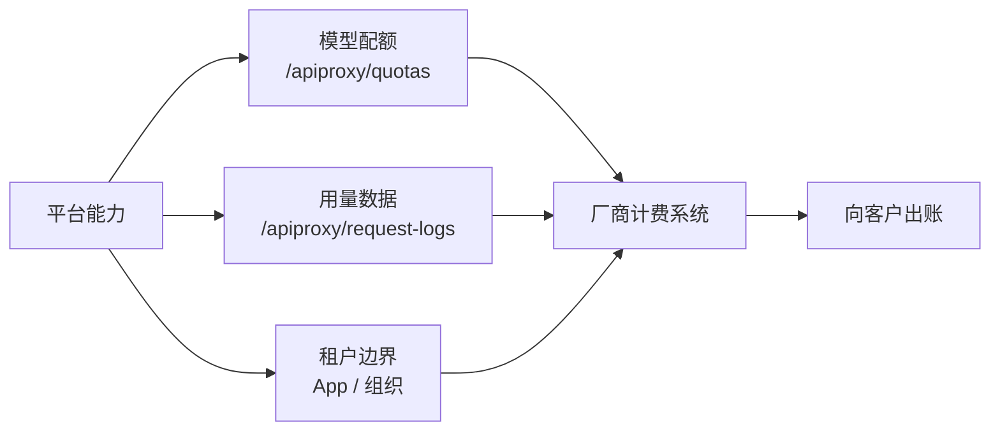
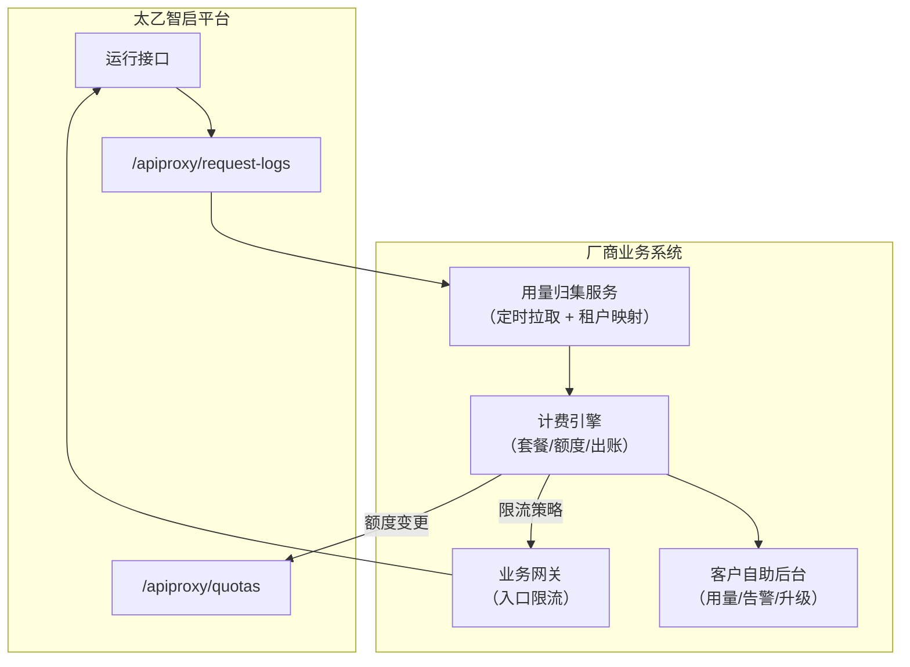

# 计费与配额管理

> 这篇文档回答厂商的商业化核心问题：**基于太乙智启的产品按什么模型向客户收费、用量数据从哪里来、配额如何管控**。

## 总体思路

太乙智启平台本身不内置面向最终客户的计费系统——**计费是厂商业务系统的事**，平台提供三样支撑：

| 平台提供 | 厂商负责 |
|----------|----------|
| 模型节点供应与配额限制 | 定义套餐与价格 |
| 模型请求日志（用量原始数据） | 用量归集、折算、出账 |
| 租户隔离边界（App / 组织 / 用户） | 租户 → 套餐 → 配额的映射管理 |

## 计费模型设计参考

### 常见计费模型对比

| 计费模型 | 计量单位 | 适合场景 | 优点 | 风险 |
|----------|----------|----------|------|------|
| **按调用量** | 请求次数 / token 数 | API 集成、开发者平台 | 与成本直接挂钩，用多少付多少 | 客户账单不可预测，需封顶机制 |
| **按席位** | 活跃用户数 / 月 | 企业员工使用的白标产品 | 账单可预测，销售好谈 | 重度用户拉高成本，需公平使用条款 |
| **按时间订阅** | 实例 / 月或年 | OEM 私有化交付 | 收入稳定 | 与用量脱钩，需限制资源规格 |
| **混合模型** | 基础订阅 + 超量计费 | 大多数 SaaS 产品 | 兼顾可预测与成本覆盖 | 计费逻辑复杂 |

:::tip 推荐
SaaS 产品首选「基础订阅（含额度）+ 超量按 token 计费」；OEM 私有化首选「年度授权 + 按实例规格分级」。
:::

### 成本结构：定价前先算清楚

| 成本项 | 说明 | 数据来源 |
|--------|------|----------|
| 模型推理成本 | 主要变动成本，按 token 计 | `/apiproxy/request-logs` |
| 平台资源成本 | 后端 / Worker / 数据库 / 向量库 / Redis | 你的基础设施账单 |
| 存储成本 | 知识库文件、会话产物、向量数据 | 对象存储与向量库用量 |
| 授权成本 | 太乙智启商业授权（白标/OEM） | 合作协议 |

**模型分级是控制成本最有效的杠杆**：不同套餐映射不同模型节点（基础套餐用高性价比模型，旗舰套餐用高端模型），通过租户 Flow 的模型配置实现；同一 Flow 内不同任务（如摘要 vs 推理）也可用不同模型。

## 用量数据采集

### 模型请求日志

`/api/v1/apiproxy/request-logs` 记录每次模型调用，是计费的第一手数据。厂商侧建议：

1. **定时拉取**（如每 5 分钟增量拉取），按租户维度归集：
   - 请求次数
   - 输入 / 输出 token 数
   - 使用的模型节点
2. **租户归属映射**：日志中的用户 / Flow → 你的租户 ID（依据开通时记录的「租户 → App/Flow 映射」，见[多租户架构](/vendor-guide/multi-tenancy)）
3. **对账兜底**：月度用量与模型供应商账单交叉核对

### 业务侧计量补充

模型日志只覆盖推理成本，完整计费可能还需要：

| 计量项 | 数据来源 |
|--------|----------|
| 活跃席位数 | 你的产品登录体系 / 平台用户接口 |
| 知识库存储量 | `/knowledge` 管理接口统计 |
| 会话数 / 消息数 | `/sessions/count` 等会话接口 |
| 工具调用次数 | `GET /sessions/{session_id}/callrecords` |

## 配额管控

### 平台侧：模型配额

`/api/v1/apiproxy/quotas` 提供模型配额管理，配合 `/apiproxy/nodes`（模型节点供应）实现：

- 限制用量上限，防止单租户耗尽资源
- 不同租户套餐绑定不同配额与模型节点

### 厂商侧：入口限流（推荐必做）

平台配额是兜底，**第一道闸门应该在厂商业务网关**：

| 限流维度 | 建议值 | 触发动作 |
|----------|--------|----------|
| 租户 QPS | 按套餐分级 | 429 + 友好提示 |
| 租户并发会话数 | 按套餐分级 | 排队或拒绝 |
| 单用户日 token 上限 | 公平使用条款 | 当日降级 / 次日恢复 |
| 租户月度总额度 | 套餐含额 | 提醒 → 限速 → 停用（分级动作，不要直接断） |

### 额度告警与自助管理

良好的客户体验要求额度透明：

- 客户后台展示实时用量与剩余额度（数据来自你的归集系统）
- 80% / 95% / 100% 三级告警（邮件 / 站内信 / webhook 通知）
- 支持在线升级套餐、购买加油包

## 典型计费架构

## 实施清单

- [ ] 确定计费模型（订阅 / 用量 / 混合）与套餐分级
- [ ] 打通「租户 → App/Flow → 用户」映射表
- [ ] 实现用量归集服务（定时拉取 request-logs）
- [ ] 业务网关实现入口限流与额度校验
- [ ] 配置平台侧模型配额作为兜底
- [ ] 客户后台展示用量与额度告警
- [ ] 月度对账流程（平台日志 vs 模型供应商账单）
- [ ] 超额处理策略评审（提醒 → 限速 → 停用的分级动作）

## 相关文档

- 租户边界设计 → [多租户架构](/vendor-guide/multi-tenancy)
- 配额相关接口 → [REST API 参考 · 模型代理与配额](/integration/rest-api)
- 模型供应与切换 → [技术架构概览 · 统一模型供应](/overview/architecture-overview)
