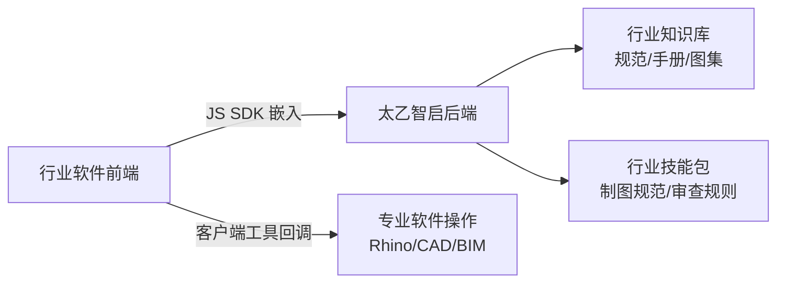
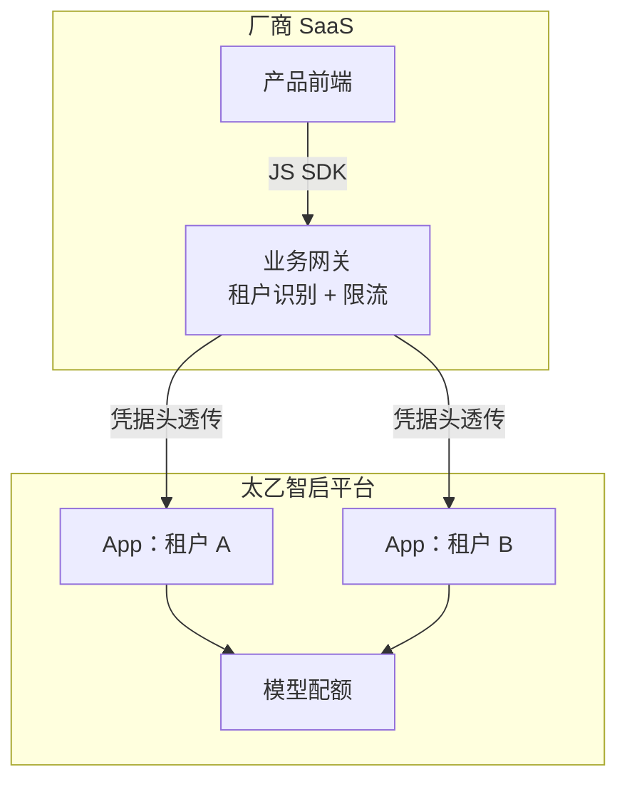
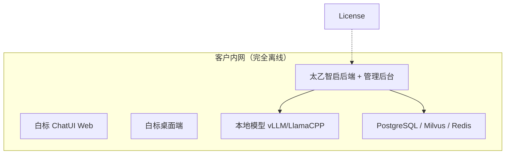

# 厂商案例参考

> 本篇提供**典型集成模式参考**：按行业形态归纳厂商基于太乙智启构建产品的架构路径、关键决策点与踩坑经验，供你在方案设计时对照。

:::tip 说明
以下为按行业场景归纳的**参考架构模式**，用于说明"这类需求通常怎么搭"，不代表特定客户的实际项目数据。具体客户案例与商务参考请联系太乙智启团队（见[服务等级与支持渠道](/reference/sla-and-support)）。
:::

## 模式一：行业软件商 · 产品集成（AEC / 设计制造）

**背景形态**：已有 CAD/BIM 类专业软件或行业 SaaS，希望加入"自然语言驱动专业操作"能力。

| 关键决策 | 做法 |
|----------|------|
| 集成模式 | JS SDK 嵌入对话窗 + 客户端工具协议操作专业软件 |
| 行业知识 | 规范/手册进知识库（RAG），审查规则与输出格式写成技能包 |
| 数据安全 | 图纸与模型数据不出客户本地，工具在客户端执行 |
| 交付形态 | 桌面端形态适配本地专业软件操作场景 |

**经验**：专业软件操作类工具的 `description` 要写清适用边界（"当用户要求批量标注时使用"），否则 AI 会在不需要时误调用；复杂操作拆成多个小工具比一个大工具更稳定。

## 模式二：SaaS 厂商 · 多租户 AI 助手

**背景形态**：面向企业客户的 SaaS 产品，为每个租户提供带业务数据的 AI 助手。

| 关键决策 | 做法 |
|----------|------|
| 租户隔离 | 每租户一个 App（`user_scope: organization`），用户凭据头透传 |
| 业务数据 | 不进知识库，通过远程 MCP 工具实时查询，权限校验留在业务系统 |
| 计费 | 基础订阅 + 超量 token，用量取自 `/apiproxy/request-logs` 按租户归集 |
| 品牌 | 按租户加载主题配置（详见[多租户架构](/vendor-guide/multi-tenancy)） |

**经验**：租户开通流程要自动化（组织 → App → Flow → 配额一条龙脚本化），手工开通在租户超过 20 个后必然出错；入口限流必须在厂商网关做，平台配额只是兜底。

## 模式三：系统集成商 · OEM 私有化交付（政企 / 信创）

**背景形态**：面向数据不出域客户，交付一套完整私有化 AI 平台。

| 关键决策 | 做法 |
|----------|------|
| 交付形态 | 离线镜像包 + 本地模型，零外网依赖 |
| 白标 | 品牌资产构建流水线化（Logo/主题/协议代码注入，不手改产物） |
| 授权 | 一客户一 License，台账管理到期与实例数 |
| 升级 | 厂商验证版本线 + 客户分级通道，升级前全量备份 |
| 能力边界 | 交付前明确告知离线环境不可用的能力（联网搜索等） |

**经验**：升级演练和回滚演练至少各做一次真实操作再交付；白标资产一定要流水线化，否则第二次升级时手工改动全部丢失。详见 [OEM 分发与授权](/vendor-guide/oem-distribution)。

## 模式四：方案商 · 行业智能体产品线

**背景形态**：把太乙智启作为底座，构建可复制售卖的行业智能体产品（如设备运维助手、合规问答助手）。

| 关键决策 | 做法 |
|----------|------|
| 产品化核心资产 | 行业技能包 + 预置 Flow 模板 + 知识库构建规范 |
| 复制方式 | Flow 导出/导入 + 技能包 ZIP 分发，新客户环境快速实例化 |
| 多智能体 | 主流程机制（`master_flow_id`）编排"分诊 → 专业子智能体"协作 |
| 定时能力 | 定时任务实现巡检报告、指标播报等无人值守场景 |

**经验**：行业 know-how 沉淀在技能包（Markdown）里而不是硬编码在代码里，交付新客户的边际成本才能降下来；为每个行业维护一套固定测试问题集，版本变更时回归。

## 模式对照速查

| 你的形态 | 对照模式 | 重点阅读 |
|----------|----------|----------|
| 已有软件想加 AI | 模式一 | [JS SDK 集成](/integration/jssdk)、[客户端工具协议](/integration/client-tool-protocol) |
| SaaS 多租户运营 | 模式二 | [多租户架构](/vendor-guide/multi-tenancy)、[计费与配额](/vendor-guide/billing-and-quota) |
| 私有化项目交付 | 模式三 | [OEM 分发与授权](/vendor-guide/oem-distribution)、[白标定制](/vendor-guide/white-label) |
| 行业产品线复制 | 模式四 | [技能注入机制](/integration/skill-injection)、[构建产品](/vendor-guide/product-building) |

## 下一步

- 动手搭第一个 Demo → [厂商快速上手](/quick-start/for-vendor)
- 完整产品化路径 → [基于太乙智启构建产品](/vendor-guide/product-building)
- 工程细节 → [厂商集成最佳实践](/vendor-guide/best-practices)
