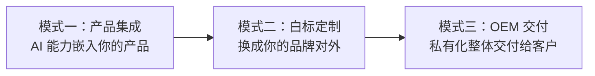
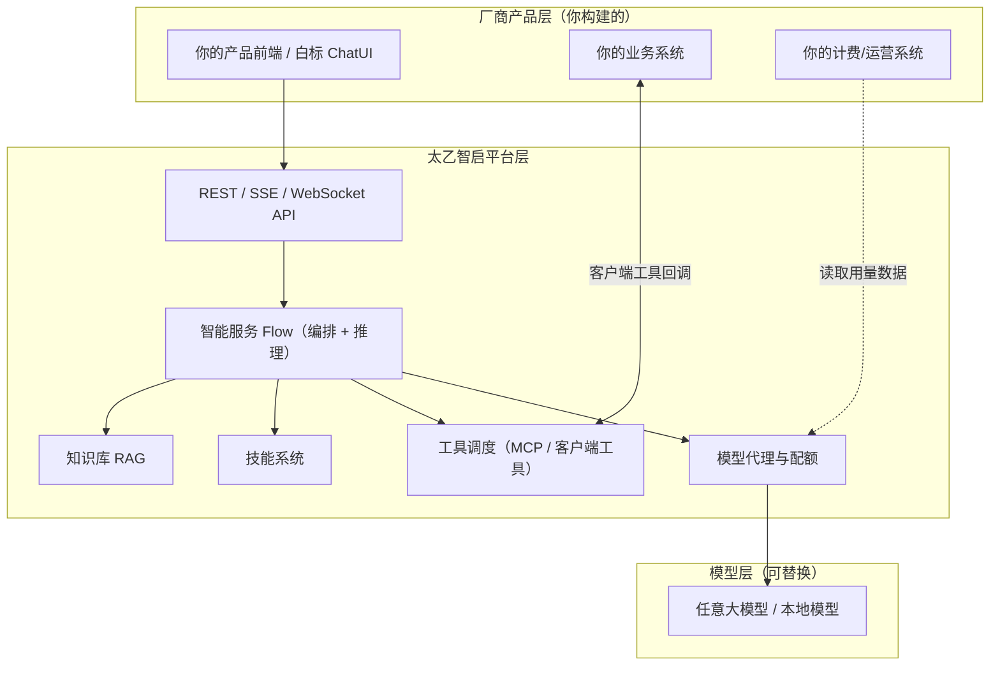

# 厂商合作总览

> 这篇文档帮助 ISV、系统集成商、行业方案商在 5 分钟内弄清楚：基于太乙智启有哪几种合作模式、各自适合什么业务形态、从哪里开始。

## 一句话结论

**太乙智启支持厂商以「产品集成 → 白标定制 → OEM 交付」三种递进模式构建可售卖的 AI 产品/方案**，全部模式共享同一套后端平台与集成协议，厂商按客户形态与商业目标选择切入深度。

## 三种合作模式

| 模式 | 你做什么 | 客户看到什么 | 适合谁 | 复杂度 |
|------|----------|--------------|--------|--------|
| **产品集成** | 通过 JS SDK / API 把智能对话、知识库问答、工具调用能力嵌入自有产品 | 你的产品里多了一个 AI 助手 | SaaS 厂商、行业软件商 | ⭐ 低 |
| **白标定制** | 部署智能体前端并替换品牌元素（Logo、配色、域名、版权信息），后端可自持或托管 | 一个"你品牌的" AI 对话产品 | 想快速推出 AI 产品线的厂商 | ⭐⭐ 中 |
| **OEM 交付** | 把太乙智启平台（后端 + 前端 + 桌面端）私有化部署到客户环境，作为整体方案交付 | 客户机房里的一套完整 AI 平台 | 系统集成商、面向政企/信创客户的方案商 | ⭐⭐⭐ 高 |

三种模式不互斥：常见路径是先做产品集成验证需求，再升级为白标产品，最终对大客户做 OEM 私有化交付。

## 平台为厂商提供的能力底座

| 能力 | 说明 | 详细文档 |
|------|------|----------|
| **多租户隔离** | App 作为租户隔离单元，数据 / 配额 / 品牌三层隔离 | [多租户架构](/vendor-guide/multi-tenancy) |
| **完整集成协议** | SSE / WebSocket / REST 全接口，任意语言后端可调用 | [集成方式总览](/integration/overview) |
| **前端快速嵌入** | JS SDK（npm 包 `taiyiflow`）零依赖嵌入对话窗口 | [JS SDK 集成](/integration/jssdk) |
| **白标前端** | ChatUI 预留品牌、主题、图标、协议文档等全套定制点 | [白标定制](/vendor-guide/white-label) |
| **客户端工具协议** | AI 可回调厂商业务系统的函数，打通"对话 → 业务操作" | [客户端工具协议](/integration/client-tool-protocol) |
| **技能系统** | 一份 Markdown 即可向 AI 注入行业知识与行为规范 | [技能注入机制](/integration/skill-injection) |
| **模型配额管理** | 模型代理层提供节点供应、配额、请求日志能力 | [计费与配额](/vendor-guide/billing-and-quota) |
| **私有化 / 离线部署** | 全组件容器化，支持完全离线环境交付 | [OEM 分发与授权](/vendor-guide/oem-distribution) |

## 按业务形态选择路径

| 你的业务形态 | 推荐模式 | 起步动作 |
|--------------|----------|----------|
| 已有 SaaS 产品，想加 AI 功能 | 产品集成 | 用 JS SDK 嵌入对话窗口，注册业务工具 → [2 小时跑通 Demo](/quick-start/for-vendor) |
| 想推出一条独立的 AI 产品线 | 白标定制 | 部署 ChatUI + 替换品牌 → [白标定制指南](/vendor-guide/white-label) |
| 服务政企 / 信创 / 数据不出域客户 | OEM 交付 | 私有化部署 + License 管理 → [OEM 分发与授权](/vendor-guide/oem-distribution) |
| 行业方案商（AEC / 制造 / 金融等） | 产品集成 + 行业技能包 | 用技能系统沉淀行业知识 → [构建产品](/vendor-guide/product-building) |

## 厂商视角的产品架构

厂商的核心工作在三件事上：

1. **前端体验**：用 JS SDK 嵌入或白标 ChatUI，让 AI 能力出现在你的产品里
2. **业务打通**：通过客户端工具协议 / MCP 工具，让 AI 能调用你的业务函数与数据
3. **行业知识**：通过技能包 + 知识库，把行业规范与经验注入 AI

## 本指南阅读地图

| 文档 | 回答的问题 |
|------|-----------|
| [基于太乙智启构建产品](/vendor-guide/product-building) | 从 0 到 1 的完整产品化路径：架构设计 → 集成 → 定制 → 测试 → 上线 |
| [多租户架构](/vendor-guide/multi-tenancy) | SaaS 化运营时，多个客户的数据、配额、品牌如何隔离 |
| [白标定制](/vendor-guide/white-label) | Logo / 配色 / 域名 / 版权信息具体怎么替换 |
| [计费与配额管理](/vendor-guide/billing-and-quota) | 按什么模型向客户收费，用量数据从哪里来 |
| [OEM 分发与授权](/vendor-guide/oem-distribution) | 私有化交付流程、License 管理、版本同步策略 |
| [厂商集成最佳实践](/vendor-guide/best-practices) | 性能优化、错误处理、灰度发布的工程经验 |
| [厂商案例参考](/vendor-guide/case-studies) | 其他厂商怎么搭的（脱敏案例） |

## 开始之前

:::tip 前置条件
- 已获取太乙智启的部署环境或开发授权（联系商务或参考[版本与授权](/overview/editions-and-licensing)）
- 团队中至少有一名后端开发者（任意语言）和一名前端开发者（产品集成模式仅需前端）
- 建议先用 [2 小时快速上手](/quick-start/for-vendor) 跑通最小 Demo，再进入本指南深入设计
:::

## 下一步

- 动手验证：[厂商快速上手（2 小时 Demo）](/quick-start/for-vendor)
- 系统设计：[基于太乙智启构建产品](/vendor-guide/product-building)
- 商务咨询：合作模式、授权价格与技术支持，见[服务等级与支持渠道](/reference/sla-and-support)
