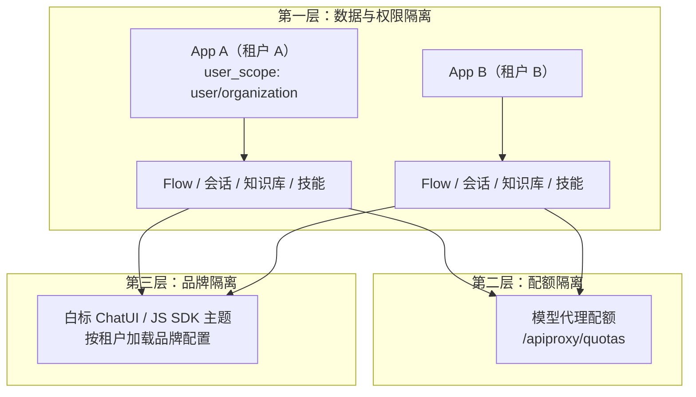
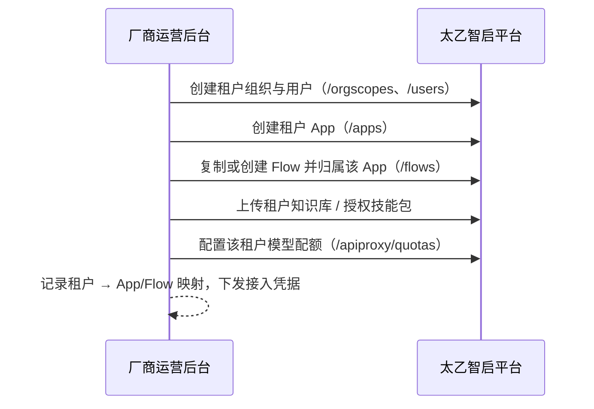

# 多租户架构

> 这篇文档回答厂商 SaaS 化运营的核心问题：**多个客户（租户）共用一套太乙智启平台时，数据、配额、品牌如何隔离**。

## 隔离模型总览

太乙智启以 **App（智能应用）作为顶层租户隔离单元**，配合用户体系与模型配额，形成三层隔离：

## 第一层：数据与权限隔离（App 模型）

### App 是权限边界

每个智能服务（Flow）都归属于一个 App，App 通过 `user_scope` 控制可见范围：

| user_scope | 含义 | 租户场景用法 |
|------------|------|--------------|
| `publish` | 公开发布，所有用户可访问 | 厂商提供的公共模板服务 |
| `organization` | 组织内可见，通过组织/成员授权访问 | **推荐**：一个租户对应一个组织 |
| `user` | 私有，仅创建者与显式授权成员可访问 | 租户内的个人空间 |

访问控制链路：用户调用某个 Flow 时，服务端校验「该 Flow 所属 App 的 user_scope + 用户身份/角色 + 组织授权（`app_org` / `app_user`）」，无权返回 403（WebSocket 关闭码 4003）。详见[认证与鉴权](/integration/authentication)。

### 推荐的租户映射方案

| 方案 | 结构 | 适合 |
|------|------|------|
| **A：每租户一个 App** | 租户 → App → 多个 Flow；租户用户挂到对应组织 | 中小规模 SaaS，租户数百级 |
| **B：每租户多个 App** | 按业务线再拆分（如"客服 App"+"知识管理 App"） | 大客户、多产品线 |
| **C：每租户独立部署** | 独立平台实例 | 数据强隔离要求（政企/金融），见 [OEM 分发](/vendor-guide/oem-distribution) |

### 租户隔离的资源清单

一个租户的完整资源边界包括：

| 资源 | 隔离方式 |
|------|----------|
| 智能服务（Flow） | 归属租户 App，跨租户不可见 |
| 会话与消息 | 归属 Flow 与用户，接口按权限过滤 |
| 知识库 | 绑定到租户的 Flow，检索范围随 Flow 隔离；请求级还可用 `knowledge_scopes` 收窄 |
| 技能包 | `SkillPackage` 支持 app / flow / system 三级作用域 + ACL 规则 |
| 文件产物 | 会话产物按 Flow + Session 路径存储，下载需时效性令牌 |
| 用户 | 对接 xeai 用户中心，按组织归属划分 |

### 租户开通流程（建议实现）

## 第二层：配额隔离

平台模型代理层提供配额能力，防止单个租户耗尽模型资源：

| 接口前缀 | 能力 |
|----------|------|
| `/api/v1/apiproxy/nodes` | 模型节点供应管理：接入多个模型供应商/本地节点 |
| `/api/v1/apiproxy/quotas` | 模型配额：限制用量上限 |
| `/api/v1/apiproxy/request-logs` | 模型请求日志：按调用记录统计用量 |

厂商侧建议：

1. **入口配额**：在你的业务网关层按租户限流（QPS / 并发会话数），平台侧配额作为兜底
2. **用量归集**：定时拉取 `/apiproxy/request-logs`，按租户维度归集 token 用量，作为计费依据（见[计费与配额](/vendor-guide/billing-and-quota)）
3. **模型分级**：不同租户套餐映射不同模型节点（如基础版用国产模型、旗舰版用高端模型），通过 Flow 的模型配置实现

## 第三层：品牌隔离

多租户 SaaS 常需要"每个租户看到自己的品牌"：

| 品牌元素 | 隔离方式 |
|----------|----------|
| 对话窗主题色 / Logo | JS SDK 按租户初始化不同 `iconUrl`；ChatUI 主题变量按租户域名加载 |
| 产品名 / 标题 | 白标构建时环境变量注入，或按域名运行时切换 |
| 智能体名称与人设 | 每租户独立 Flow，提示词与 `agentName` 独立配置 |
| 欢迎语 / 引导 | Flow 级配置 + 技能包按租户作用域授权 |

深度品牌替换（域名、版权信息、安装包）见[白标定制](/vendor-guide/white-label)。

## 会话与用户身份的映射

多租户下正确传递用户身份是关键：

- **你的产品已有登录体系**：网关认证后透传用户凭据头（`X-Credential-Username` / `X-Credential-Userid`），平台自动同步/创建本地用户记录
- **每个终端用户一个平台身份**：会话按用户隔离，历史互不可见
- **匿名/开放场景**：`X-User-Scope: public` 走开放用户身份，适合对外体验入口，注意配合配额限制

:::warning 安全要点
服务间透传凭据头时，必须确保网关层剥离外部请求伪造的同名 Header，否则存在越权风险。
:::

## 规模与性能建议

| 租户规模 | 建议架构 |
|----------|----------|
| ≤ 50 租户 | 单平台实例 + App 隔离，PostgreSQL/Milvus 单实例 |
| 50-500 租户 | 后端多实例 + Worker 独立扩缩，Milvus 独立集群，Redis 哨兵 |
| > 500 租户或强隔离要求 | 分片部署（多套平台实例）或对大客户走 OEM 独立交付 |

部署形态细节参考[技术架构概览](/overview/architecture-overview)的部署架构章节。

## 下一步

- 品牌层深度定制 → [白标定制](/vendor-guide/white-label)
- 用量变现 → [计费与配额管理](/vendor-guide/billing-and-quota)
- 强隔离交付 → [OEM 分发与授权](/vendor-guide/oem-distribution)
