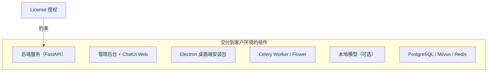
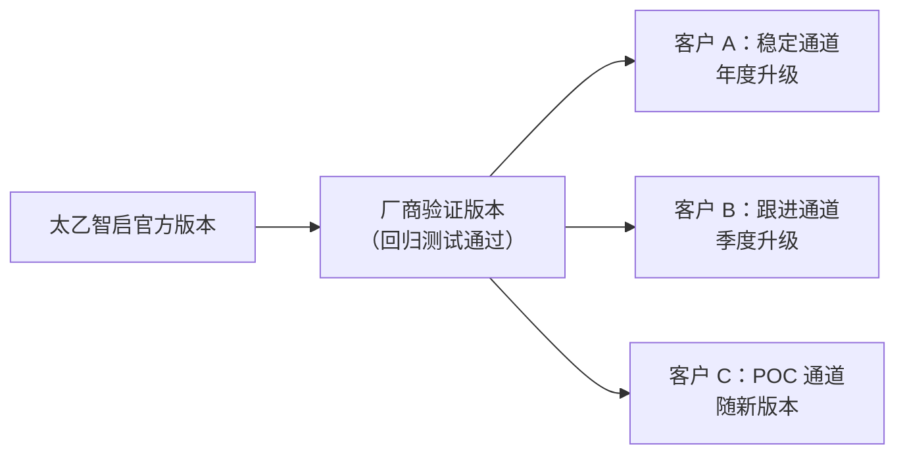
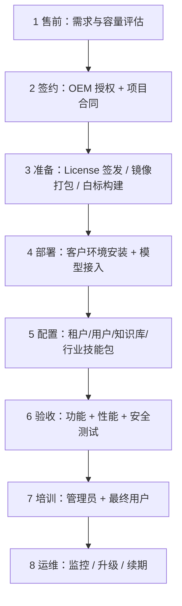

# OEM 分发与授权

> 这篇文档回答系统集成商 / 方案商的核心问题：**如何把太乙智启作为整体方案私有化交付给客户**——交付形态、License 管理、离线部署、版本同步与升级策略。

## OEM 交付形态

| 交付形态 | 内容 | 适合客户 |
|----------|------|----------|
| **标准私有化** | 后端平台 + 管理后台 + ChatUI Web + 桌面端，部署到客户机房/私有云 | 数据不出域的政企、金融、制造客户 |
| **离线（信创）交付** | 全组件镜像离线导入 + 本地模型，无任何外网依赖 | 等保 / 信创 / 涉密环境 |
| **方案捆绑交付** | 太乙智启作为你行业方案的一部分（含你的业务系统与行业技能包） | 行业整体解决方案项目 |

## License 管理

### 平台授权机制

平台内置授权许可能力：

| 接口 | 说明 |
|------|------|
| `POST /api/v1/settings/license/decode` | 授权许可解析：部署时校验 License 合法性与授权范围 |

License 通常约束：部署实例数、用户规模上限、授权期限、可用功能范围（如桌面端分发权、白标权）。具体授权条款以与太乙智启团队签署的 OEM 合作协议为准，商务模式参考[版本与授权](/overview/editions-and-licensing)。

### 厂商侧 License 运营建议

1. **一客户一 License**：每个客户环境独立签发，绑定环境指纹（如部署域名 / 实例标识），避免跨环境复用
2. **到期预警**：License 到期前 90/30/7 天提醒客户续期，预留换发窗口
3. **台账管理**：维护「客户 → 部署环境 → License → 版本 → 到期日」台账，这是 OEM 业务的生命线
4. **子分发合规**：向客户分发桌面端安装包时，确认合作协议覆盖分发权与份数

## 离线部署要点

太乙智启支持完全离线环境部署：

| 环节 | 做法 |
|------|------|
| 镜像 | 所有组件容器化；在有网环境 `docker save` 导出镜像包，客户环境 `docker load` 导入 |
| 大模型 | 本地部署（vLLM / LlamaCPP 等），通过统一模型供应层接入，平台侧用 `/lmdeploy` 相关接口做部署连通性测试 |
| 桌面端 | 离线分发安装包（内置 CLI、Python、Node 运行时与内置技能包，无需客户环境另装） |
| 依赖 | npm / pip 依赖在构建期打入镜像，运行期零外网下载 |
| 更新 | 离线升级包（镜像 + 数据库迁移脚本），见下文版本同步 |

:::warning 离线环境注意
- 联网搜索、在线地图等依赖外网的内置工具在离线环境不可用，交付前明确告知客户能力边界
- 客户环境时钟需与运维约定 NTP 方案，避免令牌时效校验异常
:::

## 版本同步与升级策略

### 版本通道设计

建议厂商维护**自己的验证版本线**，不要把官方版本直接透传给客户：

1. 官方新版本发布 → 厂商测试环境部署验证（跑通你的行业技能包、白标定制、集成回归）
2. 验证通过 → 标记为「厂商推荐版本」
3. 按客户通道计划推送升级

### 升级实施要点

| 环节 | 要点 |
|------|------|
| 升级前 | 全量备份数据库与对象存储；记录当前版本号与配置快照 |
| 数据库迁移 | 平台使用 Alembic 迁移，随版本自动执行；**跨大版本升级先在演练环境走一遍** |
| 白标资产 | 升级会覆盖前端产物，你的品牌资产（Logo、主题、协议文档）需通过构建流水线重新注入，不要手工改部署产物 |
| 回滚方案 | 保留上一版本镜像 + 数据库备份；回滚 = 旧镜像 + 恢复备份 |
| 验证清单 | 健康检查（`GET /health`、`GET /api/health_check`）→ 登录 → 核心 Flow 对话 → 工具回调 → 桌面端连接 |

### 客户环境变更管理

- 每次升级出具《升级说明》：新能力、破坏性变更、需要的配置调整
- 远程运维通道（如客户允许）可显著降低升级成本；不允许时提供标准化升级手册 + 升级演练视频
- 桌面端升级可利用平台客户端发布通道（`/agents/client/check-update`、安装包下载与状态上报接口）统一推送

## 交付流程模板

| 阶段 | 关键产出 |
|------|----------|
| 容量评估 | 用户规模 → 硬件配置清单（参考[技术架构概览](/overview/architecture-overview)部署架构） |
| 部署 | 部署记录：组件版本、端口、网关路由、SSO 对接方式 |
| 验收 | 验收报告：功能清单、性能基线（首 token ≤ 3s、并发能力）、安全项（HTTPS、凭据头防伪造） |
| 运维 | 监控接入（健康检查 + 模型请求日志）、备份策略、升级计划 |

## 实施清单

- [ ] OEM 合作协议与授权范围确认（部署实例数、分发权、白标权、期限）
- [ ] License 签发流程与台账建立
- [ ] 离线镜像包与升级包制作流水线
- [ ] 白标构建流水线（品牌资产代码化，可重复注入）
- [ ] 厂商验证版本线与升级通道策略
- [ ] 交付文档包：部署手册、升级手册、管理员手册、验收清单
- [ ] 回滚预案演练（至少一次真实回滚演练）

## 相关文档

- 白标构建细节 → [白标定制](/vendor-guide/white-label)
- 多客户 SaaS 化（非私有化）→ [多租户架构](/vendor-guide/multi-tenancy)
- 部署与运维基础 → [技术架构概览](/overview/architecture-overview)
