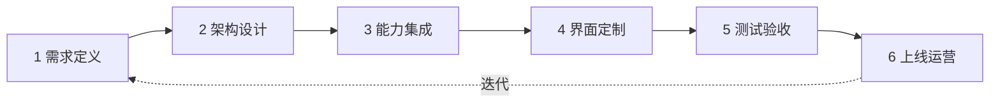
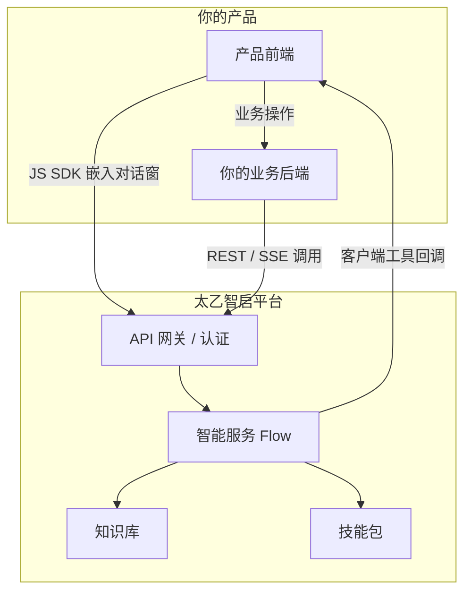

# 基于太乙智启构建产品

> 这篇文档给出从 0 到 1 构建 AI 产品的完整路径：**需求定义 → 架构设计 → 能力集成 → 界面定制 → 测试验收 → 上线运营**。每个阶段都有明确的产出物与验收标准。

## 全景路线图



| 阶段 | 核心产出 | 典型耗时 |
|------|----------|----------|
| 需求定义 | 场景清单、能力边界、集成模式选型 | 1-3 天 |
| 架构设计 | 系统架构图、租户与认证方案 | 2-5 天 |
| 能力集成 | 跑通的 API 调用、工具回调、技能包 | 1-2 周 |
| 界面定制 | 嵌入对话窗 / 白标前端 | 3-7 天 |
| 测试验收 | 功能、性能、异常场景测试报告 | 1 周 |
| 上线运营 | 灰度发布、监控告警、用量运营 | 持续 |

## 阶段一：需求定义

### 明确 AI 在你产品中的角色

先回答三个问题：

1. **AI 帮用户做什么？** 知识问答 / 内容生成 / 数据查询 / 业务操作代办 / 流程自动化
2. **AI 需要什么输入？** 用户对话 / 上传文件 / 业务系统数据 / 行业知识库
3. **AI 的输出到哪里去？** 直接展示给用户 / 写回业务系统 / 触发动作（发通知、建工单）

### 选择集成模式

| 集成模式 | 技术路径 | 适合场景 |
|----------|----------|----------|
| **嵌入式对话** | JS SDK 引入，iframe 加载 ChatUI 对话页 | 产品里加 AI 助手窗口，最快上线 |
| **API 后端集成** | 你的后端调用 `/api/v1/run/{flow}/stream`，前端自行渲染 | 需要完全自定义交互形态 |
| **深度工具集成** | 上述任一 + 客户端工具协议 / MCP 工具 | AI 需要读写你的业务数据、执行业务操作 |
| **白标整体产品** | 部署 ChatUI（Web / Electron）+ 品牌替换 | 推出独立的 AI 产品线 |

:::tip 选型建议
第一个版本永远从最简单的模式开始。「嵌入式对话 + 少量业务工具」能覆盖 80% 的首版需求，验证后再加深。
:::

## 阶段二：架构设计

### 典型产品集成架构



### 必须做出的四个设计决策

| 决策点 | 选项 | 参考 |
|--------|------|------|
| **认证方案** | 网关 SSO 透传凭据头 / JWT 登录态 / 私有化超级用户回退 | [认证与鉴权](/integration/authentication) |
| **租户模型** | 单 App 共享 / 每租户独立 App / 每租户独立部署 | [多租户架构](/vendor-guide/multi-tenancy) |
| **智能服务设计** | 一个通用 Flow / 按场景拆分多个 Flow / 主流程编排多智能体 | [集成核心概念](/integration/concepts) |
| **数据边界** | 哪些业务数据进知识库、哪些通过工具实时查询、哪些不出你的系统 | 下文「数据安全设计」 |

### 数据安全设计

:::warning 数据边界原则
- **静态知识**（手册、规范、FAQ）→ 上传知识库，注意脱敏
- **动态业务数据**（订单、客户、库存）→ 不进知识库，通过客户端工具 / MCP 工具实时查询，权限校验留在你的业务系统
- **敏感操作**（改数据、发消息）→ 工具 handler 中做二次确认与审计
:::

## 阶段三：能力集成

按依赖顺序推进，每步都可独立验收：

### 3.1 跑通对话链路

```bash
# 简化运行：验证凭据与 Flow 可用
curl -X POST "https://your-platform/api/v1/run/{flow_id_or_name}" \
  -H "Authorization: Bearer <token>" \
  -H "Content-Type: application/json" \
  -d '{"input_value": "你好", "request_type": "ask"}'
```

验收标准：收到文本回复，响应头返回 `x-session-id`。完整契约见[流式对话 API](/integration/stream-api)。

### 3.2 设计智能服务（Flow）

在管理后台完成：

- 配置系统提示词与模型（不同任务可用不同模型控制成本）
- 绑定知识库（RAG 检索范围）
- 配置可用工具范围
- 用管理端调试接口（`POST /api/v1/build/{flow_id}/flow`）验证编排逻辑

### 3.3 注入行业知识（技能包）

技能是注入系统提示词的 Markdown 文本，是**沉淀行业经验成本最低的方式**：

```javascript
// JS SDK 侧注入
sdk.registerSkill('aec-drawing-check', `# 图纸审查规范
1. 检查图层命名是否符合《制图标准》第 3 章；
2. 标注缺失时列出位置清单，不要自行猜测尺寸；
3. 输出格式：问题列表 + 严重等级 + 修改建议。`)
```

也可以上传为服务端技能包（`SkillPackage`），按 app / flow / system 三级作用域授权，所有客户端复用。详见[技能注入机制](/integration/skill-injection)。

### 3.4 打通业务系统（工具）

让 AI 能操作你的业务，两种方式：

| 方式 | 执行位置 | 适合 |
|------|----------|------|
| **客户端工具**（JS SDK `registerTool`） | 用户浏览器 / 你的前端 | 查询当前用户上下文数据、操作页面 |
| **远程 MCP 工具** | 你部署的 MCP 服务器 | 服务端数据查询、企业系统 API 封装 |

```javascript
sdk.registerTool('order-server', {
  name: 'query_order',
  description: '根据订单号查询订单状态。当用户询问订单进度时使用。',
  input_schema: {
    type: 'object',
    properties: { order_id: { type: 'string' } },
    required: ['order_id']
  },
  handler: async (args) => {
    const res = await fetch(`/api/orders/${args.order_id}`)
    return await res.json()
  }
})
```

验收标准：对话中说"查一下订单 DD20260901001"，AI 正确调用工具并基于返回数据回答。协议细节见[客户端工具协议](/integration/client-tool-protocol)。

## 阶段四：界面定制

按集成模式选择：

### JS SDK 嵌入（产品集成）

- 悬浮窗模式：`position` / `iconUrl` 匹配产品视觉
- 容器模式：`containerMode: true` 嵌入指定区域，融入页面布局
- 主题匹配：ChatUI 侧定制主题色（见[白标定制](/vendor-guide/white-label)）
- 生产环境必须设置 `origin` 限制 postMessage 来源

### 白标 ChatUI（独立产品线）

部署 ChatUI Web SPA 或构建 Electron 桌面端，替换品牌元素。完整定制点清单见[白标定制](/vendor-guide/white-label)。

## 阶段五：测试验收

### 功能测试清单

- [ ] 多轮对话上下文保持正确（同一 `session_id`）
- [ ] 知识库问答引用正确，无幻觉性编造
- [ ] 每个业务工具的调用、参数、异常返回都验证过
- [ ] 技能注入后 AI 行为符合规范（用固定测试问题集回归）
- [ ] 会话并发冲突有友好提示（同一会话同时刻只允许一个执行，冲突返回 409 / WS 关闭码 4009）

### 异常场景测试清单

- [ ] Token 过期 → 401 处理与自动续期 / 重新登录引导
- [ ] 无权限访问 Flow → 403 提示（WS 关闭码 4003）
- [ ] 网络中断 → SSE 断连后的用户提示与重试
- [ ] 模型超时 / 限流 → 降级话术
- [ ] 工具 handler 抛错 → 错误信息回传 AI 后的兜底回复

### 性能基线

| 指标 | 建议目标 |
|------|----------|
| 首 token 响应时间 | ≤ 3s（视模型而定） |
| SSE 长连接稳定性 | 网关读写超时 ≥ 600s，WebSocket 透传配置正确 |
| 并发会话 | 压测确认后端实例与模型配额上限 |

## 阶段六：上线运营

1. **灰度发布**：先对内部用户 / 小比例客户开放；平台支持影子智能服务（同一 Flow 派生影子实例用于灰度实验）
2. **监控**：接入健康检查（`GET /health`、`GET /api/health_check`）与模型请求日志（`/apiproxy/request-logs`）
3. **用量运营**：基于模型配额与请求日志统计各租户用量，支撑计费（见[计费与配额](/vendor-guide/billing-and-quota)）
4. **持续迭代**：收集坏案例 → 优化提示词 / 技能包 / 知识库，这是 AI 产品运营的日常

## 常见误区

| 误区 | 正确做法 |
|------|----------|
| 把所有业务数据灌进知识库 | 动态数据走工具实时查询，知识库只放静态知识 |
| 一个 Flow 承载所有场景 | 按场景拆分 Flow，用主流程机制编排协作 |
| 工具 description 写得含糊 | description 是 AI 决定是否调用的唯一依据，写清"做什么 + 何时用 + 参数含义" |
| 首版就追求完全自定义 UI | 先用 JS SDK 默认对话窗验证需求，再投入 UI 定制 |
| 忽略会话并发限制 | 前端做好"执行中"状态锁定，避免用户重复提交触发 409 |

## 下一步

- SaaS 化运营设计 → [多租户架构](/vendor-guide/multi-tenancy)
- 品牌与界面定制 → [白标定制](/vendor-guide/white-label)
- 工程细节经验 → [厂商集成最佳实践](/vendor-guide/best-practices)
