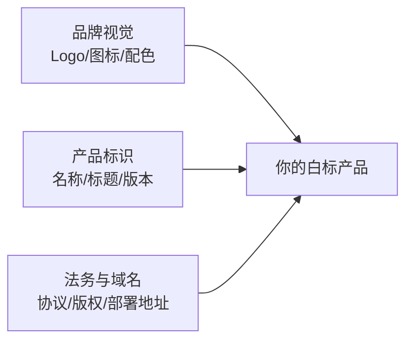

# 白标定制

> 这篇文档回答：**如何把太乙智启的对话前端（ChatUI）换成你的品牌对外**——产品名、Logo、配色、域名、版权信息、内嵌协议逐项替换，覆盖 Web SPA 与 Electron 桌面端两种形态。

## 白标定制全景



ChatUI（Vue 3 + Quasar 2）为 OEM/白标场景预留了完整定制面，绝大多数替换**不需要改动业务代码**，只涉及配置、变量与静态资源。

## 定制点清单

| 扩展点 | 位置 | 说明 |
|--------|------|------|
| 产品名/品牌 | `package.json` 的 `productName`；构建时可用 `ELECTRON_BUILDER_PRODUCT_NAME` 等环境变量覆盖 | 安装包名、窗口标题 |
| 应用标题/版本 | `quasar.config.js` 的 `build.env`（`CHAT_WEB_TITLE` / `CHAT_WEB_VERSION`） | 运行时读取 |
| 主题色 | `src/css/quasar.variables.scss`（`$primary` 等 Quasar 变量） | 全局配色体系 |
| 深色模式 | `src/stores/theme.js`、`src/css/dark-theme.scss` | 支持跟随系统 |
| 图标/Logo | `src-electron/icons/`、`public/favicon.ico`、`public/logo.png`、`icongenie-profile.json` | 全套品牌视觉 |
| 后端地址 | Web：网关路由 + `WEB_CONTEXT_PATH`；Electron：设置页运行时切换 + YAML 持久化 | 私有化部署关键 |
| 国际化 | `src/i18n/zh.js`（vue-i18n） | 当前仅中文，可扩展语言包 |
| 内嵌协议/帮助文档 | `src/docs/` + 关于页文档查看器 | 隐私政策、用户协议替换为你的 |
| 内置技能集 | `src-electron/agent-runtime/builtin-skills/` | 增删桌面端内置技能 |
| 新手引导 | `src/config/guide-steps.js`（driver.js） | 引导步骤与文案定制 |
| 书签小工具 | `public/js/libs`（JS SDK 产物） | 网页划词集成入口 |

## Web SPA 白标步骤

### 1. 替换品牌视觉

```bash
# 替换静态资源
cp your-logo.png public/logo.png
cp your-favicon.ico public/favicon.ico
```

修改主题色 `src/css/quasar.variables.scss`：

```scss
$primary: #你的品牌色;
```

### 2. 修改产品标识

在 `quasar.config.js` 的 `build.env` 中设置：

```javascript
env: {
  CHAT_WEB_TITLE: '你的产品名',
  CHAT_WEB_VERSION: '1.0.0'
}
```

### 3. 调整部署路径

`quasar.config.js` 顶部三个路径常量决定网关前缀：

| 常量 | 默认值 | 说明 |
|------|--------|------|
| `CHAT_WEB_URL` | `/taiyi/chat` | Web 页面路由 base |
| `COMPOSER_API_URL` | `/taiyi/composer/api/v1` | 业务 API 前缀 |
| `XEAI_API_URL` | `/xeai` | 认证 API 前缀 |

白标部署到自有域名时，可改为你的前缀（如 `/ai/chat`）后重新构建；同时容器部署可用 `WEB_CONTEXT_PATH` 环境变量覆盖 context path。

### 4. 替换内嵌协议

将 `src/docs/` 下的隐私政策、用户协议替换为你的法务文本。

### 5. 构建与部署

```bash
npm install -g @quasar/cli
npm install
quasar build          # 产物在 dist/spa
```

官方 Docker 镜像（`snz1.cn/taiyiflow/chatui`）适合不改代码的轻量贴牌；深度白标建议源码构建自有镜像。网关接入要点（SSO、WebSocket 透传、匿名路径）见 [ChatUI 前端集成与二次开发](/integration/chatui)。

## Electron 桌面端白标步骤

### 1. 品牌与图标

```bash
# 使用 icongenie 按 profile 生成全套图标
npx icongenie generate -p icongenie-profile.json
```

替换 `src-electron/icons/` 下全部图标（dmg 背景、托盘、安装包图标）。

### 2. 产品名与安装包

```bash
# 环境变量覆盖产品名（无需改 package.json）
ELECTRON_BUILDER_PRODUCT_NAME="你的产品名" make electron-builder-host

# 分平台构建安装包
make electron-installers-macos     # dmg/zip，支持签名与公证
make electron-installers-windows   # NSIS，支持 Certum 云证书签名
make electron-installers-linux     # deb/rpm
```

:::warning 签名与公证
- macOS 分发必须配置 Developer ID 签名 + 公证（`after-sign.js` 走公证流程），否则用户无法直接打开
- Windows 建议代码签名，避免 SmartScreen 拦截
- 签名证书与 profile 配置属于构建环境机密，不要入库
:::

### 3. 内置技能与运行时

安装包内置 `taiyiflow-cli`、Python、Node 运行时与内置技能包（`src-electron/agent-runtime/builtin-skills/`）。白标时：

- 删除与你的产品无关的技能，减小包体
- 可加入你的行业技能包（编写规范见 [SKILL.md 编写规范](/skill-development/skill-format)）

### 4. 认证与服务器地址

桌面端与 CLI 共享认证体系，配置持久化在 `~/.snz1dp/config/taiyiflow.yaml`：

- 白标产品可在设置页预置你的服务器地址
- 登录流程（账号密码 RSA 加密 / 扫码 / 持久令牌自动续期）由 XEAI 用户中心承担，白标时通常保留该链路，仅替换品牌视觉

## JS SDK 嵌入场景的轻量白标

不部署 ChatUI、只用 JS SDK 嵌入时，品牌定制在宿主侧完成：

```javascript
const sdk = new TaiyiSDK({
  agentUrl: 'https://your-platform/taiyi/chat/your-flow-id',
  agentName: '你的助手名',        // 对话窗标题
  iconUrl: 'https://your-cdn/your-logo.png',  // 悬浮图标
  origin: 'https://your-platform' // 生产必设
})
```

对话窗内部的主题色等深度定制仍需在 ChatUI 侧完成（iframe 加载的页面）。

## 白标验收清单

- [ ] 所有界面（登录、对话、设置、关于、错误页）无原品牌残留
- [ ] favicon、启动图标、安装包图标、托盘图标全部替换
- [ ] 浏览器标签标题、窗口标题、安装包名为你的产品名
- [ ] 隐私政策 / 用户协议为你的法务文本
- [ ] 主题色符合品牌规范，深色模式正常
- [ ] 后端地址指向你的部署环境，无硬编码原环境地址
- [ ] Electron：签名/公证通过，全新机器安装启动正常
- [ ] 自动更新通道指向你的发布源（如启用）

## 商务与授权

白标合作涉及授权范围（是否可去除原版权信息、可分发的形态与数量）、商务条款与技术支持等级，需与太乙智启团队签署合作协议后实施。授权模式说明见[版本与授权](/overview/editions-and-licensing)，支持渠道见[服务等级与支持渠道](/reference/sla-and-support)。

## 下一步

- 按租户区分品牌 → [多租户架构](/vendor-guide/multi-tenancy)
- 私有化整体交付 → [OEM 分发与授权](/vendor-guide/oem-distribution)
- ChatUI 源码级理解 → [ChatUI 内部实现](/internals/chatui-internals)
