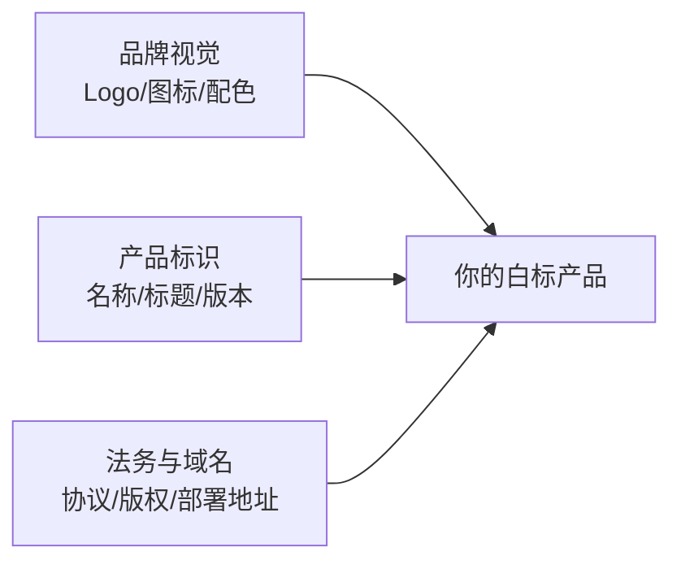

# 白标定制

> 这篇文档回答：**如何把太乙智启的对话前端（ChatUI）换成你的品牌对外**——产品名、Logo、配色、域名、版权信息、内嵌协议逐项替换，覆盖 Web SPA 与桌面端两种形态。

## 白标定制全景



ChatUI 为 OEM/白标场景预留了完整定制面，绝大多数替换**不需要改动业务代码**，只涉及配置、品牌变量与静态资源。

## 定制点清单

| 扩展点 | 说明 |
|--------|------|
| 产品名/品牌 | 安装包名、窗口标题，支持构建时环境变量覆盖，无需改代码 |
| 应用标题/版本 | 运行时读取，可按品牌与发布节奏定制 |
| 主题色 | 基于 Quasar 变量体系，一处修改全局生效 |
| 深色模式 | 支持跟随系统，配色可独立定制 |
| 图标/Logo | 全套品牌视觉：应用图标、favicon、启动图、托盘图标、安装包背景 |
| 后端地址 | Web：网关路由前缀；桌面端：设置页运行时切换并持久化 |
| 国际化 | 基于 vue-i18n，当前仅中文，可扩展语言包 |
| 内嵌协议/帮助文档 | 隐私政策、用户协议替换为你的法务文本 |
| 内置技能集 | 增删桌面端内置技能，贴合你的行业场景 |
| 新手引导 | 引导步骤与文案定制 |
| 书签小工具 | 网页划词集成入口 |

:::tip 具体修改位置
各定制点对应的文件位置、配置项名称与操作步骤，随源码授权在仓库内文档中提供。本篇聚焦"能定制什么"与验收标准。
:::

## Web SPA 白标步骤

1. **替换品牌视觉**：替换 Logo、favicon 等静态资源，修改主题色变量为你的品牌色
2. **修改产品标识**：通过构建配置设置产品名与版本号，运行时读取生效
3. **调整部署路径**：Web 页面路由前缀、业务 API 前缀、认证 API 前缀均可改为你的域名规划（如 `/ai/chat`）；容器部署还可用环境变量覆盖 context path
4. **替换内嵌协议**：将隐私政策、用户协议替换为你的法务文本
5. **构建与部署**：源码构建产出静态 SPA 产物，自行托管或打包镜像

官方 Docker 镜像（`snz1.cn/taiyiflow/chatui`）适合不改代码的轻量贴牌；深度白标建议源码构建自有镜像。网关接入要点（SSO、WebSocket 透传、匿名路径）见 [智能体前端集成与二次开发](/integration/chatui)。

## 桌面端白标步骤

1. **品牌与图标**：按图标配置一次性生成全套尺寸的应用图标、托盘图标与安装包视觉资源
2. **产品名与安装包**：通过环境变量覆盖产品名，分平台产出 macOS（dmg/zip）、Windows（NSIS）、Linux（deb/rpm）安装包
3. **内置技能与运行时**：安装包内置 CLI、Python、Node 运行时与内置技能包。白标时可删除与你产品无关的技能以减小包体，也可加入你的行业技能包（编写规范见 [SKILL.md 编写规范](/skill-development/skill-format)）
4. **认证与服务器地址**：桌面端与 CLI 共享认证体系，可在设置页预置你的服务器地址；登录链路（账号密码加密 / 扫码 / 登录态自动续期）通常保留，仅替换品牌视觉

:::warning 签名与公证
- macOS 分发必须配置 Developer ID 签名 + 公证，否则用户无法直接打开
- Windows 建议代码签名，避免 SmartScreen 拦截
- 签名证书与构建配置属于构建环境机密，不要入库
:::

## JS SDK 嵌入场景的轻量白标

不部署 ChatUI、只用 JS SDK 嵌入时，品牌定制在宿主侧完成：

```javascript
const sdk = new TaiyiSDK({
  agentUrl: 'https://your-platform/taiyi/chat/your-flow-id',
  agentName: '你的助手名',        // 对话窗标题
  iconUrl: 'https://your-cdn/your-logo.png',  // 悬浮图标
  origin: 'https://your-platform' // 生产必设
})
```

对话窗内部的主题色等深度定制仍需在 ChatUI 侧完成（iframe 加载的页面）。

## 白标验收清单

- [ ] 所有界面（登录、对话、设置、关于、错误页）无原品牌残留
- [ ] favicon、启动图标、安装包图标、托盘图标全部替换
- [ ] 浏览器标签标题、窗口标题、安装包名为你的产品名
- [ ] 隐私政策 / 用户协议为你的法务文本
- [ ] 主题色符合品牌规范，深色模式正常
- [ ] 后端地址指向你的部署环境，无硬编码原环境地址
- [ ] 桌面端：签名/公证通过，全新机器安装启动正常
- [ ] 自动更新通道指向你的发布源（如启用）

## 商务与授权

白标合作涉及授权范围（是否可去除原版权信息、可分发的形态与数量）、商务条款与技术支持等级，需与太乙智启团队签署合作协议后实施。授权模式说明见[版本与授权](/overview/editions-and-licensing)，支持渠道见[服务等级与支持渠道](/reference/sla-and-support)。

## 下一步

- 按租户区分品牌 → [多租户架构](/vendor-guide/multi-tenancy)
- 私有化整体交付 → [OEM 分发与授权](/vendor-guide/oem-distribution)
